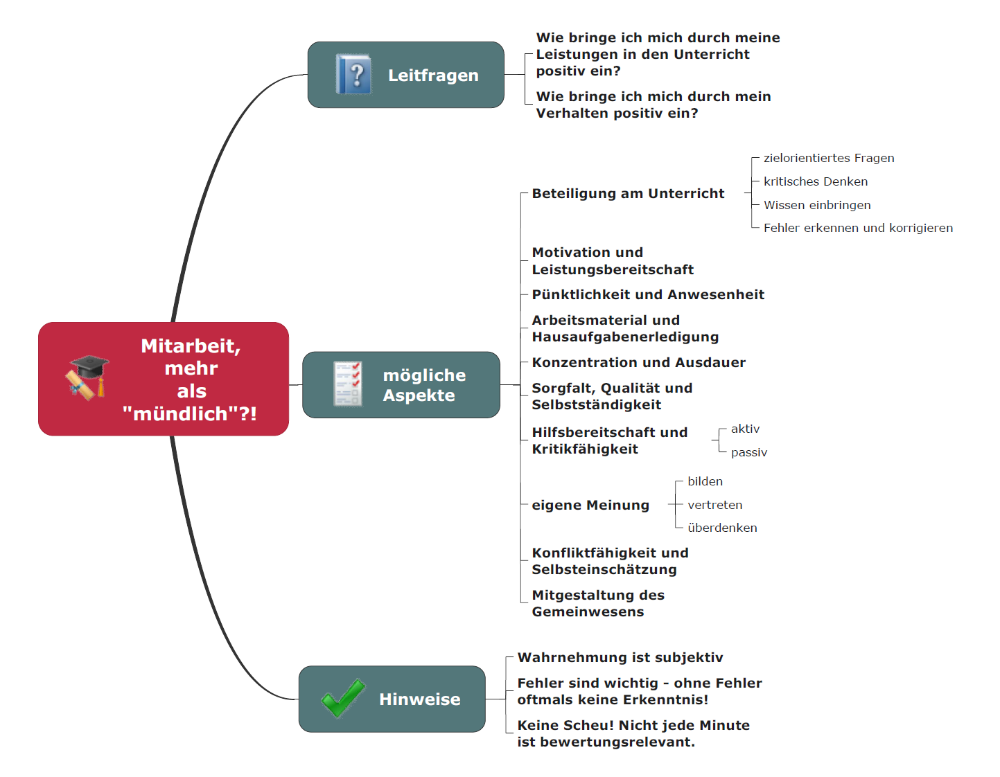
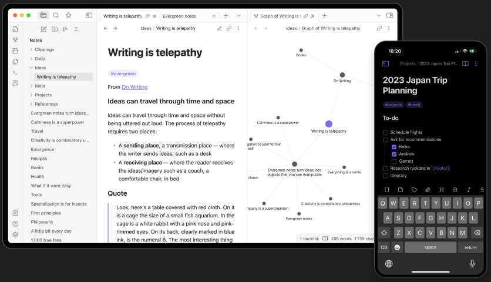
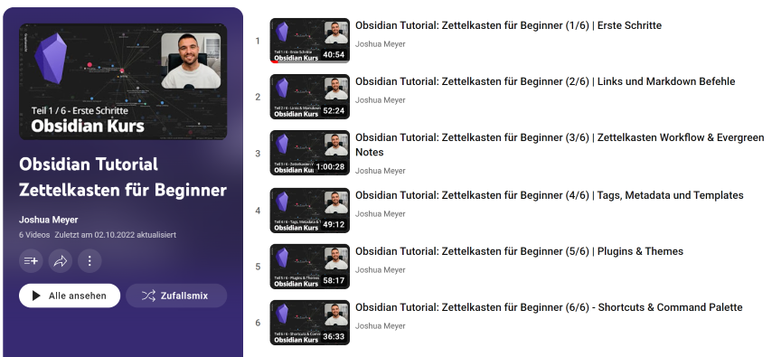

# Kapitel 0: Organisatorisches

In diesem Kapitel finden Sie ...

- ... Zielformulierungen im Lernfeld 2,
- ... Bewertungshinweise sowie
- ... Organisatorisches zum Unterricht.

---

## Zielformulierung und Inhalte

### Didaktischer Wizard

- Sie finden die didaktische Planung der MMBbS im [Didaktischen Wizard](https://didakt.mm-bbs.de).
- Die Lernsituationen sind auch direkt unter [GitHub - (Herr-NM)](https://herr-nm.github.io/MMBbS_KIT_Curriculum) abrufbar.
- Dieser Moodle-Kurs ist als MkDocs-Seite unter [GitHub.io - (Herr-NM)](https://herr-nm.github.io/MMBbS_KIT_LF02) frei einsehbar.

 

### Inhalt der Lernsituationen

Die Lernsituationen der Lernfelder werden aus den Lernfeldbeschreibungen des jeweiligen Rahmenlehrplans abgeleitet. Dazu dient in diesem Kurs der [Rahmenlehrplan](https://www.kmk.org/fileadmin/Dateien/pdf/Bildung/BeruflicheBildung/rlp/Kaufleute_fuer_Digitalisierungsmanagement_19-12-13_EL.pdf) der Kaufleute für Digitalisierungsmanagement (KDM) sowie der Kaufleute für IT-System-Management (KSM).

Im Lernfeld 2 sind die Inhalte nach Rahmenlehrplan für alle IT-Berufe identisch.

| Nr. | Lernsituation | Unterrichtsstunden |
| :--- | :--- | :--- |
| LS 2.6 | IT-Systeme unterscheiden | 12 |
| LS 2.7 | Netzwerkspeicher dimensionieren | 18 |
| LS 2.8 | | |

---

## Bewertungshinweise

---

### Informationsmaterial M|0.0: Mitarbeit - mehr als "mündlich"?!

---

### Informationsmaterial M|0.1: Zusammensetzung der Note im Lernfeld 2 (technischer Anteil)

#### Zusammensetzung

Die Lernfeld 2-Note setzt sich aus den Stunden des wirtschaftlichen Anteils im LF2 sowie den technischen Stunden bei Herrn Neumann zusammen. Beide steuern 50% der Gesamtnote bei. Auf dem Zeugnis steht das LF2 nur mit dieser Gesamtnote.

Der 50%-Anteil der LF2 Note bei Herrn Neumann setzt sich wie folgt zusammen:

- 50% Anteil an der LF2-NM-Note: lernstandsbezogene Leistungsfeststellungen
- 30% Anteil an der LF2-NM-Note: lernprozessbegleitende Leistungsfeststellungen
- 20% Anteil an der LF2-NM-Note: allgemeine Mitarbeit
- ISA-Mitarbeit kann in die Mitarbeitsnote eingehen und ggf. zwischen zwei Noten zur Verbesserung führen

#### Lernstandsbezogene Leistungsfeststellungen

Die lernstandsbezogene Leistungsfeststellung in Form einer Klassenarbeit wird im 4. Block geschrieben (genauer Termin s. zu gegebener Zeit im WebUntis). Die Klassenarbeit hat einen Umfang von 70 Minuten und findet als Moodle-Klassenarbeit statt.

#### Lernprozessbegleitende Leistungsfeststellungen

Die lernprozessbegleitenden Leistungsfeststellungen setzen sich aus verschiedenen Abgaben oder angekündigten Tests zusammen (s. hier ebenfalls WebUntis).

---

## Informationen zum Aufbau dieses Kurses

Dieser Moodle-Kurs kann als interaktives Lehrbuch verstanden werden. Dazu gibt es verschiedene Aktivitäten, die Sie aufrufen sollen und zum Teil freiwillig bearbeiten können. Das folgende Informationsmaterial kann als Anleitung hierfür dienen.

---

### Informationsmaterial M|0.2: Aufbau des Moodle-Kurses

- Dieser Kurs ist in verschiedene Kapitel aufgeteilt. Die Kapitel haben fortlaufende Nummerierungen.
- Innerhalb eines Kapitels finden Sie Arbeitsaufträge, Informationsmaterialien und vieles mehr. Diese Aktivitäten haben eine im Kapitel fortlaufende Nummer, sodass jede Aktivität direkt angesprochen werden kann.
  - **Arbeitsaufträge:** Die Aufgabe *A|2.3* kann vom Typ (*A|* = Arbeitsauftrag) und der Nummer (*2.* für Kapitel 2 und *3* für den dritten Arbeitsauftrag des Kapitels) zugeordnet werden.
  - **Informationsmaterialien**: Auch die Informationsmaterialien haben fortlaufende Nummerierungen z.B. *M|2.3* (*M|* = Material & *2.3* = Kapitel 2, drittes Material in dem Kapitel).
  - **Übungen:** Übungen werden in der Regel nicht im Unterricht besprochen, wenn es keine direkten Fragen dazu gibt. Übungen sind generell freiwillig von Ihnen zu bearbeiten und liefern immer die Möglichkeit zur Selbstkontrolle. Sobald eine Lösung von Ihnen hochgeladen wurde, schaltet sich eine Musterlösung zur Ansicht frei.
  - **Abgaben:** Die Abgaben für die lernprozessbegleitende Leistungsfeststellung erfolgen in den einzelnen Kapiteln und sind dort kenntlich gemacht.
  - **Klassenarbeit:** Klassenarbeit ist in einem separaten Kapitel zu finden.
- Am Ende eines Kapitels finden Sie ggf. weitere *Tipps und Tricks*, welche Ihnen Anstöße zum weiteren Lernen liefern sollen. Manchmal sind dies Hinweise auf Lernvideos, zusätzliche Artikel usw. Wie die Übungen auch, sind Tipps und Tricks nicht Bestandteil der Benotung und damit vollkommen freiwillig.
- Das Kapitel mit den *Projektideen zur freiwilligen Bearbeitung* ist wie der Name es schon vermuten lässt ebenfalls zusätzliches Material, das zum Lernfeld passt und nicht benotet wird.

!!! note "Zusätzliches Material, weitere Übungen & Tipps"

    Die folgenden Übungen und Tipps & Tricks dienen Ihrer persönlichen Wiederholung und Vorbereitung auf Klassenarbeiten, Prüfungen etc. Die Übungen werden im Rahmen des Unterrichts nicht besprochen, es sei denn Sie haben konkrete Fragen hierzu.  *Es wird nicht leichter. Du wirst besser!*

## Übungen

In den Kapiteln werden unterrichtsbegleitend Übungen angeboten. Diese werden im Unterricht nicht besprochen, es sei denn es besteht Ihrerseits der konkrete Wunsch dazu. Ansonsten können Sie die Übungen zum Lernen, als Vorbereitung für Klassenarbeiten oder Tests sowie zur Vorbereitung auf die IHK-Prüfung nutzen. Die Ergebnisse aus den Moodle-Aktivitäten zählen (z.B. Selbsttest) zählen nicht zur schriftlichen Note. Eine kontinuierliche Arbeit mit den Übungen kann sich aber positiv auf die Mitarbeitsnote auswirken.

---
## Podcastempfehlungen

An dieser Stelle werden Sie in den Kapiteln zum Thema passende Folgen aus Podcasts finden. In diesem Kapitel gibt es den generellen Hinweis zum [IT-Berufe-Podcast](https://it-berufe-podcast.de/episoden/). Dieser kann Ihre Ausbildung begleiten und eine wertvolle Quelle für Informationen sein.

---

### IT-Berufe-Podcast - Podcast Episodenübersicht

[https://it-berufe-podcast.de/episoden/](https://it-berufe-podcast.de/episoden/)

---

## Zusatzmaterial

Das angebotene Zusatzmaterial soll Ihnen helfen auch Material über diesen Moodle-Kurs hinaus zu den Unterrichtsthemen zu nutzen. In dieser Kategorie werden immer drei weitere Materialien vorgestellt. In der Regel sind dies Online-Materialien, die frei zur Verfügung stehen oder durch die MMBbS angeboten werden.

| Buchempfehlung 1 | Buchempfehlung 2 | Buchempfehlung 3 |
| :--- | :--- | :--- |
|  |  |  |
| Schulbuch, Grundstufe Lernfelder 1-5, Westermann Verlag: Dieses Schulbuch enthält Infotexte und Aufgaben zu den Lernfeldern 1-5. Ein Lösungsheft als PDF-Datei für die Aufgaben kann durch die Ausbilder:innen bestellt werden. | Arbeitsbuch, Lernfelder 1-5, Westermann Verlag: Dieses Arbeitsheft enthält Aufgaben zu den Lernfeldern 1-5. Ein Lösungsheft als PDF-Datei für die Aufgaben kann durch die Ausbilder:innen bestellt werden. Die Aufgaben sind auch zur Vorbereitung auf die AP1 gut geeignet. | IT-Handbuch (KIT), Westermann Verlag: Das IT-Handbuch enthält kurze Erläuterungen und Definitionen sowie Schaubilder zu den Themen aller Lernfelder. Das Handbuch dient als schnelles Nachschlagewerk und um einen Überblick zu Themen zu erhalten. |
| [Link zum Buch](https://www.westermann.de/artikel/978-3-14-220000-2/IT-Berufe-Grundstufe-Lernfelder-1-5) | [Link zum Buch](https://www.westermann.de/artikel/978-3-14-220008-8/IT-Berufe-Lernsituationen-Grundstufe-Lernfelder-1-5) | [Link zum Buch](https://www.westermann.de/artikel/978-3-14-235088-2/IT-Handbuch-IT-Systemkaufmann-frau-Informatikkaufmann-Informatikkauffrau) |

## Lernstrategien & Werkzeuge

In dieser Rubrik werden in den Kapiteln Lernmethoden und Tools vorgestellt, die sich gut eignen, für den Unterricht, die Tests bzw. Klassenarbeiten aber auch langfristig für die IHK-Prüfung zu lernen. 

### Obsidian Notes

Obsidian Notes ist eine Software für die Erstellung von zusammenhängenden Notizen. Diese werden in Markdown angelegt und bilden Seiten, ähnlich zur Struktur in Wikipedia, die schließlich untereinander verlinkt werden können. Als Ergebnis bildet sich hieraus automatisch zusätzlich ein interaktives Begriffsnetzwerk:

*Bildquelle: [https://obsidian.md](https://obsidian.md)*

### Obsidian Tutorial-Kurs

Auf YouTube finden Sie einen [Obsidian Tutorial-Kurs](https://youtube.com/playlist?list=PLzp2ZLXTBP0uMYXsnxVjJMrtWJ9JIncPC), falls Sie das Tool einsetzen oder sich einen Überblick verschaffen möchten.

*Bildquelle: [https://www.youtube.com/playlist?list=PLzp2ZLXTBP0uMYXsnxVjJMrtWJ9JIncPC](https://www.youtube.com/playlist?list=PLzp2ZLXTBP0uMYXsnxVjJMrtWJ9JIncPC)*

---

## GitHub

Dieser Kurs wird bei Erstellung und Überarbeitung mittels Markdown-Dateien verwaltet, in MkDocs zusammengeführt und parallel mit Git verwaltet. Dabei erfolgt die Versionierung über ein öffentliches Git-Repository, welches auch mittels GitHub Pages veröffentlicht ist. Kurzum, über die beiden Links s.u. finden Sie diesen Moodle-Kurs und auch die Lernsituationen als öffentliche Webseite.

### GitHub.io - LF2-Kurs als MkDocs-Variante

[https://herr-nm.github.io/MMBbS_KIT_LF02/](https://herr-nm.github.io/MMBbS_KIT_LF02/)

### GitHub.io - Curriculum der kaufmännischen IT-Berufe

[https://herr-nm.github.io/MMBbS_KIT_Curriculum/](https://herr-nm.github.io/MMBbS_KIT_Curriculum/)

---


