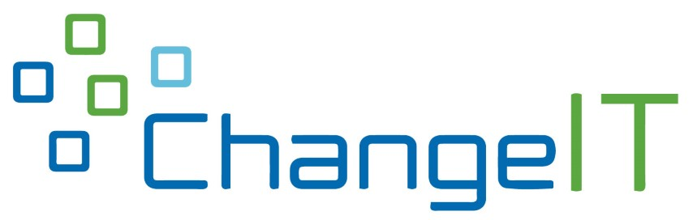
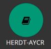
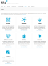

# Kapitel 1: Vorstellung des Modellunternehmens

In diesem Kapitel ...

- ... wird das Modellunternehmen, für das Sie im Lernfeld 2 arbeiten, vorgestellt.

---

## ChangeIT GmbH kennenlernen

Das IT-Systemhaus ChangeIT GmbH ist seit mehreren Jahren auf dem IT-Markt etabliert und behauptet sich dort aktuell sehr erfolgreich gegen mehrere Wettbewerber. Herr Sinter hat das Unternehmen 1997 gegründet und führt es seither alleine als eingetragener Kaufmann.

!!! note "Zusätzliches Material, weitere Übungen & Tipps"

    Die folgenden Übungen und Tipps & Tricks dienen Ihrer persönlichen Wiederholung und Vorbereitung auf Klassenarbeiten, Prüfungen etc. Die Übungen werden im Rahmen des Unterrichts nicht besprochen, es sei denn Sie haben konkrete Fragen hierzu.  *Ich kann, weil ich will, was ich muss! (Immanuel Kant)*

## Zusatzmaterial

| HERDT Campus AYCR | Adobe Creative Cloud | Tool-Sammlung kits |
| :--- | :--- | :--- |
|  |  |  |
| Im HERDT Campus AYCR finden Sie viele PDF-Skripte zu Unterrichtsthemen. Der Zugriff auf den Service ist für Schüler:innen an den MMBbS inklusive. Sie können die Verlagsseite über Ihre Landingpage erreichen. | Wenn Sie Handlungsergebnisse grafisch darstellen oder eine visuelle Übersicht anlegen wollen, greifen Sie gerne auf das Adobe CC zurück, welches Ihnen an den MMBbS angeboten wird. Zur Ersteinrichtung haben Sie eine E-Mail erhalten. Der Blick für Anfänger in Adobe Express lohnt sich. | Auf der Webseite von kits (Kompetent in Technik und Sprache) gibt es eine Zusammenstellung diverser Tools wie dem QR-Code-Generator, einem kollaborativen Mindmap-Tool (TeamMapper), einem Etherpad und einigen mehr. |
| [zur Landingpage](https://www.mm-bbs.de) | [zu Adobe Express](https://www.adobe.com/de/express/) | [zur Sammlung](https://kits.blog/tools/) |

## Lernstrategien & Werkzeuge

### Taschenrechner

Beschaffen Sie sich einen Taschenrechner, wie bspw. den Casio fx 991 DEX, der Zahlensysteme umrechnen kann und arbeiten Sie sich in dessen Funktionsweise ein. Die Vorgaben der IHK lassen einen Taschenrechner zu, der

- nicht programmiert (daher kann man über GTR streiten),
- netzunabängig (also mit Batterien) und
- ohne Kommunikationsmöglichkeit (also auch keine App auf dem Smartphone) ist.

### Taschenrechner Beispiel

In diesem Video wird die Umrechnung von Zahlensystemen am Beispiel des Casio fx 991 DEX gezeigt:

[https://www.youtube.com/watch?v=QE7D-d2goCQ](https://www.youtube.com/watch?v=QE7D-d2goCQ)

---
## GitHub

### GitHub.io - LF2-Kurs als MkDocs-Variante

[https://herr-nm.github.io/MMBbS_KIT_LF02/](https://herr-nm.github.io/MMBbS_KIT_LF02/)

### GitHub.io - Curriculum der kaufmännischen IT-Berufe

[https://herr-nm.github.io/MMBbS_KIT_Curriculum/](https://herr-nm.github.io/MMBbS_KIT_Curriculum/)

---

