# Kapitel 2: IT-Systeme auswählen

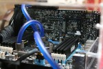

In diesem Kapitel werden Sie ...

- ... Kriterien zur Auswahl eines IT-Systems festlegen.
- ... Vor- und Nachteile unterschiedlicher IT-Systeme recherchieren.
- ... Entscheidungen bei der Auswahl eines IT-Systems für einen Kundenauftrag verbal begründen.

---

## Kompetenz 2.0: Entscheidungen verbal begründen

In Ihrer Ausbildung sind Sie aktuell im Vertriebsinnendienst eingesetzt. Hier unterstützen Sie ein Team, welches die verschiedensten Kundenaufträge für Bestandskunden bearbeitet. Viele Anfragen gehen hier per E-Mail bzw. Kontaktformular ein. Sie sollen für einige der eingegangenen Anfragen Kriterien zusammenstellen und Ihren Kolleginnen und Kollegen einen ersten Vorschlag für IT-Systeme, die zur jeweiligen Kundenanfrage passen, vorlegen. Da Sie sich auch argumentativ zur Begründung Ihrer Auswahl vorbereiten wollen, machen Sie sich auch Gedanken, wie eine Auswahl verbal begründet werden kann.

---

### Arbeitsauftrag A|2.0: Erarbeitung der verbalen Begründung

Sicherlich haben Sie schon einmal für eine private Anschaffung aus verschiedenen Kandidaten auswählen müssen. Bspw. bei der Auswahl einer passenden Smartwatch müssten Sie sich Aspekte überlegen, die Ihnen an einer solchen wichtig sind. Stellen Sie sich nun vor, Sie sollten die Auswahl einem Kollegen gegenüber begründen. Nach welchem Schema könnten Sie hierfür vorgehen, um einer außenstehenden Person zu verdeutlichen, welche Gründe zu der Auswahl geführt haben?

---

## Kompetenz 2.1: IT-Systeme (Hardware) unterscheiden

Die ersten Kundenanfragen werden Ihnen zugewiesen. Dazu haben die Kolleginnen und Kollegen der Abteilung eine Vorauswahl der Anfragen getroffen, um komplexere Systemzusammenstellungen herauszufiltern. Sie nehmen sich nun den Aufträgen der Bestandskunden an, Ihr Ausbilder möchte hierfür Ihre Vorschläge zur Abstimmung vorab erhalten. Als erstes erscheint Ihnen im System die folgende Anfrage der Kaeks OHG.

---

### Informationsmaterial M|2.0: Kundenanfrage - Kaeks OHG

Sehr geehrte Damen und Herren,

für unsere Außeneinsätze benötigen wir neue Hardware. Unsere Kundenbetreuer, die den Hausmeisterdienst ausführen, müssen mit diesem Gerät jederzeit mobil auf unsere Webanwendung zugreifen können, mit der wir die Tagespläne und Aufträge veröffentlichen. Außerdem werden regelmäßig mit dem Gerät E-Mails und Tickets beantwortet.

Da wir häufiger dokumentieren müssen, wie wir eine Einrichtung vorgefunden haben und wie diese nach unseren Dienstleistungen (Reinigung, Reparatur, Möblierung etc.) aussieht, soll mit der Hardware die Protokollierung via Video und Bild einfach möglich sein.

Eine Tastatur ist für uns schwierig zu reinigen, wir würden und über eine Toucheingabe freuen. Dabei darf der Bildschirm nicht zu klein ausfallen. Ferner sollte das Gerät einen Arbeitstag durchhalten und entsprechende Akkulaufzeit / Lademöglichkeit haben.

Nur falls dies möglich und nicht zu kostspielig ist, kam uns noch eine optionale Idee: In der vergangenen Zeit wurden die papierhaften Auftragshefte von unseren Hausmeister- und Reinigungsdiensten manchmal vor Ort vergessen oder gingen verloren. Wäre es aus Datenschutzsicht möglich, das digitale Endgerät im Notfall aus der Ferne zu löschen? Wir haben bei unserer kleinen Recherche das Stichwort "Mobile Device Management" gefunden, können uns aber nichts genaues darunter vorstellen.

Wir freuen uns auf Ihr Angebot und verbleiben

mit freundlichen Grüßen

Stefan Mayer

Kaeks OHG  
E-Mail: s.mayer@kaeks-ohg.de

---

### Arbeitsauftrag A|2.1: IT-Systeme unterscheiden

Da Sie neu in der Vertriebsabteilung sind, empfiehlt Ihr Ausbilder Ihnen, sich vorerst einen Überblick zu den angebotenen IT-Systemen zu verschaffen. Legen Sie eine Mindmap an, in welcher sie die verschiedenen IT-Systeme aufgreifen. Ordnen Sie zwei bis drei Charakteristika zu jedem System zu und wägen Sie Vor- und Nachteile ab, indem Sie jeweils maximal drei hiervon aufnehmen.

1. Falls Sie sich über Mindmaps informieren wollen, sehen Sie sich die Methodeninformation im Kurs unter dieser Aufgabe an. In dieser ist auch erläutert, wie sie den Mindmanager auf dem Terminal-Server aufrufen.
2. Erstellen Sie eine Mindmap zu den IT-Systemen unter Berücksichtigung der Vorgaben s.o.

---

### Informationsmaterial M|2.1: Methodeninformation "Mind Map"

#### Was ist eine Mindmap?
Das Wort "Mindmap" kommt aus dem Englischen und setzt sich aus den Wörtern "mind" und "map" zusammen. "Mind" kann mit "Geist", "Gedanke" oder "Kopf" übersetzt werden. "Map" bedeutet "Karte" – im Sinn von Landkarte oder Stadtplan. Zusammengesetzt ist eine Mindmap also eine Gedankenkarte oder ein Gedankenplan.

So viel zum Wort – viel wichtiger ist natürlich, was eine Mindmap wirklich ist. Das interessiert dich eh viel mehr.

Eine Mindmap ist eine grafische Darstellung zu einem Thema, Vorgang oder einer Assoziation. Meist gibt es ein Wort (Thema), das im Zentrum steht. Von diesem Zentrum gehen mehrere Verbindungen zu anderen Themen ab, von denen wiederum weitere Verbindungen abgehen.

#### Zusammengefasst die Vorteile einer Mindmap

- Themen übersichtlich strukturieren
- Ordnen von komplexen Aufgaben
- Problemlos erweiterbar
- Legt Wissenslücken offen

#### Wie erstellt man eine Mindmap? 5 Schritte zur Mindmap

1. Schreib das Hauptthema zentral auf ein Blatt.
2. Überleg dir, welche Unterthemen zu dem Hauptthema gehören, und ordne die Unterthemen um das Hauptthema an.
3. Zeichne farbige Verbindungen von dem Hauptthema zu den Unterthemen. Beachte, dass jedes Unterthema eine eigene Farbe erhält.
4. Ergänze Begriffe, die zu dem Unterthema gehören, und verbinde sie mit dem Unterthema. Benutze hierfür die gleiche Farbe wie für die Verbindung vom Hauptthema zu diesem Unterthema.
5. Wiederhole die Schritte, bis du alle wichtigen Aspekte eines Themas vollständig auf deiner Mindmap erfasst hast.

*Quelle: Learn Attack - Karmen (o.J.). Mindmap erstellen: In 5 einfachen Schritten zur Mindmap. Link [Stand: 04.10.2022].*

---

### Informationsmaterial M|2.2: IT-Systeme

#### Tablet-PC

Ein Tablet (englisch tablet ‚Schreibtafel‘, US-engl. tablet „Notizblock“) oder Tabletcomputer, Tablet-PC, selten auch Flachrechner, ist ein tragbarer, flacher Computer in besonders leichter Ausführung mit einem Touchscreen, aber, anders als bei Notebooks, ohne ausklappbare mechanische Tastatur. Ein Tablet ist eine spezielle Bauform eines Personal Computers, die zu den Handheld-Geräten zählt.

Aufgrund der leichten Bauart und des berührungsempfindlichen Bildschirms zeichnen sich Tablets durch eine einfache Handhabung aus. Die Geräte ähneln in Leistungsumfang, Bedienung und Design modernen Smartphones und verwenden meist ursprünglich für Smartphones entwickelte Betriebssysteme. Wegen der Bildschirmtastatur, die nur bei Bedarf eingeblendet wird, eignen sich Tablets weniger gut für das Schreiben größerer Textmengen.

Tablets sind meist mit fest verbauten Akkus ausgestattet, die oft nicht einmal von Fachpersonal gewechselt werden können, was dazu führt, dass preisgünstige Geräte, die mit minderwertigen Akkus ausgestattet sind, sehr schnell zu Sondermüll werden können.

Die verkabelte Anbindung an externe Geräte ist nur bei wenigen Tablet-PCs vorgesehen, daher gehören Bluetooth und WLAN zur Standardausstattung. Darüber hinaus werden viele Geräte auch mit einem integrierten Modem (u. a. UMTS oder LTE als Datenfunk) angeboten, sind dann also mobil telefonisch nutzbar, ohne auf ein externes mobiles Modem (etwa über einen USB-Port) angewiesen zu sein.

Tablets werden zunehmend auch für die Fernsteuerung digitaler Geräte eingesetzt, wie zum Beispiel Kameras, AV-Receivern, Fernsehgeräten oder Quadrocoptern.

Der Funktionsumfang eines Tablets kann durch Zusatzprogramme (genannt Apps, von englisch applications) erweitert werden. Einen immer größeren Stellenwert bekommt der Tablet-Journalismus, wobei das Tablet als Informationsmedium benutzt wird, um journalistisch aufbereitete Medieninhalte zu konsumieren oder zum Teil auch selbst zu schaffen.

*Quelle: [https://de.wikipedia.org/wiki/Tabletcomputer](https://de.wikipedia.org/wiki/Tabletcomputer)*

#### Desktop-Computer / Personal Computer

Ein Desktop-Computer, kurz „Desktop“ (entlehnt aus dem englischen desk für „Schreibtisch“ und top für „Oberseite“, also ein Schreibtischrechner), ist ein Computer in einer Gehäuseform, passend für den Einsatz als Arbeitsplatzrechner auf Schreibtischen. Der Begriff wird meist synonym zu Desktop-PC benutzt, es sind also Personal Computer gemeint. 

Ein Personal Computer (engl., zu dt. „persönlicher Rechner“, kurz PC) ist ein Mehrzweckcomputer, dessen Größe und Fähigkeiten ihn für den individuellen persönlichen Gebrauch im Alltag nutzbar machen; im Unterschied zu vorherigen Computermodellen beschränkt sich die Nutzung nicht mehr auf Computerexperten, Techniker oder Wissenschaftler. Das Konzept geht zurück auf eine Idee aus den 1970er Jahren, begründet von Hackern. Die leichte Bedienbarkeit und ein für Privathaushalte erschwinglicher Preis waren wichtige Voraussetzungen für das Konzept, das seit 1976 technisch umgesetzt wird. Erst Geräte dieser Art lösten das aus, was der Journalist Steven Levy als Computerrevolution bezeichnet. Demgegenüber werden Geräte aus einer früheren Zeit vereinzelt bereits Personal Computer genannt, obgleich sie nicht in das Konzept passen.

Ein PC ist ein Mikrocomputer, in Abgrenzung zu einem Minirechner oder Großrechner. Er tritt beispielsweise als Desktop-, Notebook- oder Tablet-Computer in Erscheinung und kann unter einem beliebigen Betriebssystem laufen, wie Windows, iOS oder Unix. Das Spektrum reicht vom Bereich des Heimcomputers bis hin zum typischen Arbeitsplatzrechner. Überdurchschnittlich leistungsfähige Arbeitsplatzrechner für rechen- und speicherintensive Anwendungen werden als Workstation bezeichnet; ihr Preis kann ein Vielfaches eines PC betragen.

Obwohl bereits in den 1970er Jahren üblich, wurde der Begriff „Personal Computer“, vor allem dessen Kurzform „PC“, ab 1981 im Sprachgebrauch zunehmend und exklusiv mit dem IBM Personal Computer und dessen IBM-kompatiblen PC-Nachbauten verknüpft. Das war dem Marketing von IBM mit seiner erfolgreichen Werbung geschuldet. Die Verknüpfung bezog sich auf die darin verbaute x86-Prozessor-Familie und der darauf laufenden Betriebssysteme DOS und Windows. Darüber hinaus wird der Begriff vereinzelt mit der Bauart eines x86er-Desktop-PC assoziiert, was jedoch im Widerspruch steht zur Bauart und den Bezeichnungen alternativer x86er-PC-Geräte, wie dem Microsoft Tablet-PC.

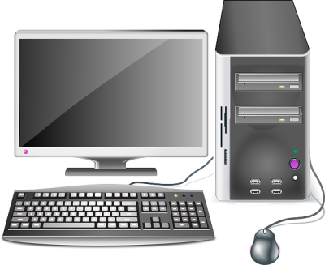

*Quellen:*

- *[https://de.wikipedia.org/wiki/Desktop-Computer](https://de.wikipedia.org/wiki/Desktop-Computer)*  
- *[https://de.wikipedia.org/wiki/Personal_Computer](https://de.wikipedia.org/wiki/Personal_Computer)*

#### Smartphone

Smartphone (englisch, etwa „schlaues Telefon“) nennt man ein Mobiltelefon (umgangssprachlich Handy) mit umfangreichen Computer-Funktionalitäten und Konnektivitäten. Der Begriff dient der Abgrenzung von herkömmlichen („reinen“) Mobiltelefonen. Frühe Smartphone-Vorläufer vereinigten etwa Ende der 1990er Jahre die Funktionen eines Personal Digital Assistant (PDA) bzw. Organizers, mit dem man z. B. Kontakte und seinen Kalender verwalten konnte, mit der Funktionalität eines reinen Mobiltelefons. Später wurden dem kompakten Gerät auch noch die Funktionen eines transportablen Medienabspielgerätes, einer Digital- und Videokamera und eines GPS-Navigationsgeräts hinzugefügt. Zentrale Merkmale sind Touchscreens zur Bedienung sowie Computer-ähnliche Betriebssysteme. Ein Internetzugang ist wahlweise per mobiler Breitbandverbindung des Mobilfunkanbieters oder WLAN möglich.

Die ersten Smartphones gab es bereits in den späten 1990er Jahren, aber erst ab der Einführung des iPhones im Jahr 2007 gewannen sie nennenswerte Marktanteile. Der Begriff Smartphone stammt von der Firma Ericsson, welche ihr Modell R380 mit Touchscreen, Internetbrowser und Kalender um die Jahrtausendwende so nannte. Heute sind die meisten verkauften Mobiltelefone Smartphones. Durch den permanent mitgeführten Internetzugang löste dies einen Wandel im Internet-Nutzungsverhalten aus, insbesondere bei sozialen Netzwerken wie Facebook, und ermöglichte neue Kommunikationsformen über Dienste wie WhatsApp und Instagram. Als das meistverbreitete Smartphone-Betriebssystem setzte sich in den 2010er-Jahren das inzwischen von fast allen Herstellern verwendete Android durch (Marktanteil gemäß IDC im Jahr 2019 86,6 %), mit einigem Abstand gefolgt von dem nur auf Apple-Geräten eingesetzten Apple iOS (Marktanteil im Jahr 2019 13,4 %).

*Quelle: [https://de.wikipedia.org/wiki/Smartphone](https://de.wikipedia.org/wiki/Smartphone)*

#### Server

Ein Hardware-Server (Hostrechner) ist ein Computer, auf dem ein oder mehrere Server (Software) laufen.

Als Hostrechner (auch Host-Rechner, Hostcomputer oder Host-Computer; Lehnübersetzungen von englisch host computer), kurz Host, wird ein in ein Rechnernetz eingebundener Computer mit zugehörigem Betriebssystem bezeichnet, der Clients bedient oder Server beherbergt (also Dienste bereitstellt).

Geschichtlich betrachtet bezeichnet der Ausdruck Host zunächst einen Mehrbenutzer-Rechner, der mit Hilfe von Anwendungen im Hintergrund Rechenleistung für Terminals erbringt.[1] Nachdem in den 1980er Jahren Rechnernetze den Alltag eroberten, wurde der Ausdruck auch für in ein Rechnernetz eingebundene Rechner verwendet, die Dienstleistungen für meist kleinere oder weniger leistungsfähige Systeme erbringen.

Neben mächtigeren Betriebssystemen können auch weniger mächtige Systeme – für Minirechner oder auch Netzwerkgeräte, wie Router und Druckerserver als Host dienen. Beispielsweise ist jedes System, das seine Netzwerkkonfiguration durch das Dynamic Host Configuration Protocol (DHCP) beziehen kann, Client eines DHCP-Servers.

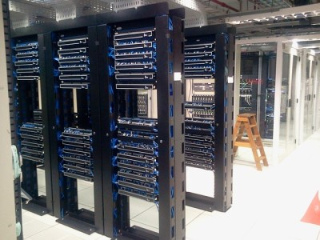

*Quellen:*

- *[https://de.wikipedia.org/wiki/Server](https://de.wikipedia.org/wiki/Server)*  
- *[https://de.wikipedia.org/wiki/Hostrechner](https://de.wikipedia.org/wiki/Hostrechner)*

#### All-in-one-Computer

Unter einem All-in-one-Computer versteht man einen stationären Computer, bei dem Hauptplatine und Monitorteil in einem gemeinsamen Gehäuse untergebracht sind. Außerdem wird der Begriff auf Desktop-Computer eingeschränkt, da er auf alle mobilen Geräte wie Notebooks, Tablet-Computer und Portables konzeptbedingt immer zutrifft.

Ein wichtiger Vorteil dieser Bauweise ist, dass die fehlerträchtige und oft unansehnliche Verkabelung weitgehend entfällt. Zusätzlich verringert sich der Stromverbrauch gegenüber Einzelkomponenten, wenn bei der Konstruktion auf Notebookkomponenten oder zumindest verbrauchsreduzierte Komponenten zurückgegriffen wird. Diese sind in der Regel allerdings etwas leistungsschwächer, produzieren aber auch weniger Abwärme, sodass auf störend laute Lüfter oft verzichtet werden kann.

Wenn ein optisches Laufwerk fehlt, muss bei Bedarf auf ein externes Laufwerk mit Anschluss per USB zurückgegriffen werden.

Der in den 2000er-Jahren wieder zunehmende Erfolg Apples auf dem Verbrauchermarkt, nicht zuletzt populären Produkten wie dem iPod und iPhone geschuldet, verleitete auch andere Hersteller wie etwa Asus, Dell oder Sony ab etwa 2010 dazu, nun ebenfalls PCs in einer platzsparenden All-in-one-Konstruktion anzubieten. Anders als Apple integrieren viele dieser Hersteller zusätzlich einen Touchscreen in ihre Produkte.

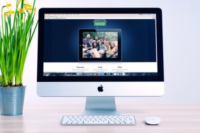

*Quelle: [https://de.wikipedia.org/wiki/All-in-one-Computer](https://de.wikipedia.org/wiki/All-in-one-Computer)*

#### Notebook

Ein Notebook (englisch notebook ‚Notizbuch‘) oder Laptop (vom englischen ‚laptop‘ wörtlich für „auf dem Schoß“, übertragen „Schoßrechner“), selten auch Klapprechner, ist eine spezielle Bauform eines Personal Computers, die zu den Mobilgeräten zählt. Sie besitzt folgende grundlegende Eigenschaften:

- In einem flachen rechteckigen Gehäuse ist auf der Oberseite eine Tastatur flächenbündig integriert. Diese weist im alphanumerischen Bereich den von der ISO 9241-410:2012-12 für effizientes Tippen geforderten Tastenmittenabstand von 19 mm auf (bei kleineren Tasten spricht man von einem Subnotebook) und hat eine Tastaturbelegung gemäß ISO/IEC 9995-2, z. B. QWERTZ für den deutschsprachigen Anwendungsbereich.
- An diesem Gehäuse ist ein ähnlich großer Bildschirm beweglich angebracht, der so auf das Gehäuse geklappt werden kann, dass in zugeklapptem Zustand Bildschirmoberfläche und Tastatur innen liegen und das Gesamtgerät so ohne spezielle Schutzanforderungen transportabel wird. Die Gelenke halten durch Haftreibung den aufgeklappten Bildschirm in jeder Position ohne weitere mechanische Stützung; das gesamte Gerät bleibt dabei stets kippsicher, da die gewichtsintensiven Bauteile zusammen mit der Tastatur im Grundgehäuse angeordnet sind.
- Das Gerät ist standortunabhängig verwendbar. Die Stromversorgung erfolgt durch Akkumulatoren.

Von der Größe und Leistungsfähigkeit her liegen Notebooks nach heutigen Maßstäben zwischen den größeren Desktop-Computern und den kleineren Tablets. In 2010er Jahren sind Notebooks von der Leistung nahe an die klassischen Desktop-Computer herangekommen und haben ihnen Marktanteile abgenommen.

*Quelle: [https://de.wikipedia.org/wiki/Notebook](https://de.wikipedia.org/wiki/Notebook)*

#### Einplatinencomputer

Ein Einplatinencomputer, oft engl. single-board computer (SBC), ist ein Computersystem, bei dem sämtliche zum Betrieb nötigen elektronischen Komponenten auf einer einzigen Leiterplatte zusammengefasst sind. Typischerweise ist das Netzteil als einzige Komponente separat untergebracht. Sie werden in vielen Anwendungsgebieten eingesetzt – z. B. in der Industrie, in elektronisch gesteuerten Gebrauchsgegenständen und im Privat- und Hobbybereich.

Bis in die 1990er-Jahre wurden 8-Bit-Einplatinencomputer, z. B. mit Intel-8085-Prozessor, Intel-MCS-51-Mikrocontrollern und ihren Nachfolgern, zu Mess-Steuer-Regel-Zwecken (MSR) eingesetzt. Heute werden Einplatinenrechner mit leistungsfähigeren Microcontrollern bestückt und decken den unterschiedlichen Bedarf für Haushalts-, Industrie-, Automobil- und Militärzwecke als Eingebettetes System ab. Der Trend geht dazu, immer mehr Funktionen (Standardschnittstellen, A/D-Wandler usw., bis hin zu kompletten WLAN-Funktionen inkl. TCP/IP-Stack) des Einplatinencomputers direkt auf demselben Chip wie die CPU zu integrieren (siehe System-on-a-Chip). Dadurch kann bei steigender Funktionalität der Stückpreis dieser Rechner gesenkt werden.

Zu den bekannten aktuellen Einplatinenrechnern für Endnutzer zählen Arduino, BeagleBoard, Cubieboard, Ethernut, PandaBoard, Raspberry Pi, Tinkerforge, Banana Pi, pcDuino, Orange Pi, ODROID, NanoPC, HummingBoard und der für Bildungszwecke konzipierte BBC micro:bit. Solche Rechner werden etwa als Musik-Streaming-Client, Media Center, Thin Client oder Server, als Steuerungsplatine in einem Quadrocopter, als Wetterstation, UKW-Radiosender oder als Steuereinheit für dedizierte Bitcoin-Mining-Hardware verwendet.

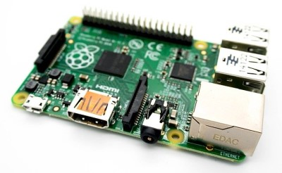

*Quelle: [https://de.wikipedia.org/wiki/Einplatinencomputer](https://de.wikipedia.org/wiki/Einplatinencomputer)*

#### Mikrocontroller

Als Mikrocontroller (auch µController, µC, MCU) werden Halbleiterchips bezeichnet, die einen Prozessor und zugleich auch Peripheriefunktionen enthalten. In vielen Fällen befindet sich auch der Arbeits- und Programmspeicher teilweise oder komplett auf demselben Chip. Ein Mikrocontroller ist ein Ein-Chip-Computersystem. Für manche Mikrocontroller wird auch der Begriff System-on-a-Chip oder SoC verwendet.

Auf modernen Mikrocontrollern finden sich häufig auch komplexe Peripheriefunktionen wie z. B. CAN- (Controller Area Network), LIN- (Local Interconnect Network), USB- (Universal Serial Bus), I²C- (Inter-Integrated Circuit), SPI- (Serial Peripheral Interface), serielle oder Ethernet-Schnittstellen, PWM-Ausgänge, LCD-Controller und -Treiber sowie Analog-Digital-Umsetzer. Einige Mikrocontroller verfügen auch über programmierbare digitale und/oder analoge bzw. hybride Funktionsblöcke.

Ein Beispiel ist der Arduino: Die Hardware eines typischen Arduino-Boards basiert auf einem Atmel-AVR-Mikrocontroller aus der megaAVR-Serie, wie etwa dem ATmega328. Abweichungen davon gibt es unter anderem bei den Arduino-Boards Arduino Due (ARM Cortex-M3 32-Bit-Prozessor vom Typ Atmel SAM3X8E), Yún, Tre, Gemma und Zero, wo andere Mikrocontroller von Atmel eingesetzt werden. Eine Besonderheit stellen zudem die Arduino-Boards Yún und Tre dar, die zusätzlich zum Mikrocontroller einen stärkeren Mikroprozessor besitzen. Alle Boards werden entweder über USB (5 V) oder eine externe Spannungsquelle (7–12 V) versorgt und verfügen über einen 16-MHz-Schwingquarz. Es gibt auch Varianten mit 3,3 V-Versorgungsspannung und Varianten mit abweichendem Takt. Über Erweiterungen können auch andere Mikrocontroller, etwa der ESP8266, über die Arduino-IDE programmiert werden.

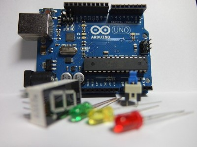

*Quellen:*

- *[https://de.wikipedia.org/wiki/Mikrocontroller](https://de.wikipedia.org/wiki/Mikrocontroller)*  
- *[https://de.wikipedia.org/wiki/Arduino_(Plattform)](https://de.wikipedia.org/wiki/Arduino_(Plattform))*

#### Network Attached Storage (NAS)

Network Attached Storage (NAS, englisch für netzgebundener Speicher) bezeichnet einfach zu verwaltende Dateiserver. Allgemein wird ein NAS eingesetzt, um ohne hohen Aufwand unabhängige Speicherkapazität in einem Rechnernetz bereitzustellen.

Heutige Personal Computer (PCs) verfügen normalerweise über einen Festplattenspeicher, der direkt in das Gehäuse des Computers eingebaut ist, und legen dort ihre Verzeichnisse und Dateien ab. Man spricht von lokalem Speicher (Local Storage), der im Regelfall nur den Nutzern zur Verfügung steht, die unmittelbar am Computer arbeiten.

Soll ein Festplattenspeicher mit den darauf abgelegten Dateien netzweit zur Verfügung stehen, also von allen Rechnern des Netzwerks erreichbar sein, muss das Speichersystem zunächst direkt an das Netzwerk angeschlossen sein und zusätzlich Übertragungsprotokolle beherrschen, welche die Dateien auf diesem Speicherplatz im angebundenen Computernetz zur Verfügung stellen. Diese Funktionalität wird durch dateibasierte Netzwerkprotokolle wie SMB/CIFS und NFS oder blockbasierte Netzwerkprotokolle wie iSCSI bereitgestellt. Man spricht dann von „Speicher, der an ein Netz angeschlossen ist“, also Network Attached Storage oder kurz NAS. NAS-Systeme werden also direkt am Netzwerk angeschlossen und arbeiten autonom, d.h. ohne einen dedizierten PC oder Server zu benötigen. Die Dateisysteme des NAS, also alle dort angelegten Dateien und Verzeichnisse, erscheinen auf dem Zielsystem wie eine eingebundene Freigabe beziehungsweise ein lokales Dateisystem.

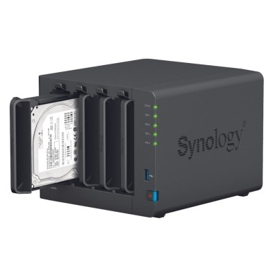

*Quellen:*

- *[https://de.wikipedia.org/wiki/Network_Attached_Storage](https://de.wikipedia.org/wiki/Network_Attached_Storage)*  
- *[Bildquelle NAS](https://www.onlinepc.ch/img/9/7/6/1/0/0/Bild-01---Synology_NAS_w915_h915.jpg)*

#### Peripherie

In der Informatik wird der Ausdruck Peripherie verwendet, wenn von Peripheriegeräten die Rede ist, das sind z. B. alle Geräte, die an die Zentraleinheit angeschlossen sind/werden. Diese Geräte bedürfen der Steuerung durch die Zentraleinheit und gegebenenfalls einer vorherigen Initialisierung. Dies sind zum Beispiel Drucker, Scanner, Tastatur und Maus, aber auch interne Geräte wie Anschlüsse, Laufwerke und Erweiterungskarten.

Peripheriegeräte sind unterteilt in Eingabe- und Ausgabegeräte. Auch Multifunktionsgeräte kann man als eine Art der Peripheriegeräte zählen. Zu Eingabegeräten kann man z. B.: Tastaturen, Mäuse, Scanner und Mikrofone zählen. Zu Ausgabegeräten zählt man Bildschirme, Beamer, Plotter/Drucker und Lautsprecher. Ein Drucker mit Scan-Funktion oder der Touchscreen lassen sich als Multifunktionsgeräte bezeichnen.

*Quellen:*

- *[https://de.wikipedia.org/wiki/Peripherie#Verwendung_in_der_Computertechnik](https://de.wikipedia.org/wiki/Peripherie#Verwendung_in_der_Computertechnik)*  
- *[https://de.wikipedia.org/wiki/Peripherieger%C3%A4t](https://de.wikipedia.org/wiki/Peripherieger%C3%A4t)*

---

Nachdem Sie sich über die unterschiedlichen IT-Systeme informiert haben und deren Charakteristika, Stärken und Schwächen kennen, fühlen Sie sich sicher genug, eine Auswahl für den Kunden Kaeks OHG zu treffen.

---

### Arbeitsauftrag A|2.2: Auswahl eines IT-Systems für die Kaeks OHG

Treffen Sie eine Auswahl für ein IT-System, welches den Kundenauftrag am besten erfüllt. Bereiten Sie außerdem entsprechend Ihrer angestellten Überlegungen zur verbalen Begründung einer Auswahl eine kurze Stellungnahme zur Überzeugung des Ausbilders und des Kunden vor. Verschriftlichen Sie diese in einem Text.

---

## Kompetenz 2.2: IT-Systeme (Software) unterscheiden

Bei der Auswahl des IT-Systems haben Sie zwar eine Kategorie an Geräten als Ergebnis erzielt, allerdings unterscheiden sich die Systeme hinsichtlich ihrer Software. Während von der Kaeks OHG diesbezüglich keine Vorgaben vorlagen, werden in der nächsten Kundenanfrage Wünsche hierzu geäußert.

---

### Informationsmaterial M|2.3: Kundenanfrage - Schneidefuchs Werbeagentur GmbH

Sehr geehrte Damen und Herren,

vielen Dank für das digitale Flipchart, welches Sie uns vergangenen Monat verkauft und eingerichtet haben. Mein Team ist begeistert und auch bei unseren Kunden macht dies einiges her.

Heute melde ich mich bei Ihnen in anderer Sache. Leider löst sich so langsam unser Videoschnitt-Computer, den wir zur Erstellung von Werbefilmen unserer Kunden benötigen, auf. Da wir diesem ja schon im letzten Jahr aktualisierte Komponenten spendiert hatten, ist es wohl an der Zeit einen neuen PC einzusetzen.

Ich habe mit unserem Video-Spezialisten gesprochen und er hat folgende Wünsche:

- der PC soll leistungsstarke Komponenten im High-End-Bereich haben.
- Die Videoschnittsoftware, die wir einsetzen läuft auf MacOS und Windows 10 gut und stabil, wir wollen wenn möglich bei MacOS bleiben.
- Es soll vielfältige Peripherie angeschlossen werden können, daher also moderne Anschlüsse berücksichtigen.

Da wir in der Agentur verschiedenste Geräte einsetzen, haben wir uns für den Client *MS Teams* als Groupware entschieden, ich bin Apple-User, daher meine Frage: Hat der Kollege das korrekt eingeschätzt? Auf welchen Systemen funktioniert die Anwendung? Kann ich außerdem auch die Apps von meinem iPad Pro auf dem System nutzen?

Ach ja und bevor ich es vergesse: Wir brauchen dann auch entsprechende Software-Lizenzen für das Windows und auch für andere Anwendungen. Wie sieht es da bei der Streaming-Software OBS, dem Adobe-CC-Paket und den Microsoft-Anwendungen aus?

Viele Grüße,

Volker Fuchs  
Schneidefuchs Werbeagentur GmbH

---

### Arbeitsauftrag A|2.3: Software- und Systemarten unterscheiden

1. In der Kundenanfrage der Schneidefuchs Werbeagentur GmbH stecken verschiedene Anforderungen. Notieren Sie sich diese übersichtlich.
2. Welche Aspekte muss die Werbeagentur bei der Auswahl eines Betriebssystem bzw. eines Schnittcomputers hinsichtlich der Rechnerarchitektur berücksichtigen?
3. Welche Rechnerarchitekturen gibt es aktuell im Praxis-Einsatz und welche Betriebssysteme können auf diesen jeweils eingesetzt werden?
4. Wie verhält sich der Betrieb von Anwendungssoftware zu einem Betriebssystem bzw. zu einer Rechnerarchitektur? Welche Zusammenhänge gibt es?

---

### Informationsmaterial M|2.4: Rechnerarchitekturen

#### Prozessor-Einsatz bei Apple

##### Von Motorola zu IBM

Ursprünglich setzte Apple auf Prozessoren von Motorola – so kamen Motorola-CPUs des Typs 68000 zum Einsatz. Mit dem PowerMac wechselte der Hersteller im Jahr 1994 auf IBM-Prozessoren mit PowerPC-Architektur. Während die Prozessoren von Motorola einen CISC-Befehlssatz (Complex Instruction Set Computer) verwendeten, kam bei den PowerPC-Modellen ein RISC-Befehlssatz (Reduced Instruction Set Computer) zum Einsatz.

Aufgrund der unterschiedlichen Befehlssätze waren Programme, die für Motorola-CPUs kompiliert wurden nicht mit den neuen PowerPC-Prozessoren kompatibel. Trotzdem konnten unter Apples damaligem Betriebssystem CPUs mit beiden Befehlssätzen verwendet werden. Dafür wurden zum einen viele Programme auf RISC angepasst, zum anderen beherbergte das Betriebssystem einen Emulator von Motorola, auf dem nicht angepasste Programme ausgeführt wurden.

##### Der Sprung zu x86

Der im Jahr 2005 durchgeführte Sprung von PowerPC auf x86 lief analog ab. Apples neues Betriebssystem Mac OS X 10.4 Tiger hatte mit Rosetta einen Emulator an Bord, der es erlaubte, alten PowerPC-Code auszuführen. Die damals verbreiteten Java-Applikationen liefen aufgrund der Java Virtual Machine ohnehin auf beiden Architekturen – wobei es vereinzelte Ausnahmen gab.

Steve Jobs nannte bei der WWDC 2005 gleich mehrere Gründe, wieso Apple zu Intel wechselte. Zum einen sollten die neuen CPUs eine deutlich höhere Leistung pro Watt liefern. Zudem sei es unmöglich gewesen, Frequenzen von über 3 GHz mit PowerPC-Prozessoren zu erreichen. Auch die geplanten – und niemals produzierten – G5 PowerBooks seien nicht umsetzbar gewesen. Von Jobs unerwähnt blieb die neue Möglichkeit, Microsofts Windows, das x86-Prozessoren voraussetzte, als zweites Betriebssystem installieren zu können.

##### MacOS lief schon 5 Jahre auf Intel

Noch mehr als mit der Ankündigung des Wechsels schaffte es Steve Jobs die Zuschauer zur WWDC 2005 mit einer anderen Offenbarung zu überraschen: Schon seit 2001 hatte Apple jede Version von MacOS nicht nur für PowerPC, sondern auch für Intels x86-Architektur kompiliert. Und der iMac, den Jobs für seine Keynote zuvor genutzt hatte, verfügte ebenfalls über einen Pentium 4.

Obwohl Apple viel unternommen hatte, um die Kompatibilität alter Software zu gewährleisten, gab es einige Probleme. Programme, die für PowerPC-Prozessoren unter Mac OS (nicht X) geschrieben wurden, konnten nur mit Hilfe eines Drittanbieter-Emulators, die von Stabilitätsproblemen geplagt waren, ausgeführt werden.

##### Apple wechselt zu ARM

Apple hat auf seiner Entwicklerkonferenz WWDC 2020 den Wechsel von Intel- auf ARM-Prozessoren bei seinen Macs angekündigt. Laut Tim Cook sollen innerhalb von zwei Jahren alle Mac-Modelle auf die ARM-Architektur umgestellt werden. Entwickler haben nun Zeit, ihre macOS-Programme auf die neue Architektur anzupassen, denn der x86-Code für Intel-CPUs wird nicht einfach nativ auf ARM-Hardware laufen.

Für Apps, die auf allen Hardware-Plattformen (Apple Silicon und Intel) laufen, gibt es einen neuen Standard namens Universal 2. Um den Übergang für die Anwender komplikationslos zu gestalten, hat Apple ähnlich wie seinerzeit beim Wechsel von PowerPC zu x86 wieder eine Laufzeitumgebung geschaffen, genannt Rosetta 2. Sie soll bestehende Apps emulieren, bis sie portiert sind. Wie stark das Performance und Kompatibilität beeinflusst, muss sich zeigen. Portiert sind laut Apple bereits Microsoft Office, Photoshop und Final Cut Pro.

Doch was treibt Apple zu diesem Schritt? Waren noch vor einigen Jahren ARM-Prozessoren für Notebooks oder gar Desktops und Server ungeeignet, so hat sich hier einiges getan. Der schnellste Supercomputer der Welt ist zurzeit ein ARM-Rechner.

Eine Datenbreite von 64 Bit erreichen ARM-CPUs schon lange, nunmehr stellen auch die Anbindung von sehr viel Arbeitsspeicher, sehr vielen Rechenkernen und PCI Express kein Problem mehr dar. Thunderbolt 3 könnten die ARM-Macs gleich überspringen und mit USB 4 starten, dessen Spezifikationen Thunderbolt 3 umfassen.

*Quellen:*

- *[https://www.computerbase.de/2020-06/apple-mac-intel-x86-cpu-rueckblick/](https://www.computerbase.de/2020-06/apple-mac-intel-x86-cpu-rueckblick/)*  
- *[https://www.heise.de/news/Apple-wechselt-in-seinen-Mac-von-Intel-auf-ARM-Prozessoren-4791764.html](https://www.heise.de/news/Apple-wechselt-in-seinen-Mac-von-Intel-auf-ARM-Prozessoren-4791764.html)*

#### Unterscheidung von Mikroprozessoren

Man unterscheidet im Wesentlichen zwei Gruppen von Mikroprozessoren:

- CISC-Prozessoren (Complex Instruction Set Computer) - besitzen einen umfangreichen Befehlssatz.
- RISC-Prozessoren (Reduced Instruction Set Computer) - besitzen eine stark reduzierte Anzahl an sehr effizienten Maschinenbefehlen.

Die Anzahl der Hersteller für Mikroprozessoren hat sich im Laufe der Jahre durch Übernahmen, Insolvenzen oder Rückzug aus dem Geschäft verringert. Der Markt wird umkämpft in einem Wettbewerb um ...

- die höchste Taktfrequenz.
- die höchste Verarbeitungsbreite
- die beste Technologie
- den geringsten Energieverbrauch (=Wärmeentwicklung)

des Mikroprozessors.

Die Taktfrequenz in GHz eines Mikroprozessors gibt an, mit welcher Frequenz ein Prozessor maximal getaktet werden kann, und ist ein Maß dafür, wie schnell er die Anweisungen eines Programms abarbeiten kann. Die durchschnittliche Anzahl der pro Sekunde verarbeiteten Anweisungen wird in MIPS (Millions of Instructions per Second) angegeben.

#### Prozessorfamilien

##### 680xx-Familie

Diese Familie ist namentlich mit den Prozessoren der Firma Motorola verbunden und fand hauptsächlich in den Geräten der Firmen Apple, Atari und Commodore Verwendung. Trotz der damals beachtlichen Reichenleitsung fanden diese Rechner - mit Ausnahme der Apple-Computer - im kommerziellen Bereich kaum Verbreitung. Heute hat diese Prozessorenfamilie für Computer keine Bedeutung mehr. Motorola fertigt jedoch noch Mikrocontroller, die vom 68000 abstammen.

##### 80x86-Familie

Diese Familie ist namentlich mit den Prozessoren der Firmel Intel und AMD verbunden, die heute den Markt dominieren. In der Vergangenheit fanden die Prozessoren hauptsächlich in den Computern von IBM und den sogenannten IBM-kompatiblen Geräten Verwendung. Der Begriff "IBM-kompatibel" ist heute kein Werbeattribut mehr.

##### RISC-Prozessoren

Diese Prozessoren wurden durch den PowerPC der Firma Apple oder durch die Archimedes-Reihe der Firma Acorn bekannt. Nach Weiterentwicklung dieses Prozessortyps entstand die Advanced RISC Maschine (ARM), einer der heute in Embedded-Systemen am meisten eingesetzte Mikroprozessor.

---

### Informationsmaterial M|2.5: Betriebssysteme

#### Was ist ein Betriebssystem?

Ein Betriebssystem, auch OS (von englisch operating system) genannt, ist eine Zusammenstellung von Computerprogrammen, die die Systemressourcen eines Computers wie Arbeitsspeicher, Festplatten, Ein- und Ausgabegeräte verwaltet und diese Anwendungsprogrammen zur Verfügung stellt. Das Betriebssystem bildet dadurch die Schnittstelle zwischen den Hardware-Komponenten und der Anwendungssoftware des Benutzers. Betriebssysteme bestehen in der Regel aus einem Kernel (deutsch: Kern), der die Hardware des Computers verwaltet, sowie speziellen Programmen, die beim Start unterschiedliche Aufgaben übernehmen. Zu diesen Aufgaben gehört unter anderem das Laden von Gerätetreibern. Betriebssysteme finden sich in fast allen Arten von Computern: Als Echtzeitbetriebssysteme auf Prozessrechnern und Eingebetteten Systemen, auf Personal Computern, Tabletcomputern, Smartphones und auf größeren Mehrprozessorsystemen wie z. B. Servern und Großrechnern.

Die Aufgaben eines Betriebssystems lassen sich wie folgt zusammenfassen: Benutzerkommunikation; Laden, Ausführen, Unterbrechen und Beenden von Programmen; Verwaltung und Zuteilung der Prozessorzeit; Verwaltung des internen Speicherplatzes für Anwendungen; Verwaltung und Betrieb der angeschlossenen Geräte; Schutzfunktionen z.B. durch Zugriffsbeschränkungen.

Das Unternehmen StatCounter analysiert die Verbreitung von Endanwender-Betriebssystemen anhand von Zugriffsstatistiken diverser Websites. Sehr viele Jahre war Windows an der Spitze, bis es laut StatCounter 2017 von Android überholt wurde.

Die laut StatCounter am weitesten verbreiteten Endanwender-Betriebssysteme sind:

| | 2018 | 2017 |
| :--- | :--- | :--- |
| 1. | Android | 38,97 % | 31,76 % |
| 2. | Windows | 37,07 % | 43,82 % |
| 3. | iOS | 13,18 % | 11,71 % |
| 4. | macOS | 5,24 % | 5,09 % |
| 5. | Linux | 0,76 % | 0,94 % |
| | nicht identifizierte OS | 2,72 % | 3,64 % |
| | andere Betriebssysteme | 2,06 % | 3,03 % |  

#### Was ist eine Plattform?

Eine Plattform ist eine bestimmte Kombination aus Hardware und Betriebssystem, auf der ein Softwareprogramm ausgeführt wird. Im Endverbraucherbereich unterscheidet man beispielsweise zwischen den folgenden Plattformen: PC (IBM-PC kompatible Computer, auf denen Microsofts DOS-System oder Windows läuft, Mac (Apple Macintosh-Rechner mit dem Apple-eigenen Betriebssystem OS oder OS X) und Linux/Unix. Software-Anwendungen sind oft in unterschiedlichen Varianten für die verschiedenen Plattformen erhältlich, also in Versionen, die speziell für einen Windows-PC oder einen Apple Mac entwickelt wurden. Viele Softwarepakete sind allerdings auch plattformunabhängig und können auf den unterschiedlichen Betriebssystemen gleichermassen eingesetzt werden.

*Quellen:*

- *[https://www.toptarif.de/internet/wissen/plattform/](https://www.toptarif.de/internet/wissen/plattform/)*
- *[https://de.wikipedia.org/wiki/Betriebssystem](https://de.wikipedia.org/wiki/Betriebssystem)*

---

### Informationsmaterial M|2.6: Anwendungssoftware

#### Was sind Anwendungen?

Als Anwendungssoftware (auch Anwendungsprogramm, kurz Anwendung oder Applikation; englisch application software, kurz App) werden Computerprogramme bezeichnet, die genutzt werden, um eine nützliche oder gewünschte nicht systemtechnische Funktionalität zu bearbeiten oder zu unterstützen. Sie dienen der „Lösung von Benutzerproblemen“. Beispiele für Anwendungsgebiete sind: Bildbearbeitung, E-Mail-Programme, Webbrowser, Textverarbeitung, Tabellenkalkulation oder Computerspiele.

Aus dem englischen Begriff application hat sich in der Alltagssprache auch die Bezeichnung Applikation, kurz App, eingebürgert. Im deutschen Sprachraum wird die Abkürzung App seit dem Erscheinen des iOS App Store (2008) fast ausschließlich mit mobiler App gleichgesetzt, also Anwendungssoftware für Mobilgeräte wie Smartphones und Tabletcomputer. Allerdings wird inzwischen Desktop-Anwendungssoftware ebenfalls App genannt, zum Beispiel bei Microsofts Betriebssystem Windows seit Windows 8 (Windows-Apps), das sowohl auf Desktop-PCs als auch Tablets eingesetzt wird, oder bei Apples Betriebssystem macOS mit dem Mac App Store.

Anwendungssoftware steht (nach ISO/IEC 2382) im Gegensatz zu Systemsoftware und Dienstprogrammen. Dazu „zählen die Programme, die für den korrekten Ablauf einer Rechenanlage erforderlich sind, sowie alle Programme, die die Programmerstellung unterstützen, z. B. Übersetzer und Testwerkzeuge und allgemeine Dienstleistungen bereitstellen [… Formatierung, Dateiverwaltung, Datentransfer …]“,[2] die aber keinen Endbenutzer-bezogenen ‚Nutzen‘ bringen. Beispiele sind das Betriebssystem, Compiler für verschiedene Programmiersprachen oder Datenbanksysteme.

Anwendungssoftware kann sowohl lokal auf einem Desktop-Computer (Desktop-Anwendung) bzw. auf einem Mobilgerät installiert sein oder auf einem Server laufen, auf den vom Desktop-Computer bzw. Mobilgerät zugegriffen wird (Client-Server- bzw. Webanwendung). Sie kann, abhängig von der technischen Implementierung, im Modus Stapelverarbeitung oder im Dialogmodus (mit direkter Benutzer-Interaktion) ausgeführt werden. Diese beiden Unterscheidungen gelten aber für alle Computerprogramme, grundsätzlich auch für Systemsoftware.

#### Plattformunabhängigkeit

Plattformunabhängigkeit ist die Eigenschaft eines Programms, mit unterschiedlichen Hard- und Software-Konstellationen kompatibel zu sein, z.B. unterschiedliche Betriebssysteme wie Windows, Unix oder Mac OS oder Rechnerarchitekturen wie Macintosh oder PC.

Dabei lässt sich der Grad der Plattformunabhängigkeit an der Quellcode -Portabilität messen, d.h. wie groß der Aufwand ist, ein Programm auf anderen Plattformen lauffähig zu machen. Ist dazu kein Aufwand nötig, so ist eine hundertprozentige Plattformunabhängigkeit gegeben.

Es gibt verschiedene Methoden, eine Anwendung plattformunabhängig zu gestalten. Zum einen kann der Quellcode durch eingebaute Anweisungen, die es erlauben, Unterschiede der Betriebssysteme auszugleichen, frei übertragbar gemacht werden. Derartige Programme liegen meist in vorgefertigten Versionen für verschiedene Plattformen vor. Zum anderen können Programme in Paketen vorliegen, die, basierend auf der Quellcode-Portabilität, mehrere lauffähige Versionen ein- und desselben Programms enthalten ("Fat Binaries"). Das Betriebssystem startet dabei automatisch die Installationsroutine der entsprechend kompatiblen Version des Programms.

*Quellen:*

- *[https://de.wikipedia.org/wiki/Anwendungssoftware](https://de.wikipedia.org/wiki/Anwendungssoftware)*  
- *[https://www.e-teaching.org/projekt/nachhaltigkeit/plattform/index_html/html2print](https://www.e-teaching.org/projekt/nachhaltigkeit/plattform/index_html/html2print)*

---

### Arbeitsauftrag A|2.4: Lizenzmodelle unterscheiden

Im Kundenauftrag der Schneidefuchs Werbeagentur werden Ihnen verschiedene Anforderungen benannt. Mit dem Fokus auf die Softwarelizenzen sollen weitere Fragen geklärt werden:

1. Wonach werden Softwarelizenzen unterschieden?
2. Welche Lizenzen sind für Adobe Audition verfügbar?
3. Wie ist die Lizenz von Audacity einzuordnen?
4. Inwiefern unterscheiden sich Adobe Audition sowie Audacity mit Blick auf die Softwarelizenzen?

---

### Informationsmaterial M|2.7: Softwarelizenzen

#### Softwarelizenzen nach Offenheit des Quellcodes

##### Public Domain

Public Domain oder auch „gemeinfrei“ bedeutet einen völligen Verzicht des Urhebers auf sein Urheberrecht und somit eine kostenlose und uneingeschränkte Nutzung und Weiterverwendung der Software. Da in Deutschland, ein Verzicht auf das Urheberrecht nicht möglich ist, kann hier keine Public Domain Software entstehen. Public Domain Software aus anderen Ländern kann jedoch entsprechend genutzt werden.

##### Freie Software

Bei freier Software kann nicht nur die Software kostenlos genutzt und weiterverbreitet werden, sondern der Urheber ist verpflichtet den Quellcode offenzulegen. Der Lizenznehmer darf diesen Quellcode dann nicht nur einsehen, sondern auch verändern und den geänderten Quellcode und die daraus resultierende Software weiterverbreiten.

##### Open Source

Der Begriff Open Source wird oft mit freier Software gleichgesetzt, er beschreibt allerdings nur die Offenheit des Quellcodes und garantiert keine kostenlose Nutzung. Weitere Einzelheiten zu Open Source Lizenzen siehe Open Source.

##### Freeware

Der Begriff Freeware sollte nicht mit freier Software verwechselt werden, denn es handelt sich hierbei um Software, die kostenlos genutzt werden darf, deren Quellcode meist jedoch nicht öffentlich ist.

##### Donationware

Donationware ist eine Unterart der Freeware. Die Nutzung der Software ist grundsätzlich kostenlos, es wird jedoch um eine Spende gebeten, um die Urheber finanziell zu unterstützen und somit die Entwicklung der Software zu erleichtern.

##### Shareware

Bei Shareware handelt es sich um Software, die kostenlos getestet und weiterverbreitet werden darf. Die Testphase ist entweder zeitlich begrenzt, oder die Testversion ermöglicht nur die Nutzung eines Teils der Funktionalität der Software. Zur uneingeschränkten Nutzung einer solchen Software ist der Erwerb einer kommerziellen Lizenz nötig.

#### Kommerzielle Software

Bei Software unter einer kommerziellen Lizenz erwirbt der Lizenznehmer nur das Recht der Nutzung der Software. Der Erwerb einer solchen Lizenz ist meist entgeltlich, kann jedoch auch kostenlos erfolgen. Ein Beispiel für den kostenlosen Erwerb von kommerzieller Software sind akademische Allianzen wie MSDNAA von Microsoft. Diese Akademischen Allianzen ermöglichen Lehrenden und Lernenden im Bereich Informatik eine kostenlose Nutzung ihrer Software, um diese daran zu binden.

##### Kommerzielle Lizenzmodelle

Alle Software-Produkte unterliegen bestimmten Lizenzbedingungen. Dabei gibt es reine Nutzungslizenzen, die im Wesentlichen aus „einem Stück Papier“ bestehen, sowie Lizenzen, die zur Überprüfung der Einhaltung der Lizenzbedingungen technische Methoden einsetzen.

Bei reinen Nutzungslizenzen erkennt der Lizenznehmer durch Unterzeichnen des Vertrages bzw. einfach durch Nutzung der Software die Vertragsbedingungen an und verpflichtet sich, diese einzuhalten. Eine technische Kontrolle zur Einhaltung der Lizenzbestimmungen besteht nicht. Nutzungslizenzen können in unterschiedlicher Ausprägung angeboten werden. Einige der weit verbreiteten Lizenzformen in diesem Bereich sind:

##### Freie Software

Die Software darf – in der Regel unentgeltlich - von jedem genutzt werden, der die Vertragsbedingungen anerkennt.

##### Einzelplatzlizenz

Viele Softwareprodukte müssen für jeden Rechner, auf dem sie zum Einsatz kommen, extra lizenziert werden. Eine Lizenz darf nicht auf mehreren Rechnern genutzt werden.

##### "Concurrent use"-Lizenz

Sie berechtigen zum Einsatz der Software auf beliebigen Dienstrechnern, solange nicht mehr als die gekaufte Anzahl Lizenzen gleichzeitig in Benutzung ist .

##### Campus-, Fakultäts- oder Institutslizenz

Die Software darf auf beliebigen und beliebig vielen Rechnern der vertragsunterzeichnenden Institution (z.B. Universität) eingesetzt werden.

Viele kommerzielle Softwarehersteller setzen Mechanismen ein, welche die vertragsmäßig korrekte Nutzung der Software kontrollieren. Dabei unterscheidet man im Wesentlichen die folgenden Möglichkeiten:

##### Rechnergebundene Lizenz (nodelocked license)

Die Software wird für einen bestimmten Rechner lizenziert und ist an diesen mittels einer Hardware-ID gebunden.

##### Benutzergebundene Lizenz (named user license)

Die Software ist an einen bestimmten Benutzernamen gebunden und kann von jedem beliebigen Dienstrechner von genau diesem Benutzer genutzt werden.

##### Netzwerklizenz (floating license, concurrent use license)

Die Software wird für eine bestimmte Anzahl gleichzeitiger Aufrufe lizenziert. Die Art des Rechners/Betriebssystems ist dabei in der Regel nicht festgelegt.

*Quellen:*

- *[http://www.informatik.uni-oldenburg.de/~iug09/igr/koenigssee.informatik.uni-oldenburg.de_1211/index.php/software/23-lizenzen/78-formen-von-softwarelizenzen.html](http://www.informatik.uni-oldenburg.de/~iug09/igr/koenigssee.informatik.uni-oldenburg.de_1211/index.php/software/23-lizenzen/78-formen-von-softwarelizenzen.html)*  
- *[https://doc.itc.rwth-aachen.de/display/SW/Lizenzmodelle](https://doc.itc.rwth-aachen.de/display/SW/Lizenzmodelle)*

---

### Arbeitsauftrag A|2.5: Auswahl eines IT-Systems für die Schneidefuchs Werbeagentur GmbH

Treffen Sie eine Auswahl für ein IT-System, welches den Kundenauftrag am besten erfüllt. Bereiten Sie außerdem entsprechend Ihrer angestellten Überlegungen zur verbalen Begründung einer Auswahl eine kurze Stellungnahme zur Überzeugung des Ausbilders und des Kunden vor. Verschriftlichen Sie diese in einem Text.

---

## Kompetenz 2.4: Auswahl eines IT-Systems

Nachdem Sie bereits gemeinsam mit Ihrem Ausbilder Gespräche mit zwei Kunden geführt und diesen Ihre Empfehlungen erläutert haben, wurde schon eine Anfrage in eine Bestellung weitergeführt.

Der Betriebsrat der Change-IT GmbH, den Sie auch am Kennlerntag gesprochen haben, kommt nun auf die Abteilung als interner Kunde zu. Ihr Ausbilder findet, es sei eine gute Möglichkeit im nächsten Schritt etwas freier zu Arbeiten und überträgt Ihnen die Verantwortung für die Anfrage und auch die folgenden Gespräche dazu.

---

### Informationsmaterial M|2.10: Interne Anfrage - Gesprächsprotokoll

| Gesprächspartner | Inhalt |
| :--- | :--- |
| **Heiner Paßmann** | Hallo, schön dass Sie mich aufsuchen. Ihr Ausbilder hat schon mit mir gesprochen und mitgeteilt, dass Sie sich um meine Anfrage kümmern werden.|
| **Sie** | Ganz genau, ich bin gespannt, worum es geht. |
| **Heiner Paßmann** | Wie Sie wissen, bin ich als Betriebsrat auch für den Gesundheitsschutz der Belegschaft verantwortlich. Zu diesem Punkt sind nun drei Kollegen auf mich zugekommen und haben sich über die hohen Raumtemperaturen an den Arbeitsplätzen beschwert. Ich kann dazu wenig sagen, da ich noch nie einen Schreibtisch in dem Gebäudeteil hatte. Nun war meine Überlegung, ob wir nicht eine Art Sensor-Box an den Arbeitsplätzen installieren könnten. |
| **Sie** | Das klingt interessant, wie genau stellen Sie sich das denn vor? |
| **Heiner Paßmann** | Nun, erstmal würde ich gerne die Temperatur messen können und der Mitarbeiter soll sehen, ob die Werte ggf. Grenzwerte über- oder unterschreiten. Wir haben da klare interne aber auch rechtliche Rahmenbedingungen, welche hinsichtlich der Raumtemperatur eingehalten werden müssen. Ich stelle mir das mit einer LED-Anzeige an der Box vor, sodass man mit einem Blick sieht, ob der Normalbereich über- oder unterschritten wird. | 
| **Sie** | Ja ok, das sollte machbar sein. | 
| **Heiner Paßmann** | Außerdem kann ich ja schlecht meinen Tag bei den drei Kollegen verbringen, also müsste ich aus meinem Büro oder über mein Smartphone jederzeit die Temperaturwerte ablesen können. |
| **Sie** | Ok, also eine Art Webanzeige der aktuellen Werte. |
| **Heiner Paßmann** | Genau, wenn mich dann einer der Kollegen anspricht oder ich zwischendurch mal schauen will, kann ich das direkt ablesen. Letztendlich sollte die Box nicht so groß sein und der Umwelt zuliebe auch recht energiesparend. |
| **Sie** | Das denke ich auch, die Box soll ja auch auf den Schreibtisch stehen. |
| **Heiner Paßmann** | Ich kann mir das zukünftig auch als größeres Projekt vorstellen. Im Sinne von Smart Home können wir auch Smart Office anstreben. Wenn die Kollegen recht haben, müssten wir ja darauf entsprechend reagieren. Mir schweben da noch weitere Projekte mit der Box vor, suchen Sie erstmal etwas möglichst flexibles aus. Wenn Sie dann eine Zusammenstellung haben, sprechen Sie mich noch einmal an, damit ich eine ungefähre Kostenabschätzung für die interne Kostenstelle habe. Übertreiben Sie es nicht! |
| **Sie** | Nein nein, ich habe die Kosten im Blick. Gut, dann mache ich mich mal an die Suche. Bis bald. |
| **Heiner Paßmann** | Danke, ja bis bald. Nun bin ich gespannt. |

---

### Arbeitsauftrag A|2.6: Auswahl eines IT-Systems für die ChangeIT GmbH

Treffen Sie eine Auswahl für ein IT-System, welches den Kundenauftrag am besten erfüllt. Nutzen Sie hierfür das im Kurs aufgeführte Informationsmaterial mit den Steckbriefen von vier IT-Systemen. Bereiten Sie außerdem entsprechend Ihrer angestellten Überlegungen zur verbalen Begründung einer Auswahl eine kurze Stellungnahme zur Überzeugung des Betriebsrates (als internen Kunden) vor. Verschriftlichen Sie diese in einem Text.

---

### Informationsmaterial M|2.11: IT-Systeme Datenblätter

#### IT-Sytsem A: Desktop PC mit Windows 10

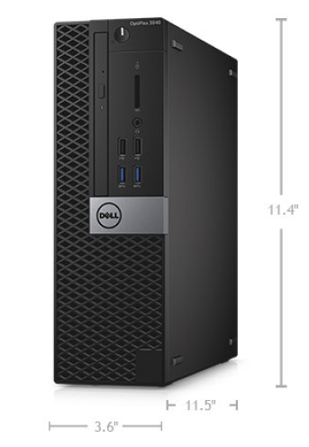

| Bezeichnung | Beschreibung |
| :--- | :--- |
| Hersteller und Produktbezeichnung | Dell OptiPlex 5040 Small Form Factor |
| Maße HxBxT | 29 cm x 9,26 cm x 29,2 cm |
| Prozessor | Intel Core i3-6100 Prozessor |
| Anzahl Prozessorkerne | 2 |
| Taktfrequenz | 3,7 GHz |
| Arbeitsspeicher | 4 GB DDR3L |
| Arbeitsspeicher erweiterbar | ja |
| Festspeicher | 3,5 Zoll, 500 GB (7.200 1/min) |
| Schnittstelle Bildschirm | 2x Display-Port-Anschluss, 1x HDMI-Anschluss |
| USB-Schnittstellen | 6x USB 3.0 (2x vorne, 4x hinten), 5x USB 2.0 (2x vorne, 2x hinten, 1x intern) |
| Netzwerk | LAN: Gigabit-Ethernet (1000 MBit/s, RJ-45-Anschluss), WLAN: keine integrierte Wireless-Funktion |
| Anschlüsse für LEDs und Temperatursensor | indirekt über USB-Adapter möglich |
| sonstige Anschlüsse | 2x PS/2-Anschluss, 1x Universal-Audiobuchse |
| Betriebssystem (Lieferumfang) | Windows 10 |
| Leistung in Watt | 65 W |
| Preis | 500,00 € |

#### IT-System B: Thin Client mit Windows Embedded

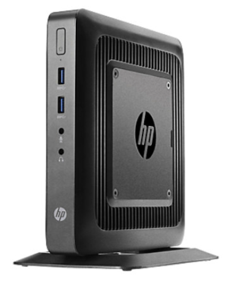

| Bezeichnung | Beschreibung |
| :--- | :--- |
| Hersteller und Produktbezeichnung | HP t620 WES8 64 Bit |
| Maße HxBxT | 20,01 cm x 4,51 cm x 20 cm |
| Prozessor | AMD GX-415GA |
| Anzahl Prozessorkerne | 2 |
| Taktfrequenz | 1,5 GHz |
| Arbeitsspeicher | 4 GB |
| Arbeitsspeicher erweiterbar | keine Information |
| Festspeicher | 32 GB (Flash Speicher) |
| Schnittstelle Bildschirm | 2x Display-Port-Anschluss, 1x VGA-Anschluss |
| USB-Schnittstellen | 2x USB 3.0, 6x USB 2.0 (4x außen, 2x intern) |
| Netzwerk | LAN: Gigabit-Ethernet (1000 MBit/s, RJ-45-Anschluss), WLAN: keine integrierte Wireless-Funktion |
| Anschlüsse für LEDs und Temperatursensor | indirekt über USB-Adapter möglich |
| sonstige Anschlüsse | 1 x Mikrofonbuchse (3,5 mm), 1 x Audio Out (3,5 mm) |
| Betriebssystem (Lieferumfang) | Windows Embedded Standard 8 |
| Leistung in Watt | 65 W |
| Preis | 280,00 € |

#### IT-System C: Mikrocontrollerboard Arduino Uno ohne Betriebssystem (OS)

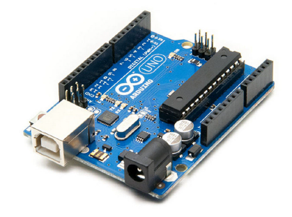

| Bezeichnung | Beschreibung |
| :--- | :--- |
| Hersteller und Produktbezeichnung | Arduino Uno Rev.3 |
| Maße HxBxT | 2,5 cm x 5,5 cm x 8 cm |
| Prozessor | ATmega328 |
| Anzahl Prozessorkerne | 1 |
| Taktfrequenz | 16 MHz |
| Arbeitsspeicher | 8 KB SRAM |
| Arbeitsspeicher erweiterbar | nein |
| Festspeicher | 32 KB Flash |
| Schnittstelle Bildschirm | nicht vorhanden |
| USB-Schnittstellen | eine USB Schnittstelle zur Programmierung des Mikrocontrollers |
| Netzwerk | nicht vorhanden |
| Anschlüsse für LEDs und Temperatursensor | Anschluss über die Buchsenleiste (GPIO und serielle Schnittstellen) auf der Platine möglich, diese können direkt programmiert werden |
| sonstige Anschlüsse | Hohlbuchse zur alternativen Spannungsversorgung |
| Betriebssystem (Lieferumfang) | nicht vorhanden / Bootloader auf dem Mikrocontroller |
| Leistung in Watt | kleiner 5 W |
| Preis | 25,00 € |

#### IT-System D: Einplatinencomputer Raspberry Pi 4 mit Raspbian (Linux)

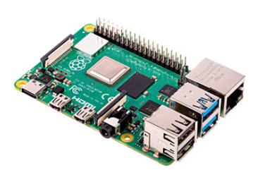

| Bezeichnung | Beschreibung |
| :--- | :--- |
| Hersteller und Produktbezeichnung | Raspberry Pi 4 |
| Maße HxBxT | 2,5 cm x 5,5 cm x 8 cm |
| Prozessor | Broadcom BCM2711 |
| Anzahl Prozessorkerne | 4 |
| Taktfrequenz | 1,5 GHz |
| Arbeitsspeicher | je nach Modell 1, 2, 4 oder 8 GB |
| Arbeitsspeicher erweiterbar | nein |
| Festspeicher | SD-Karte, verschiedene Größen möglich |
| Schnittstelle Bildschirm | 2x Micro HDMI, DSI-Flachband, 4-Poliger 3,5 mm Klinke |
| USB-Schnittstellen | 2x USB 3.0, 2x USB 2.0 |
| Netzwerk | WLAN (2,4 GHz & 5 GHz), Bluetooth (5.0 BLE), RJ-45 Gigabit Ethernet |
| Anschlüsse für LEDs und Temperatursensor | Anschluss über die Buchsenleiste (GPIO und serielle Schnittstellen) auf der Platine möglich, diese können direkt programmiert werden |
| sonstige Anschlüsse | CSI (Camera Flachband), USB-C zur Spannungsversorgung |
| Betriebssystem (Lieferumfang) | Linux Raspbian Buster |
| Leistung in Watt | kleiner 12 W |
| Preis | 38,00 € (mit 2 GB RAM) |

---

## Kompetenz 2.5: Auswahl von verschiedenen IT-Systemen

Neben dem internen Projekt betreuen Sie weiterhin auch externe Kundenanfragen. Als Sie in Ihr Postfach schauen, sehen Sie schon einige Ihnen zugeordnete Aufgaben.

---

### Arbeitsauftrag A|2.7: Auswahl verschiedener IT-Systeme für Kundenanfragen (10% lernprozessbegleitend)

Die nachfolgenden Informationsmaterialien stellen Kundenanfragen für IT-Systeme dar. Dabei sollen Sie auf Basis Ihrer in diesem Kapitel gewonnenen Erfahrungen IT-Systeme auswählen. Ggf. sind kleinere Recherchen notwendig, um eine endgültige Entscheidung zu treffen. Dazu steht Ihnen das Informationsmaterial im Kurs unter den Anfragen zur Verfügung.

Fassen Sie für jeden Fall separat Ihre Entscheidung in einer kurzen verbalen Begründung zusammen.

Bauen Sie diese auf, als wäre es eine E-Mail an den Kunden. Benennen Sie die Datei nach dem Schema "klasse_nachname.pdf" und geben Sie die PDF-Datei innerhalb der Zeitvorgabe in dieser Aufgabe ab.

---

### Informationsmaterial M|2.12: Kundenanfrage - Region Pomburg - Museum für Kunstgeschichte

Sehr geehrte Damen und Herren,

ich bin im Museum für Kunstgeschichte für die IT-Ausstattung verschiedener Arbeitsplätze verantwortlich. Für unseren Empfangstresen benötigen wir eine neue IT-Ausstattung für einen neuen Mitarbeiter. Der Arbeitsplatz ist räumlich (wie unser gesamtes Museum) nicht sehr groß. Daher benötigen wir ein platzsparendes System. Die Anwendungen, die auf dem System laufen sind einerseits das MS Office-Paket und unsere Informations- und Auskunftssysteme, die browserbasiert aufgerufen werden. Ferner werden E-Mails von dem System aus beantwortet.

Wir stellen uns ein Gerät vor, welches in unseren bestehenden Windows-basierten Gerätepark einbinden lässt. Außerdem wünscht sich der Mitarbeiter eine Touch-Eingabemöglichkeit an dem Gerät. Zuletzt sollte noch darauf geachtet werden, dass der Bildschirm der Gerätes eine Diagonale von mindestens 20 Zoll aber maximal 32 Zoll aufweisen darf.

Bitte bieten Sie mir ein System an.

Mit freundlichen Grüßen
Peter Haller

Museum für Kunstgeschichte
der Region Pomburg

---

### Informationsmaterial M|2.13: Kundenanfrage - Hackerspace Stendal e.V.

Guten Tag,

vielen Dank für die Einrichtung des Netzwerkswitches vergangenen Monat, unser Durchsatz hat sich hierdurch wirklich merklich verbessert. Die Mitglieder des Hackerspaces sind vollkommen zufrieden. Nun haben wir aber auch schon das nächste Projekt vor: Bisher lassen wir unsere Webseite über einen Raspberry Pi laufen. Da dieser aber an seine Grenzen stößt und wir auch noch weitere Dienste auf einem neuen Gerät einrichten wollen, benötigen wir eine neue Hardware.

Wir würden auf dem System gerne die Webseite, ein Ticketsystem, ein Benutzermanagement und ggf. zukünftig noch weitere Dienste in unser Netzwerk einbinden. Welche Art von System würden Sie hierfür vorschlagen? Ich freue mich auf eine Antwort Ihrerseits.

Viele Grüße

@HaHase23 aka Jan Pahler
Hackerspace Stendal e.V.

---

### Informationsmaterial M|2.14: Kundenanfrage - ProgIT GmbH

Sehr geehrte Damen und Herren der ChangeIT,

wir, die ProgIT sind seit etwa zwei Jahren Kunde bei Ihnen. Da wir in diesem Jahr zum ersten Mal Fachinformatiker Anwendungsentwicklung ausbilden, benötigen wir Ihre Unterstützung. Wir haben zwar noch eine ausreichende Anzahl an Notebooks für die neuen Azubis, diese müssten aber softwareseitig eingerichtet werden. Da wir aktuell noch unterbesetzt sind und die Auftragslage boomt, würden wir diese Tätigkeit gerne bei Ihnen in Auftrag geben. Welche Option sehen Sie, um die Notebooks für folgende Anwendungszwecke vorzubereiten?

- Einfacher Wechsel zwischen Windows-System und Linux-System
- Übergreifende Entwicklungsumgebung für beide Betriebssysteme
- Möglichkeit, eine Sandbox für das Testen von Software einzurichten

Bitte melden Sie sich bei uns, damit wir uns Abstimmen und wir die Notebooks zu Ihnen bringen können.

Mit freundlichen Grüßen

Saher Mekac
ProgIT GmbH

---

### Informationsmaterial M|2.15: Kundenanfrage - Terminus Automobile GmbH

Sehr geehrte Damen und Herren,

wir sind im Internet auf Ihre Webseite gestoßen und haben von ihrem breiten Service-Angebot gelesen. Die Terminus Automobile GmbH arbeitet aktuell mit klassischen Anwendungen auf Fatclients. Durch den Homeoffice-Druck wollen wir unserer Mitarbeiter zukünftig gerne mit Notebooks ausstatten. Die Hardwareauswahl ist unsererseits eigentlich schon getroffen, allderdings würden wir uns mit Ihnen gerne über die Software austauschen. Wir haben in einer Rubrik Ihrer Webseite vom Everything as a Service gelesen. Würden Sie uns einmal kurz zusammenfassen, was dies bei Ihnen konkret beinhaltet und inwiefern wir dieses Potenzial für uns nutzen können?

Freundliche Grüße

Thomas Hannes
Terminus Automobile GmbH

---

### Informationsmaterial M|2.16: Weitere Informationen zu IT-Systemen

#### Virtualisierung an Einzeplatzsystemen

Der Begriff Virtualisierung ist mehrdeutig. In der Regel verwendet man den Begriff Virtualisierung in der Computertechnik. Typischerweise versteht man unter Virtualisierung die Prozessor-Virtualisierung. Neben der Prozessor-Virtualisierung gibt es auch noch andere Möglichkeiten. Dazu zählt zum Beispiel das Partitionieren von Festplatten oder die Netzwerk-Virtualisierung durch VLAN.

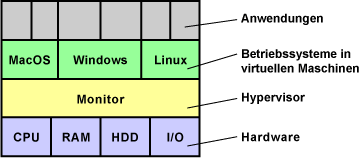

Virtualisierung ist eine Hardware-Unterstützung, die den Betrieb virtueller Computer auf einem echten Computer erleichtert oder beschleunigt. Mit der Virtualisierung kann man mehrere Software-Systeme auf einer Hardware laufen lassen. Das können zum Beispiel unterschiedliche Betriebssysteme sein. Virtualisierung macht dann Sinn, wenn ein Hardware-System nicht ausgelastet ist und die Ressourcen parallel für weitere Systeme genutzt werden sollen.

Da eine steigende Taktfrequenz bei Prozessoren so einfach nicht möglich ist, sind die Prozessorhersteller, insbesondere Intel und AMD, auf alternative leistungssteigernde Techniken für Prozessoren angewiesen. Neben Mehrkern-Prozessoren, Multimedia-Erweiterungen und 64-Bit gelten Virtualisierungs-Funktionen als die bahnbrechende Entwicklung.

##### Gründe für Virtualisierung

- Erhöhung der Ausfallsicherheit
- bessere Auslastung der IT-Systeme durch Konsolidierung der Hardware
- niedrigere IT-Kosten
- geringerer Stromverbrauch

Wichtigstes Merkmal der Virtualisierung ist die Ausfallsicherheit. Wenn eine Applikation sich selbst oder sogar das gesamte Betriebssystem zum Absturz bringt, laufen die anderen virtuellen Maschinen weiter.

Der Betrieb unterschiedlicher Applikationen in mehreren Umgebungen ist die häufigste Anwendung. Zum Beispiel um Applikationen aus Sicherheitsgründen und wegen des Datenschutzes getrennt zu halten. Um aber nicht für jede Applikation eine eigene Hardware bereitstellen zu müssen, werden virtuelle Maschinen geschaffen, auf denen dann die Applikationen getrennt voneinander arbeiten können.

Auf den ersten Blick scheint Virtualisierung nur etwas für Server zu sein. Doch auch normale Anwender können davon profitieren. Zum Beispiel zwei Umgebungen für das Arbeiten mit dem Computer. Die eine ganz normal und die andere bei Verbindung mit dem Internet. Hat sich das Internet-System Würmer oder Viren eingefangen, wird sie gelöscht und neu aufgesetzt. So etwas lässt sich zum Beispiel bei jedem Systemstart automatisieren. So hat man immer ein sauberes System. Das könnte auch soweit gehen, dass unsichere Programme in einer eigenen Umgebung laufen, damit das Betriebssystem von außen nicht angreifbar ist.

##### Virtuelle Maschine

Eine virtuelle Maschine ist ein Software-Container, der einem darin installierten Betriebssystem eine Scheinwelt vorgaukelt, in dem gängige Hardware-Komponenten emuliert werden. Üblicherweise verfügen Betriebssystem über Standard-Treiber mit denen sie die emulierte Hardware ansprechen können.

Virtuelle Maschinen verfügen nur über eine eingeschränkte Grafikleistung. 3D-Software und die Wiedergabe und Bearbeitung von Videos ist in einer virtuellen Maschine nicht ausreichend schnell machbar.

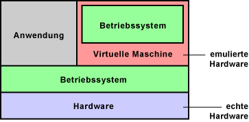

Mit virtuell ist die Hardware gemeint, die dem Betriebssystem in der virtuellen Maschine zur Verfügung steht. Denn CPU, Arbeitsspeicher, Grafikkarte, Laufwerke und Schnittstellen stehen den parallel arbeitenden Betriebssystemen nicht direkt zur Verfügung. Eine im Hintergrund laufende Virtualisierungssoftware überwacht die Zugriffe auf die Hardware. Sie organisiert und verwaltet die virtuellen Maschinen (VM).

Diese Aufgabe kann zum Beispiel ein Hypervisor übernehmen. Er benötigt einen kleinen Teil der Hardware-Leistung, insbesondere von Prozessor und Arbeitsspeicher, um seine Arbeit erledigen zu können.

##### Anwendungen

Virtuelle Computer sind eher selten im Einsatz. Es werden aber schon konkrete Anwendungen diskutiert. Einiges davon ist jetzt schon möglich. Mit einem neuen Software-Zweig ist zu rechnen.

- Software-Entwickler nutzen virtuelle Computer, um ihre Produkte unter verschiedenen Betriebssystemen zu testen.
- Auf Arbeitsplatz-Rechnern könnte man verschiedene Arbeitsumgebungen schaffen. Eine normale Arbeitsoberfläche, eine Oberfläche für den Internet-Zugang und eine für spezielle Hardware-Ressourcen. So lassen sich die verschiedenen Oberflächen gegen Hardware- und Software-Fehler, Viren und Würmern schützen.
- Bestimmte Anwendungen für ältere Betriebssysteme können in einem virtuellen Computer ausgeführt werden. Parallel dazu kann ein aktuelles Betriebssystem mit vollem Leistungsumfang arbeiten.
- Wenn zwei Applikationen sich nicht vertragen, kann man sie unter eigenen virtuellen Umgebungen installieren und ausführen.

##### Virtualisierung in der Server-Umgebung

- bessere Systemauslastung erreichbar
- leichter managebar
- Energiekosten senken -> Umweltrichtlinien einhalten
- höhere Sicherheit und Stabilität
- schneller Anforderungen umsetzen

*Quelle: [https://www.elektronik-kompendium.de/sites/com/1101011.htm](https://www.elektronik-kompendium.de/sites/com/1101011.htm)*

#### Everything as a Service

##### Service-orientierte Architektur

Die Service-orientierte Architektur (SOA) ist ein Architekturkonzept mit dem diverse Internetdienste, durch sogenannte Web Services, angeboten werden können. Web Services sind Softwareanwendungen zur Unterstützung maschinenübergreifender Interaktion. So lautet die Definition der zuständigen Working Group des World Wide Web Consortium. Damit stellen Web Services die Technologie zum Aufbau von verteilten, lose gekoppelten und Service-orientierten Anwendungen dar, die miteinander über ein Netzwerk kommunizieren und zum Anbieten von Diensten verwendet werden.

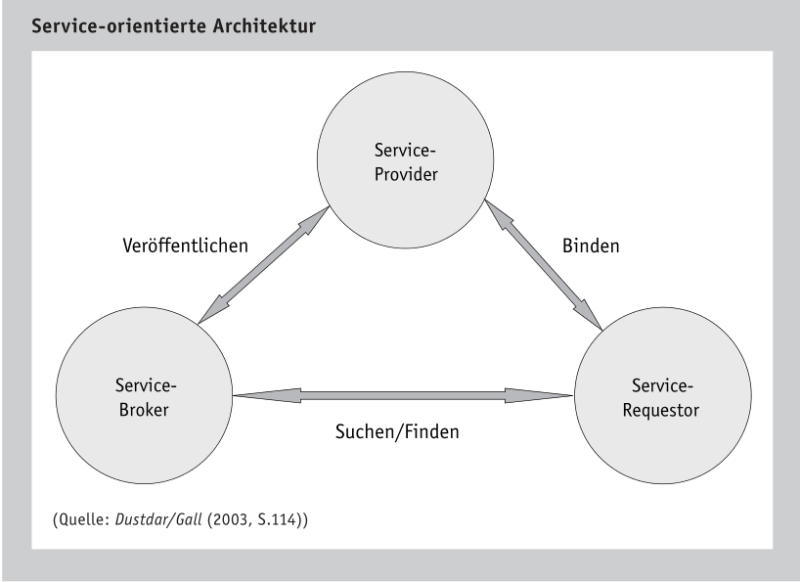

SOA ist wie ein Dreieck aufgebaut und unterscheidet die Rollen Service-Provider, Service-Requestor und Service-Broker. Durch den Service-Provider wird ein Dienst zur Verwendung bereitgestellt. Dieser Dienst wird wiederum bei dem Service-Broker gelistet. Über den Service-Broker kann der Service-Requestor einen bestimmten Dienst finden und einbinden. Ausgeführt wird der Dienst durch den Service-Provider. Somit fällt dem Service-Broker die Rolle des Vermittlers zwischen Service-Requestor und Service-Provider zu.

Die Umsetzung der Funktionsweise einer Service-orientierte Architektur findet sich in Web Services wieder. Dabei kommen unterschiedliche Techniken zum Datenaustausch und der Kommunikation zum Einsatz. Bekannte Protokolle wie das Transportprotokoll HTTP, das File Transfer Protocol (FTP) oder das Simple Mail Transfer Protocol (SMTP) können zur Verwendung von Web Services eingesetzt werden. Zur Speicherung der Dienstbeschreibung setzten Web Services auf XML-Dokumente. Die eingesetzte Beschreibungssprache ist die Web Service Description Language (WSDL), die dem entfernten Client die Nutzungsdetails für den angeforderten Web Service bereitstellt. Somit kann der Service-Provider seine Dienste veröffentlichen. Um einen bestimmten Web Service im Internet ausfindig zu machen, kann die durchsuchbare Datenbank Universal Description, Discovery and Integration (UDDI) verwendet werden.

*Quelle: Schwarzer & Krcmar (2014). Wirtschaftsinformatik. Grundlagen betrieblicher Informationssysteme. Stuttgart: Schäffer-Poeschel.*

##### Everything as a Service-Konzepte

Everything as a Service (XaaS) ist ein Oberbegriff für die Betrachtung sämtlicher Leistungen des Informationsmanagements aus einer dienstleistungsorientierten Perspektive. Die einzelnen Basisfunktionalitäten, Basistechniken und Technikbündel werden als grundlegende Dienstleistung eines Service-Ecosystems aufgefasst. So erlaubt das XaaS-Konzept ein feingranulares Outsourcing in diesen Bereichen. Ein Unternehmen kann z. B. die Bereitstellung der IT-Infrastruktur oder die Datenspeicherung von einem externen Dienstleister übernehmen lassen. Der Service-Anbieter kann, durch die Spezialisierung auf eine Aufgabe, Economies-of-Scale realisieren und somit diese Aufgabe kosteneffizienter ausführen. Einige ausgewählte Konzepte des XaaS werden im Folgenden vorgestellt.

Infrastructure as a Service (IaaS) bezeichnet die Anwendung des XaaS-Konzepts auf die IT-Infrastruktur. So wird die Bereitstellung der Infrastruktur als Dienstleistung angeboten (Hosting). Neben der Auslagerung der operativen Tätigkeit besteht die Möglichkeit, die benötigte Leistung, durch die Nutzung zusätzlicher Ressourcen kurzfristig anzupassen. Prominente Beispiele sind z.B. Amazon Webservices ([http://aws.amazon.com](http://aws.amazon.com)) oder Rackspace Hosting ([http://www.rackspace-hosting.de](http://www.rackspace-hosting.de)).

Das Konzept des Storage as a Service (StaaS) wendet das Konzept der Dienstleistungsorientierung auf die Datenspeicherung an. Durch eine Übernahme der Datenspeicherung durch einen Service-Anbieter können einerseits erneut Flexibilisierungspotenziale ausgeschöpft werden, andererseits kann die Aufgabe der Konzeption und Umsetzung notwendiger Speicherressourcen ausgelagert werden.

Durch das Software as a Service (SaaS)-Konzept wird eine bestimmte Applikation für eine Vielzahl von Servicekonsumenten zur Verfügung gestellt. Der Kunde kann die Software nach Vertragsabschluss einfach nutzen ohne diese selbst installieren oder warten zu müssen. Diese Aufgaben werden von dem Service-Anbieter übernommen. Für SaaS gibt es viele verschiedene Anbieter, wie z. B. Google, die mit der Software Google Docs einen SaaS anbieten, mit dem Tabellen und Textdokumente bearbeitet und verwaltet werden können ([http://docs.google.com](http://docs.google.com)).

Platform as a Service (PaaS) stellt eine Erweiterung des SaaS-Konzepts dar. Statt fertigen Anwendungen werden integrierte Entwicklungs- und Betriebsumgebungen für Software im Internet bereitgestellt. Microsoft stellt etwa mit der Plattform Azure einen solchen Service bereit ([http://www.microsoft.com/windowsazure](http://www.microsoft.com/windowsazure)).

*Quelle: Schwarzer & Krcmar (2014). Wirtschaftsinformatik. Grundlagen betrieblicher Informationssysteme. Stuttgart: Schäffer-Poeschel.*

##### Cloud Computing

Unter Cloud Computing wird ein IT-basiertes Bereitstellungsmodell verstanden, bei dem Ressourcen sowohl in Form von Infrastruktur als auch Anwendungen und Daten, als verteilter Dienst über das Internet, durch einen oder mehrere Leistungserbringer bereitgestellt wird. So wird das Prinzip von Web Services, mit denen komplette Anwendungen aus gekapselten Funktionen über das Internet ausgeführt werden können, erweitert. Diese „Clouds“ sind nach Bedarf flexibel skalierbar und können verbrauchsabhängig abgerechnet werden, d.h. es wird immer die aktuell benötigte Menge an Ressourcen zur Verfügung gestellt.

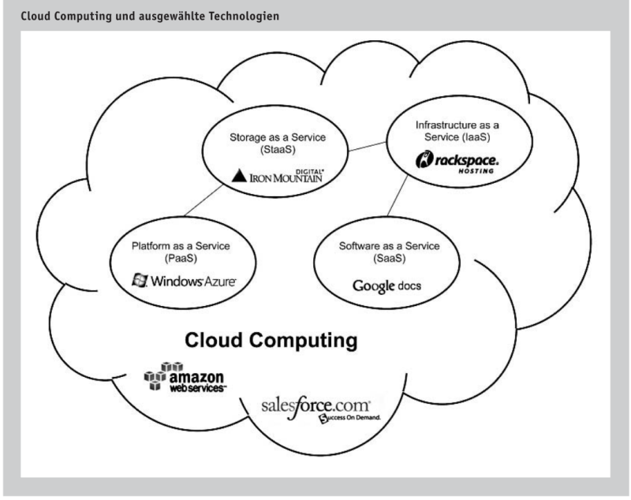

Aus Sicht des Nutzers werden die Ressourcen zentral in der „Cloud“ bereitgestellt. Im Hintergrund können diese aber auch über diverse Cloud-Dienste verstreut sein. Für die Realisation von Cloud Computing kann auf verschiedene XaaS-Verfahren zurückgegriffen werden. Durch XaaS und Cloud Computing lassen sich Vorteile durch eine feingranulare Gestaltung der Auslagerung realisieren. Auf der anderen Seite kann die hohe Beziehungskomplexität mit den verschiedenen Service-Anbietern und die Abhängigkeit zu selbigen ein Unternehmen vor weitere Herausforderungen stellen.

*Quelle: Schwarzer & Krcmar (2014). Wirtschaftsinformatik. Grundlagen betrieblicher Informationssysteme. Stuttgart: Schäffer-Poeschel.*

---

## Weitere Übungen

Sollten Sie sich zu den folgenden Themen noch nicht auskennen, ist die Bearbeitung der Aufgaben / Selbsttests zu den IT-Grundlagen sehr sinnvoll.

---

### Übung UE|2.0: Komponenten im EVA-Prinzip

Interaktives Inhaltselement  
[https://moodle.mm-bbs.de/moodle/mod/hvp/view.php?id=110384](https://moodle.mm-bbs.de/moodle/mod/hvp/view.php?id=110384)

---

### Übung UE|2.1: Info - Aufbau eines Motherboards

The motherboard, also known as the system board or the main board, is the backbone of the computer. As shown in Figure 1, a motherboard is a printed circuit board (PCB) that contains buses, or electrical pathways, that interconnect electronic components. These components may be soldered directly to the motherboard, or added using sockets, expansion slots, and ports.

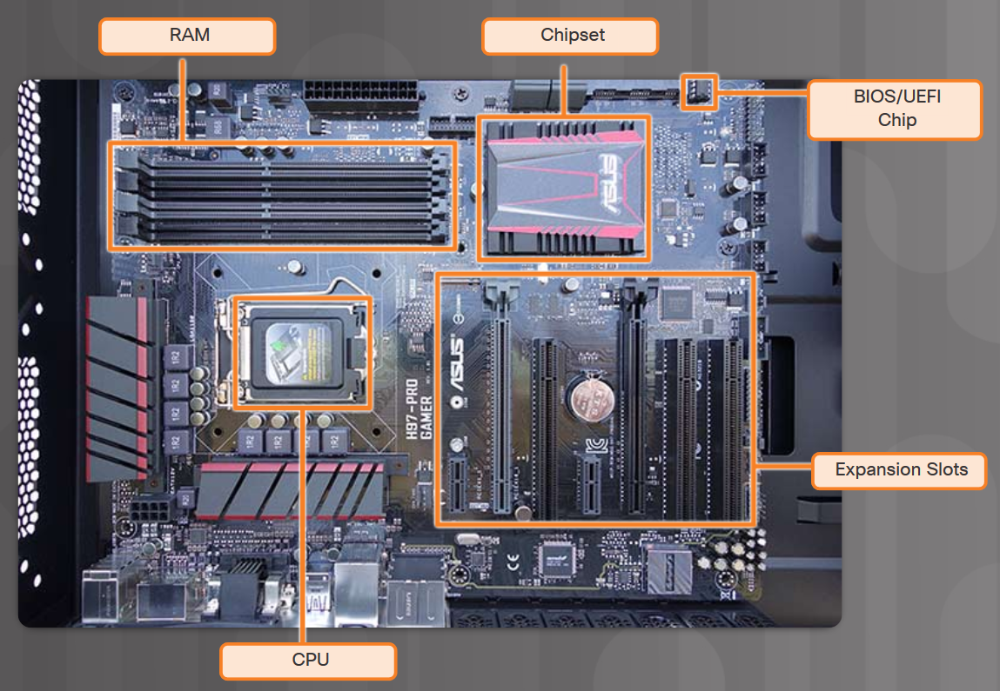

These are some connections on the motherboard where computer components can be added:

- **Central Processing Unit (CPU)** - This is considered the brain of the computer.
- **Random Access Memory (RAM)** - This is a temporary location to store data and applications.
- **Expansion slots** - These provide locations to connect additional components.
- **Chipset** - This consists of the integrated circuits on the motherboard that control how system hardware interacts with the CPU and motherboard. It also establishes how much memory can be added to a motherboard and the type of connectors on the motherboard.
- **Basic input/output system (BIOS)** chip and **Unified Extensible Firmware Interface (UEFI)** chip - BIOS is used to help boot the computer and manage the flow of data between the hard drive, video card, keyboard, mouse, and more. Recently the BIOS has been enhanced by UEFI. UEFI specifies a different software interface for boot and runtime services but still relies on the traditional BIOS for system configuration, power-on self test (POST), and setup.

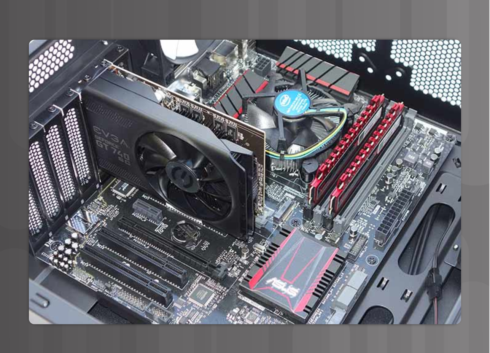

The picture above displays a motherboard with some additional components installed.

Most chipsets consist of the following two types:

- **Northbridge** – Controls high speed access to the RAM and video card. It also controls the speed at which the CPU communicates with all of the other components in the computer. Video capability is sometimes integrated into the Northbridge.
- **Southbridge** – Allows the CPU to communicate with slower speed devices including hard drives, Universal Serial Bus (USB) ports, and expansion slots.

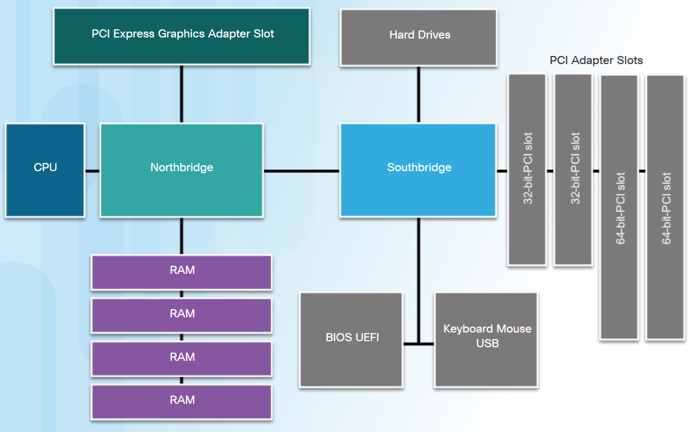

The picture above illustrates how a motherboard connects various components.

The form factor of motherboards pertains to the size and shape of the board. It also describes the physical layout of the different components and devices on the motherboard.

There have been many variations of motherboards developed over the years. There are three common motherboard form factors:

- **Advanced Technology eXtended (ATX)** - This is the most common motherboard form factor. The ATX case accommodates the integrated I/O ports on the standard ATX motherboard. The ATX power supply connects to the motherboard via a single 20-pin connector.
- **Micro-ATX** – This is a smaller form factor that is designed to be backward-compatible with ATX. Micro-ATX boards often use the same Northbridge and Southbridge chipsets and power connectors as full-size ATX boards and therefore can use many of the same components. Generally, Micro-ATX boards can fit in standard ATX cases. However, Micro-ATX motherboards are much smaller than ATX motherboards and have fewer expansion slots.
- **ITX** - The ITX form factor has gained in popularity because of its very small size. There are many types of ITX motherboards; however, Mini-ITX is one of the most popular. The Mini-ITX form factor uses very little power, so fans are not needed to keep it cool. A Mini-ITX motherboard has only one PCI slot for expansion cards. A computer based on a Mini-ITX form factor can be used in places where it is inconvenient to have a large or noisy computer.

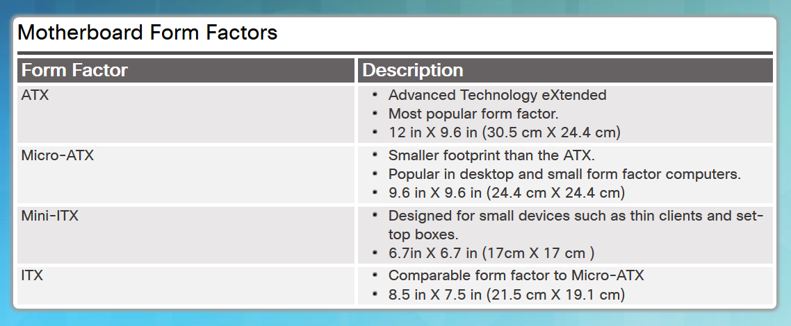

*Quelle: [Cisco NetAcad - https://static-course-assets.s3.amazonaws.com/ITE6/en/index.html#1.1.2.1](https://static-course-assets.s3.amazonaws.com/ITE6/en/index.html#1.1.2.1)*

---

## Tipps und Tricks

Der Cisco NetAcad-Kurs "IT-Essentials" beinhaltet viele Informationen zu den Grundlagen der IT. Für diesen Abschnitt eignen sich einige Aspekte aus dem Kurs ganz besonders.

| Chapter / Section | Title | Objectives |
| :--- | :--- | :--- |
| Chapter 3 | Advanced Computer Hardware | Install and configure components to upgrade a computer |
| 3.1 | Boot the Computer | Explain how to verify BIOS and UEFI settings |
| 3.2 | Electrical Power | Explain electrical power |
| 3.3 | Advanced Computer Functionality | Explain computer functionality |
| 3.4 | Computer Configuration | Select components to upgrade a computer to meet requirements |
| 3.5 | Protecting the Environment | Explain the necessary procedures to protect the environment |

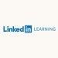

Im Videoportal "LinkedIn-Learning" stehen verschiedene Videos und Kurse zur Verfügung. Für dieses Kapitel sollen die folgenden Links Unterstützung, Wiederholung oder auch neue Perspektiven bieten:

[LinkedIn-Learning - VirtualBox Grundkurs](https://www.linkedin.com/learning-login/share?forceAccount=false&redirect=https%3A%2F%2Fwww.linkedin.com%2Flearning%2Fvirtualbox-grundkurs-2%3Ftrk%3Dshare_ent_url&account=68522354)

Im Videoportal "Studyflix" stehen ebenfalls verschiedene Videos und Kurse zur Verfügung. Für dieses Kapitel sollen die folgenden Links Unterstützung, Wiederholung oder auch neue Perspektiven bieten:

[Studyflix - Der Rechner als System (Rechnerarchitekturen)](https://studyflix.de/informatik/der-rechner-als-system-770)

---

***Multi Media Berufsbildende Schulen***  
*Ansprechpartner zum Kurs: neumann@mmbbs.de*
