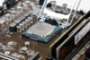

# Kapitel 2: IT-Systeme auswählen

In diesem Kapitel werden Sie ...

- ... Kriterien zur Auswahl eines IT-Systems festlegen.
- ... Vor- und Nachteile unterschiedlicher IT-Systeme recherchieren.
- ... Entscheidungen bei der Auswahl eines IT-Systems für einen Kundenauftrag verbal begründen.

---

## Kompetenz 2.0: Entscheidungen verbal begründen

In Ihrer Ausbildung sind Sie aktuell im Vertriebsinnendienst eingesetzt. Hier unterstützen Sie ein Team, welches die verschiedensten Kundenaufträge für Bestandskunden bearbeitet. Viele Anfragen gehen hier per E-Mail bzw. Kontaktformular ein. Sie sollen für einige der eingegangenen Anfragen Kriterien zusammenstellen und Ihren Kolleginnen und Kollegen einen ersten Vorschlag für IT-Systeme, die zur jeweiligen Kundenanfrage passen, vorlegen. Da Sie sich auch argumentativ zur Begründung Ihrer Auswahl vorbereiten wollen, machen Sie sich auch Gedanken, wie eine Auswahl verbal begründet werden kann.

---

### Arbeitsauftrag A|2.0: Erarbeitung der verbalen Begründung

Sicherlich haben Sie schon einmal für eine private Anschaffung aus verschiedenen Kandidaten auswählen müssen. Bspw. bei der Auswahl einer passenden Smartwatch müssten Sie sich Aspekte überlegen, die Ihnen an einer solchen wichtig sind. Stellen Sie sich nun vor, Sie sollten die Auswahl einem Kollegen gegenüber begründen. Nach welchem Schema könnten Sie hierfür vorgehen, um einer außenstehenden Person zu verdeutlichen, welche Gründe zu der Auswahl geführt haben?

---

## Kompetenz 2.1: IT-Systeme unterscheiden

Die ersten Kundenanfragen werden Ihnen zugewiesen. Dazu haben die Kolleginnen und Kollegen der Abteilung eine Vorauswahl der Anfragen getroffen, um komplexere Systemzusammenstellungen herauszufiltern. Sie nehmen sich nun den Aufträgen der Bestandskunden an, Ihr Ausbilder möchte hierfür Ihre Vorschläge zur Abstimmung vorab erhalten. Als erstes erscheint Ihnen im System die folgende Anfrage der Kaeks OHG.

---

### Informationsmaterial M|2.0: Kundenanfrage - Kaeks OHG

Sehr geehrte Damen und Herren,

für unsere Außeneinsätze benötigen wir neue Hardware. Unsere Kundenbetreuer, die den Hausmeisterdienst ausführen, müssen mit diesem Gerät jederzeit mobil auf unsere Webanwendung zugreifen können, mit der wir die Tagespläne und Aufträge veröffentlichen. Außerdem werden regelmäßig mit dem Gerät E-Mails und Tickets beantwortet.

Da wir häufiger dokumentieren müssen, wie wir eine Einrichtung vorgefunden haben und wie diese nach unseren Dienstleistungen (Reinigung, Reparatur, Möblierung etc.) aussieht, soll mit der Hardware die Protokollierung via Video und Bild einfach möglich sein.

Eine Tastatur ist für uns schwierig zu reinigen, wir würden und über eine Toucheingabe freuen. Dabei darf der Bildschirm nicht zu klein ausfallen. Ferner sollte das Gerät einen Arbeitstag durchhalten und entsprechende Akkulaufzeit / Lademöglichkeit haben.

Nur falls dies möglich und nicht zu kostspielig ist, kam uns noch eine optionale Idee: In der vergangenen Zeit wurden die papierhaften Auftragshefte von unseren Hausmeister- und Reinigungsdiensten manchmal vor Ort vergessen oder gingen verloren. Wäre es aus Datenschutzsicht möglich, das digitale Endgerät im Notfall aus der Ferne zu löschen? Wir haben bei unserer kleinen Recherche das Stichwort "Mobile Device Management" gefunden, können uns aber nichts genaues darunter vorstellen.

Wir freuen uns auf Ihr Angebot und verbleiben

mit freundlichen Grüßen

Stefan Mayer

Kaeks OHG  
E-Mail: s.mayer@kaeks-ohg.de

---

### Arbeitsauftrag A|2.1: IT-Systeme unterscheiden

Da Sie neu in der Vertriebsabteilung sind, empfiehlt Ihr Ausbilder Ihnen, sich vorerst einen Überblick zu den angebotenen IT-Systemen zu verschaffen. Legen Sie eine Mindmap an, in welcher sie die verschiedenen IT-Systeme aufgreifen. Ordnen Sie zwei bis drei Charakteristika zu jedem System zu und wägen Sie Vor- und Nachteile ab, indem Sie jeweils maximal drei hiervon aufnehmen.

1. Falls Sie sich über Mindmaps informieren wollen, sehen Sie sich die Methodeninformation im Kurs unter dieser Aufgabe an. In dieser ist auch erläutert, wie sie den Mindmanager auf dem Terminal-Server aufrufen.
2. Erstellen Sie eine Mindmap zu den IT-Systemen unter Berücksichtigung der Vorgaben s.o.

---

### Informationsmaterial M|2.1: Methodeninformation "Mind Map"

#### Was ist eine Mindmap?
Das Wort "Mindmap" kommt aus dem Englischen und setzt sich aus den Wörtern "mind" und "map" zusammen. "Mind" kann mit "Geist", "Gedanke" oder "Kopf" übersetzt werden. "Map" bedeutet "Karte" – im Sinn von Landkarte oder Stadtplan. Zusammengesetzt ist eine Mindmap also eine Gedankenkarte oder ein Gedankenplan.

So viel zum Wort – viel wichtiger ist natürlich, was eine Mindmap wirklich ist. Das interessiert dich eh viel mehr.

Eine Mindmap ist eine grafische Darstellung zu einem Thema, Vorgang oder einer Assoziation. Meist gibt es ein Wort (Thema), das im Zentrum steht. Von diesem Zentrum gehen mehrere Verbindungen zu anderen Themen ab, von denen wiederum weitere Verbindungen abgehen.

#### Zusammengefasst die Vorteile einer Mindmap

- Themen übersichtlich strukturieren
- Ordnen von komplexen Aufgaben
- Problemlos erweiterbar
- Legt Wissenslücken offen

#### Wie erstellt man eine Mindmap? 5 Schritte zur Mindmap

1. Schreib das Hauptthema zentral auf ein Blatt.
2. Überleg dir, welche Unterthemen zu dem Hauptthema gehören, und ordne die Unterthemen um das Hauptthema an.
3. Zeichne farbige Verbindungen von dem Hauptthema zu den Unterthemen. Beachte, dass jedes Unterthema eine eigene Farbe erhält.
4. Ergänze Begriffe, die zu dem Unterthema gehören, und verbinde sie mit dem Unterthema. Benutze hierfür die gleiche Farbe wie für die Verbindung vom Hauptthema zu diesem Unterthema.
5. Wiederhole die Schritte, bis du alle wichtigen Aspekte eines Themas vollständig auf deiner Mindmap erfasst hast.

*Quelle: Learn Attack - Karmen (o.J.). Mindmap erstellen: In 5 einfachen Schritten zur Mindmap. Link [Stand: 04.10.2022].*

---

### Informationsmaterial M|2.2: Tool-Tipp - TeamMapper

Über [TeamMapper](https://map.kits.blog/) können Sie Mindmaps kollaborativ erstellen.

---

### Informationsmaterial M|2.3: IT-Systeme

#### Tablet-PC

Ein Tablet (englisch tablet "Schreibtafel", US-engl. tablet "Notizblock") oder Tabletcomputer, Tablet-PC, selten auch Flachrechner, ist ein tragbarer, flacher Computer in besonders leichter Ausführung mit einem Touchscreen, aber, anders als bei Notebooks, ohne ausklappbare mechanische Tastatur. Ein Tablet ist eine spezielle Bauform eines Personal Computers, die zu den Handheld-Geräten zählt.

Aufgrund der leichten Bauart und des berührungsempfindlichen Bildschirms zeichnen sich Tablets durch eine einfache Handhabung aus. Die Geräte ähneln in Leistungsumfang, Bedienung und Design modernen Smartphones und verwenden meist ursprünglich für Smartphones entwickelte Betriebssysteme. Wegen der Bildschirmtastatur, die nur bei Bedarf eingeblendet wird, eignen sich Tablets weniger gut für das Schreiben größerer Textmengen.

Tablets sind meist mit fest verbauten Akkus ausgestattet, die oft nicht einmal von Fachpersonal gewechselt werden können, was dazu führt, dass preisgünstige Geräte, die mit minderwertigen Akkus ausgestattet sind, sehr schnell zu Sondermüll werden können.

Die verkabelte Anbindung an externe Geräte ist nur bei wenigen Tablet-PCs vorgesehen, daher gehören Bluetooth und WLAN zur Standardausstattung. Darüber hinaus werden viele Geräte auch mit einem integrierten Modem (u. a. UMTS oder LTE als Datenfunk) angeboten, sind dann also mobil telefonisch nutzbar, ohne auf ein externes mobiles Modem (etwa über einen USB-Port) angewiesen zu sein.

Tablets werden zunehmend auch für die Fernsteuerung digitaler Geräte eingesetzt, wie zum Beispiel Kameras, AV-Receivern, Fernsehgeräten oder Quadrocoptern.

Der Funktionsumfang eines Tablets kann durch Zusatzprogramme (genannt Apps, von englisch applications) erweitert werden. Einen immer größeren Stellenwert bekommt der Tablet-Journalismus, wobei das Tablet als Informationsmedium benutzt wird, um journalistisch aufbereitete Medieninhalte zu konsumieren oder zum Teil auch selbst zu schaffen.

*Quelle: [https://de.wikipedia.org/wiki/Tabletcomputer](https://de.wikipedia.org/wiki/Tabletcomputer)*

#### Desktop-Computer / Personal Computer

Ein Desktop-Computer, kurz „Desktop“ (entlehnt aus dem englischen desk für „Schreibtisch“ und top für „Oberseite“, also ein Schreibtischrechner), ist ein Computer in einer Gehäuseform, passend für den Einsatz als Arbeitsplatzrechner auf Schreibtischen. Der Begriff wird meist synonym zu Desktop-PC benutzt, es sind also Personal Computer gemeint. 

Ein Personal Computer (engl., zu dt. „persönlicher Rechner“, kurz PC) ist ein Mehrzweckcomputer, dessen Größe und Fähigkeiten ihn für den individuellen persönlichen Gebrauch im Alltag nutzbar machen; im Unterschied zu vorherigen Computermodellen beschränkt sich die Nutzung nicht mehr auf Computerexperten, Techniker oder Wissenschaftler. Das Konzept geht zurück auf eine Idee aus den 1970er Jahren, begründet von Hackern. Die leichte Bedienbarkeit und ein für Privathaushalte erschwinglicher Preis waren wichtige Voraussetzungen für das Konzept, das seit 1976 technisch umgesetzt wird. Erst Geräte dieser Art lösten das aus, was der Journalist Steven Levy als Computerrevolution bezeichnet. Demgegenüber werden Geräte aus einer früheren Zeit vereinzelt bereits Personal Computer genannt, obgleich sie nicht in das Konzept passen.

Ein PC ist ein Mikrocomputer, in Abgrenzung zu einem Minirechner oder Großrechner. Er tritt beispielsweise als Desktop-, Notebook- oder Tablet-Computer in Erscheinung und kann unter einem beliebigen Betriebssystem laufen, wie Windows, iOS oder Unix. Das Spektrum reicht vom Bereich des Heimcomputers bis hin zum typischen Arbeitsplatzrechner. Überdurchschnittlich leistungsfähige Arbeitsplatzrechner für rechen- und speicherintensive Anwendungen werden als Workstation bezeichnet; ihr Preis kann ein Vielfaches eines PC betragen.

Obwohl bereits in den 1970er Jahren üblich, wurde der Begriff „Personal Computer“, vor allem dessen Kurzform „PC“, ab 1981 im Sprachgebrauch zunehmend und exklusiv mit dem IBM Personal Computer und dessen IBM-kompatiblen PC-Nachbauten verknüpft. Das war dem Marketing von IBM mit seiner erfolgreichen Werbung geschuldet. Die Verknüpfung bezog sich auf die darin verbaute x86-Prozessor-Familie und der darauf laufenden Betriebssysteme DOS und Windows. Darüber hinaus wird der Begriff vereinzelt mit der Bauart eines x86er-Desktop-PC assoziiert, was jedoch im Widerspruch steht zur Bauart und den Bezeichnungen alternativer x86er-PC-Geräte, wie dem Microsoft Tablet-PC.

*Quellen:*

- *[https://de.wikipedia.org/wiki/Desktop-Computer](https://de.wikipedia.org/wiki/Desktop-Computer)*  
- *[https://de.wikipedia.org/wiki/Personal_Computer](https://de.wikipedia.org/wiki/Personal_Computer)*

#### Smartphone

Smartphone (englisch, etwa „schlaues Telefon“) nennt man ein Mobiltelefon (umgangssprachlich Handy) mit umfangreichen Computer-Funktionalitäten und Konnektivitäten. Der Begriff dient der Abgrenzung von herkömmlichen („reinen“) Mobiltelefonen. Frühe Smartphone-Vorläufer vereinigten etwa Ende der 1990er Jahre die Funktionen eines Personal Digital Assistant (PDA) bzw. Organizers, mit dem man z. B. Kontakte und seinen Kalender verwalten konnte, mit der Funktionalität eines reinen Mobiltelefons. Später wurden dem kompakten Gerät auch noch die Funktionen eines transportablen Medienabspielgerätes, einer Digital- und Videokamera und eines GPS-Navigationsgeräts hinzugefügt. Zentrale Merkmale sind Touchscreens zur Bedienung sowie Computer-ähnliche Betriebssysteme. Ein Internetzugang ist wahlweise per mobiler Breitbandverbindung des Mobilfunkanbieters oder WLAN möglich.

Die ersten Smartphones gab es bereits in den späten 1990er Jahren, aber erst ab der Einführung des iPhones im Jahr 2007 gewannen sie nennenswerte Marktanteile. Der Begriff Smartphone stammt von der Firma Ericsson, welche ihr Modell R380 mit Touchscreen, Internetbrowser und Kalender um die Jahrtausendwende so nannte. Heute sind die meisten verkauften Mobiltelefone Smartphones. Durch den permanent mitgeführten Internetzugang löste dies einen Wandel im Internet-Nutzungsverhalten aus, insbesondere bei sozialen Netzwerken wie Facebook, und ermöglichte neue Kommunikationsformen über Dienste wie WhatsApp und Instagram. Als das meistverbreitete Smartphone-Betriebssystem setzte sich in den 2010er-Jahren das inzwischen von fast allen Herstellern verwendete Android durch (Marktanteil gemäß IDC im Jahr 2019 86,6 %), mit einigem Abstand gefolgt von dem nur auf Apple-Geräten eingesetzten Apple iOS (Marktanteil im Jahr 2019 13,4 %).

*Quelle: [https://de.wikipedia.org/wiki/Smartphone](https://de.wikipedia.org/wiki/Smartphone)*

#### Server

Ein Hardware-Server (Hostrechner) ist ein Computer, auf dem ein oder mehrere Server (Software) laufen.

Als Hostrechner (auch Host-Rechner, Hostcomputer oder Host-Computer; Lehnübersetzungen von englisch host computer), kurz Host, wird ein in ein Rechnernetz eingebundener Computer mit zugehörigem Betriebssystem bezeichnet, der Clients bedient oder Server beherbergt (also Dienste bereitstellt).

Geschichtlich betrachtet bezeichnet der Ausdruck Host zunächst einen Mehrbenutzer-Rechner, der mit Hilfe von Anwendungen im Hintergrund Rechenleistung für Terminals erbringt.[1] Nachdem in den 1980er Jahren Rechnernetze den Alltag eroberten, wurde der Ausdruck auch für in ein Rechnernetz eingebundene Rechner verwendet, die Dienstleistungen für meist kleinere oder weniger leistungsfähige Systeme erbringen.

Neben mächtigeren Betriebssystemen können auch weniger mächtige Systeme – für Minirechner oder auch Netzwerkgeräte, wie Router und Druckerserver als Host dienen. Beispielsweise ist jedes System, das seine Netzwerkkonfiguration durch das Dynamic Host Configuration Protocol (DHCP) beziehen kann, Client eines DHCP-Servers.

*Quellen:*

- *[https://de.wikipedia.org/wiki/Server](https://de.wikipedia.org/wiki/Server)*  
- *[https://de.wikipedia.org/wiki/Hostrechner](https://de.wikipedia.org/wiki/Hostrechner)*

#### All-in-one-Computer

Unter einem All-in-one-Computer versteht man einen stationären Computer, bei dem Hauptplatine und Monitorteil in einem gemeinsamen Gehäuse untergebracht sind. Außerdem wird der Begriff auf Desktop-Computer eingeschränkt, da er auf alle mobilen Geräte wie Notebooks, Tablet-Computer und Portables konzeptbedingt immer zutrifft.

Ein wichtiger Vorteil dieser Bauweise ist, dass die fehlerträchtige und oft unansehnliche Verkabelung weitgehend entfällt. Zusätzlich verringert sich der Stromverbrauch gegenüber Einzelkomponenten, wenn bei der Konstruktion auf Notebookkomponenten oder zumindest verbrauchsreduzierte Komponenten zurückgegriffen wird. Diese sind in der Regel allerdings etwas leistungsschwächer, produzieren aber auch weniger Abwärme, sodass auf störend laute Lüfter oft verzichtet werden kann.

Wenn ein optisches Laufwerk fehlt, muss bei Bedarf auf ein externes Laufwerk mit Anschluss per USB zurückgegriffen werden.

Der in den 2000er-Jahren wieder zunehmende Erfolg Apples auf dem Verbrauchermarkt, nicht zuletzt populären Produkten wie dem iPod und iPhone geschuldet, verleitete auch andere Hersteller wie etwa Asus, Dell oder Sony ab etwa 2010 dazu, nun ebenfalls PCs in einer platzsparenden All-in-one-Konstruktion anzubieten. Anders als Apple integrieren viele dieser Hersteller zusätzlich einen Touchscreen in ihre Produkte.

*Quelle: [https://de.wikipedia.org/wiki/All-in-one-Computer](https://de.wikipedia.org/wiki/All-in-one-Computer)*

#### Notebook

Ein Notebook (englisch notebook ‚Notizbuch‘) oder Laptop (vom englischen ‚laptop‘ wörtlich für „auf dem Schoß“, übertragen „Schoßrechner“), selten auch Klapprechner, ist eine spezielle Bauform eines Personal Computers, die zu den Mobilgeräten zählt. Sie besitzt folgende grundlegende Eigenschaften:

- In einem flachen rechteckigen Gehäuse ist auf der Oberseite eine Tastatur flächenbündig integriert. Diese weist im alphanumerischen Bereich den von der ISO 9241-410:2012-12 für effizientes Tippen geforderten Tastenmittenabstand von 19 mm auf (bei kleineren Tasten spricht man von einem Subnotebook) und hat eine Tastaturbelegung gemäß ISO/IEC 9995-2, z. B. QWERTZ für den deutschsprachigen Anwendungsbereich.
- An diesem Gehäuse ist ein ähnlich großer Bildschirm beweglich angebracht, der so auf das Gehäuse geklappt werden kann, dass in zugeklapptem Zustand Bildschirmoberfläche und Tastatur innen liegen und das Gesamtgerät so ohne spezielle Schutzanforderungen transportabel wird. Die Gelenke halten durch Haftreibung den aufgeklappten Bildschirm in jeder Position ohne weitere mechanische Stützung; das gesamte Gerät bleibt dabei stets kippsicher, da die gewichtsintensiven Bauteile zusammen mit der Tastatur im Grundgehäuse angeordnet sind.
- Das Gerät ist standortunabhängig verwendbar. Die Stromversorgung erfolgt durch Akkumulatoren.

Von der Größe und Leistungsfähigkeit her liegen Notebooks nach heutigen Maßstäben zwischen den größeren Desktop-Computern und den kleineren Tablets. In 2010er Jahren sind Notebooks von der Leistung nahe an die klassischen Desktop-Computer herangekommen und haben ihnen Marktanteile abgenommen.

*Quelle: [https://de.wikipedia.org/wiki/Notebook](https://de.wikipedia.org/wiki/Notebook)*

#### Einplatinencomputer

Ein Einplatinencomputer, oft engl. single-board computer (SBC), ist ein Computersystem, bei dem sämtliche zum Betrieb nötigen elektronischen Komponenten auf einer einzigen Leiterplatte zusammengefasst sind. Typischerweise ist das Netzteil als einzige Komponente separat untergebracht. Sie werden in vielen Anwendungsgebieten eingesetzt – z. B. in der Industrie, in elektronisch gesteuerten Gebrauchsgegenständen und im Privat- und Hobbybereich.

Bis in die 1990er-Jahre wurden 8-Bit-Einplatinencomputer, z. B. mit Intel-8085-Prozessor, Intel-MCS-51-Mikrocontrollern und ihren Nachfolgern, zu Mess-Steuer-Regel-Zwecken (MSR) eingesetzt. Heute werden Einplatinenrechner mit leistungsfähigeren Microcontrollern bestückt und decken den unterschiedlichen Bedarf für Haushalts-, Industrie-, Automobil- und Militärzwecke als Eingebettetes System ab. Der Trend geht dazu, immer mehr Funktionen (Standardschnittstellen, A/D-Wandler usw., bis hin zu kompletten WLAN-Funktionen inkl. TCP/IP-Stack) des Einplatinencomputers direkt auf demselben Chip wie die CPU zu integrieren (siehe System-on-a-Chip). Dadurch kann bei steigender Funktionalität der Stückpreis dieser Rechner gesenkt werden.

Zu den bekannten aktuellen Einplatinenrechnern für Endnutzer zählen Arduino, BeagleBoard, Cubieboard, Ethernut, PandaBoard, Raspberry Pi, Tinkerforge, Banana Pi, pcDuino, Orange Pi, ODROID, NanoPC, HummingBoard und der für Bildungszwecke konzipierte BBC micro:bit. Solche Rechner werden etwa als Musik-Streaming-Client, Media Center, Thin Client oder Server, als Steuerungsplatine in einem Quadrocopter, als Wetterstation, UKW-Radiosender oder als Steuereinheit für dedizierte Bitcoin-Mining-Hardware verwendet.

*Quelle: [https://de.wikipedia.org/wiki/Einplatinencomputer](https://de.wikipedia.org/wiki/Einplatinencomputer)*

#### Mikrocontroller

Als Mikrocontroller (auch µController, µC, MCU) werden Halbleiterchips bezeichnet, die einen Prozessor und zugleich auch Peripheriefunktionen enthalten. In vielen Fällen befindet sich auch der Arbeits- und Programmspeicher teilweise oder komplett auf demselben Chip. Ein Mikrocontroller ist ein Ein-Chip-Computersystem. Für manche Mikrocontroller wird auch der Begriff System-on-a-Chip oder SoC verwendet.

Auf modernen Mikrocontrollern finden sich häufig auch komplexe Peripheriefunktionen wie z. B. CAN- (Controller Area Network), LIN- (Local Interconnect Network), USB- (Universal Serial Bus), I²C- (Inter-Integrated Circuit), SPI- (Serial Peripheral Interface), serielle oder Ethernet-Schnittstellen, PWM-Ausgänge, LCD-Controller und -Treiber sowie Analog-Digital-Umsetzer. Einige Mikrocontroller verfügen auch über programmierbare digitale und/oder analoge bzw. hybride Funktionsblöcke.

Ein Beispiel ist der Arduino: Die Hardware eines typischen Arduino-Boards basiert auf einem Atmel-AVR-Mikrocontroller aus der megaAVR-Serie, wie etwa dem ATmega328. Abweichungen davon gibt es unter anderem bei den Arduino-Boards Arduino Due (ARM Cortex-M3 32-Bit-Prozessor vom Typ Atmel SAM3X8E), Yún, Tre, Gemma und Zero, wo andere Mikrocontroller von Atmel eingesetzt werden. Eine Besonderheit stellen zudem die Arduino-Boards Yún und Tre dar, die zusätzlich zum Mikrocontroller einen stärkeren Mikroprozessor besitzen. Alle Boards werden entweder über USB (5 V) oder eine externe Spannungsquelle (7–12 V) versorgt und verfügen über einen 16-MHz-Schwingquarz. Es gibt auch Varianten mit 3,3 V-Versorgungsspannung und Varianten mit abweichendem Takt. Über Erweiterungen können auch andere Mikrocontroller, etwa der ESP8266, über die Arduino-IDE programmiert werden.

*Quellen:*

- *[https://de.wikipedia.org/wiki/Mikrocontroller](https://de.wikipedia.org/wiki/Mikrocontroller)*  
- *[https://de.wikipedia.org/wiki/Arduino_(Plattform)](https://de.wikipedia.org/wiki/Arduino_(Plattform))*

#### Network Attached Storage (NAS)

Network Attached Storage (NAS, englisch für netzgebundener Speicher) bezeichnet einfach zu verwaltende Dateiserver. Allgemein wird ein NAS eingesetzt, um ohne hohen Aufwand unabhängige Speicherkapazität in einem Rechnernetz bereitzustellen.

Heutige Personal Computer (PCs) verfügen normalerweise über einen Festplattenspeicher, der direkt in das Gehäuse des Computers eingebaut ist, und legen dort ihre Verzeichnisse und Dateien ab. Man spricht von lokalem Speicher (Local Storage), der im Regelfall nur den Nutzern zur Verfügung steht, die unmittelbar am Computer arbeiten.

Soll ein Festplattenspeicher mit den darauf abgelegten Dateien netzweit zur Verfügung stehen, also von allen Rechnern des Netzwerks erreichbar sein, muss das Speichersystem zunächst direkt an das Netzwerk angeschlossen sein und zusätzlich Übertragungsprotokolle beherrschen, welche die Dateien auf diesem Speicherplatz im angebundenen Computernetz zur Verfügung stellen. Diese Funktionalität wird durch dateibasierte Netzwerkprotokolle wie SMB/CIFS und NFS oder blockbasierte Netzwerkprotokolle wie iSCSI bereitgestellt. Man spricht dann von „Speicher, der an ein Netz angeschlossen ist“, also Network Attached Storage oder kurz NAS. NAS-Systeme werden also direkt am Netzwerk angeschlossen und arbeiten autonom, d.h. ohne einen dedizierten PC oder Server zu benötigen. Die Dateisysteme des NAS, also alle dort angelegten Dateien und Verzeichnisse, erscheinen auf dem Zielsystem wie eine eingebundene Freigabe beziehungsweise ein lokales Dateisystem.

*Quellen:*

- *[https://de.wikipedia.org/wiki/Network_Attached_Storage](https://de.wikipedia.org/wiki/Network_Attached_Storage)*  
- *[Bildquelle NAS](https://www.onlinepc.ch/img/9/7/6/1/0/0/Bild-01---Synology_NAS_w915_h915.jpg)*

#### Thin- und Zero-Clients

Als Reaktion auf die zunehmende Komplexität von Thin Clients riefen Hersteller wie Pano Logic oder NComputing die Rückkehr zum absolut schlanken Endgerät aus, dem Zero Client. Um den Begriff hat sich mittlerweile ein Hype gebildet, und deshalb benutzen ihn mehrere Hersteller, um sehr unterschiedliche Konzepte zu benennen. Was kennzeichnet also den Zero Client und ist er wirklich das einzig wahre Endgerät für virtuelle Desktops?

##### Thin Clients: Kompromiss zwischen schlank und leistungsfähig

Die im Lauf der Jahre gewachsene Ausstattung von Thin Clients mit immer mehr Funktionen spiegelt die widersprüchlichen Anforderungen an diese Geräte wider. Einerseits sollen sie wartungsarm sein und wenig Strom verbrauchen, andererseits ein ähnliches Benutzererlebnis bieten wie ein ausgewachsener PC. Da jedoch remote ausgeführte Audio- oder Video-Anwendungen oft nicht den Erwartungen der User entsprechen, springen in solchen Fällen ein lokaler Desktop inklusive Web-Browser oder Media Player ein.

##### Lokale Software erfordert Management

Mit der Zahl lokal installierter Softwarekomponenten steigt der Wartungsaufwand, weil etwa im Fall von XP Embedded auch jedes Security Update des Internet Explorer eingespielt werden muss.

Bedingt durch den Wettbewerb bei der Desktop-Virtualisierung kommen neue Remote-Display-Protokolle hinzu, so dass es mit Unterstützung für RDP und ICA nicht mehr getan ist. Die Geräte sollen also zumindest noch PCoIP sprechen, neuerdings wird auch RemoteFX erwartet.

##### Zero Clients schließen potenzielle Nutzergruppen aus

Wenn nun bestimmte Hersteller weniger Komplexität fordern, dann müssen sie trotzdem den Spagat zwischen einfachem Management und ansprechendem Benutzererlebnis meistern. Dabei kommen ihnen allerdings die Fortschritte bei den Remote-Display-Protokollen ebenso zugute wie jene bei der Desktop-Virtualisierung insgesamt.

Wenn jedoch Mechanismen wie Multimedia Redirection oder Reverse Seamless ausscheiden, dann verringert dies die potenziellen Einsatzgebiete für die Geräte. Das betrifft primär anspruchsvolle Software für Wissensarbeiter und Power-User, die man mit Hilfe virtueller Desktops für Thin Clients gewinnen wollte. Sie bleiben beim traditionellen Server Based Computing (Terminal-Server, Citrix) weitgehend außen vor, der Schwerpunkt liegt hier auf aufgabenbezogenen Tätigkeiten.

##### Was darf rein in einen Zero Client?

Neben Pano haben auch Dell, Fujitsu, Sun/Oracle oder Wyse Geräte im Angebot, die sie als Zero Clients bezeichnen. Pano vertritt die reine Lehre und möchte nur das "absolute Minimum" am Arbeitsplatz sehen. Es installiert dort keine Software oder Treiber. Dagegen halten die Teradici-Lizenznehmer wie Fujitsu oder Dell lokal Code als Firmware vor, die bei Bedarf auch aktualisiert werden muss.

Wyse schließlich lädt mit mit seinem Xenith-Gerät die Konfiguration und die so genannte Engine für bestimmte Protokolle beim Start aus dem Netz. Weil der Code nicht lokal vorgehalten wird, reklamiert auch Wyse einen konfigurationsfreien Zero Client für sich.

##### Kriterien für Zero Clients

Während sich das Marketing der Hersteller vor allem mit der Frage beschäftigt, ob die Zero Clients der Konkurrenz diese Bezeichnung verdienen, möchte der potenzielle Käufer wissen, welche Kriterien solche Geräte tatsächlich erfüllen sollten. Der Ex-Gartner-Analyst Simon Bramfitt stellte eine solche Liste zusammen, die gleichzeitig die wesentlichen Vorteile dieses Konzepts repräsentiert:

- **Plug and Play:** ein Zero Client muss aus der Box ohne Eingriff des Administrators einsatzfähig sein. Ein neues Gerät muss sich außerdem genauso verhalten wie alle anderen des gleichen Modells, ohne dass es vor der Auslieferung individuell angepasst wurde. Wenn mehr zu tun ist als das Gerät mit dem Netz zu verbinden, sowie Tastatur, Maus und Monitor anzuschließen, dann hat der Gerät ein wesentliches Kriterium nicht erfüllt.
- **Keine Konfiguration:** ein eingeschalteter Zero Client muss in der Lage sein, eine Netzverbindung aufzubauen, virtuelle Desktop-Umgebungen bzw. Terminal-Server zu finden und sich dort anzumelden, ohne dafür konfiguriert zu werden.
- **Seltene und zentrale Updates:** Wenn überhaupt Updates erforderlich sind, dann sollten sie selten sein (keine "Patch Tuesdays") und sich zentral verteilen lassen, ohne dass IT-Mitarbeiter physisch auf die Zero Clients zugreifen müssen. Lokale Peripherie sollte sich nutzen lassen, ohne dass dafür Treiber installiert werden.

Unter diesen Kriterien können Geräte als Zero Client durchgehen, die etwa aus der Sicht von Pano Logic keine sind, weil sie eine CPU besitzen und Software ausführen. Andererseits gehen die Geräte auf Basis von Teradici-Technik vom Konzept her zwar als Zero Clients durch, die praktische Implementierung verstößt bei häufigen Firmware-Updates jedoch gegen das dritte Kriterium.

##### Geringe Flexibilität und die Folgekosten

Die Ausrichtung von Zero Clients auf Einfachheit und geringen Management-Aufwand helfen dabei, Kosten zu sparen, sowohl beim Erwerb der Geräte als auch bei ihrem Unterhalt. Dazu werfen sie viele der Erweiterungen über Bord, die Hersteller von Thin Clients entwickelt haben, um die Defizite der zentralen Ausführung von Anwendungen zu kompensieren. Das Ergebnis kann je nach Konzept zu geringerer Flexibilität führen und die Kostenvorteile zunichte machen.

Bei radikalen Zero-Client-Konzepten bietet die Hardware nur wenige und fest verdrahtete Funktionen, lokale Software gibt es nicht. Nachdem die ganze Intelligenz und Arbeitslast auf den Server verlagert wird, besteht keine Gefahr, dass der Zero Client aufgrund höherer Anforderungen seine Aufgabe nicht mehr erfüllen könnte. Einzelne Hersteller reklamieren deshalb eine Nutzungsdauer ihrer Geräte von bis zu 10 Jahren.

##### Kürzere Lebensdauer bei fehlenden Update-Möglichkeiten

Andererseits können Zero Clients je nach Update-Fähigkeit nicht von technischen Fortschritten profitieren, etwa bei Remoting-Protokollen. Wenn Anwender jedoch in den Genuss dieser Errungenschaften kommen möchten, dann geht das möglicherweise nur über den vorzeitigen Austausch der Hardware. Das gilt auch dann, wenn Hersteller heute proprietäre Protokolle verwenden, aber sich Technologien wie RemoteFX im Lauf der Zeit als De-facto-Standard etablieren sollten.

Die geringere Flexibilität zeigt sich auch bei solchen Geräten, die Puristen nicht als Zero Clients durchgehen lassen, weil sie CPUs sowie RAM besitzen und Software lokal ausführen. Beispielsweise beruht das Xenith-Modell von Wyse auf der gleichen Hardware wie die Class-C-Geräte (also traditionelle Thin Clients, die auch Windows Embedded ausführen können). Im Gegensatz zu universellen Thin Clients sind sie aber dauerhaft auf eine bestimmte Technologie festgelegt, sei es Citrix/HDX oder VMware View/PCoIP (siehe dazu die umfangreiche Analyse von Brian Madden).

*Quelle: Sommergut (2011): [https://www.windowspro.de/wolfgang-sommergut/zero-clients-definition-varianten-vorteile-und-nachteile](https://www.windowspro.de/wolfgang-sommergut/zero-clients-definition-varianten-vorteile-und-nachteile) [Stand: 07.11.2022].*

#### Peripherie

In der Informatik wird der Ausdruck Peripherie verwendet, wenn von Peripheriegeräten die Rede ist, das sind z. B. alle Geräte, die an die Zentraleinheit angeschlossen sind/werden. Diese Geräte bedürfen der Steuerung durch die Zentraleinheit und gegebenenfalls einer vorherigen Initialisierung. Dies sind zum Beispiel Drucker, Scanner, Tastatur und Maus, aber auch interne Geräte wie Anschlüsse, Laufwerke und Erweiterungskarten.

Peripheriegeräte sind unterteilt in Eingabe- und Ausgabegeräte. Auch Multifunktionsgeräte kann man als eine Art der Peripheriegeräte zählen. Zu Eingabegeräten kann man z. B.: Tastaturen, Mäuse, Scanner und Mikrofone zählen. Zu Ausgabegeräten zählt man Bildschirme, Beamer, Plotter/Drucker und Lautsprecher. Ein Drucker mit Scan-Funktion oder der Touchscreen lassen sich als Multifunktionsgeräte bezeichnen.

*Quellen:*

- *[https://de.wikipedia.org/wiki/Peripherie#Verwendung_in_der_Computertechnik](https://de.wikipedia.org/wiki/Peripherie#Verwendung_in_der_Computertechnik)*  
- *[https://de.wikipedia.org/wiki/Peripherieger%C3%A4t](https://de.wikipedia.org/wiki/Peripherieger%C3%A4t)*

---

### Arbeitsauftrag A|2.2: Auswahl eines IT-Systems für die Kaeks OHG

Treffen Sie eine Auswahl für ein IT-System, welches den Kundenauftrag am besten erfüllt. Bereiten Sie außerdem entsprechend Ihrer angestellten Überlegungen zur verbalen Begründung einer Auswahl eine kurze Stellungnahme zur Überzeugung des Ausbilders und des Kunden vor. Verschriftlichen Sie diese in einem Text.

---

## Kompetenz 2.2: Rechnerarchitekturen und ihre Software unterscheiden

Bei der Auswahl des IT-Systems haben Sie zwar eine Kategorie an Geräten als Ergebnis erzielt, allerdings unterscheiden sich die Systeme hinsichtlich ihrer Software. Während von der Kaeks OHG diesbezüglich keine Vorgaben vorlagen, werden in der nächsten Kundenanfrage Wünsche hierzu geäußert.

---

### Informationsmaterial M|2.4: Kundenanfrage - Schneidefuchs Werbeagentur GmbH

Sehr geehrte Damen und Herren,

vielen Dank für das digitale Flipchart, welches Sie uns vergangenen Monat verkauft und eingerichtet haben. Mein Team ist begeistert und auch bei unseren Kunden macht dies einiges her.

Heute melde ich mich bei Ihnen in anderer Sache. Leider löst sich so langsam unser Videoschnitt-Computer, den wir zur Erstellung von Werbefilmen unserer Kunden benötigen, auf. Da wir diesem ja schon im letzten Jahr aktualisierte Komponenten spendiert hatten, ist es wohl an der Zeit einen neuen PC einzusetzen.

Ich habe mit unserem Video-Spezialisten gesprochen und er hat folgende Wünsche:

- Der PC soll leistungsstarke Komponenten im High-End-Bereich haben.
- Die Videoschnittsoftware, die wir einsetzen läuft auf MacOS und Windows 10 gut und stabil, wir wollen wenn möglich bei MacOS bleiben.
- Es soll vielfältige Peripherie angeschlossen werden können, daher also moderne Anschlüsse berücksichtigen.

Ferner habe ich allgemein noch Fragen, die bei der Auswahl eines PCs aufgekommen sind:

- Da wir in der Agentur verschiedenste Geräte einsetzen, haben wir uns für den Client *MS Teams* als Groupware entschieden. Auf welchen Betriebssystemen funktioniert diese Anwendung?
- Ich bin Nutzer eines Apple iPad Pro und würde einige Apps gerne auf dem PC installieren, damit ich mich nicht umgewöhnen muss, geht das?
- Mein Kollege nutzt ein Samsung Smartphone für viele Apps, kann er diese auf dem PC installieren?

Viele Grüße und Dank im Voraus,

Volker Fuchs  
Schneidefuchs Werbeagentur GmbH

---

### Arbeitsauftrag A|2.3: Systemarten und Software unterscheiden

1. In der Kundenanfrage der Schneidefuchs Werbeagentur GmbH stecken verschiedene Anforderungen und Fragestellungen. Notieren Sie sich diese übersichtlich.
2. Ihre Kolleg:innen haben bereits eine Vorrecherche erledigt und zum System Fragen notiert, die Sie im Rahmen einer Produktpräsentation beim Kunden beantworten sollen.
   1. Welche Merkmale können bei Prozessoren unterschieden werden (nennen und beschreiben)?
   2. Recherchieren Sie kurz im Internet Vertreter der x86/x64-CPUs sowie Vertreter der ARM-Prozessoren, damit sich der Kunde hierunter konkrete Modelle vorstellen kann.
   3. Warum ist der Unterschied zwischen RISC und CISC heutzutage unbedeutend?
   4. Wie steigern Multi-Core-Prozessoren gegenüber Single-Core-Prozessoren ihre Leistung und was ist Hyper Threading?
   5. Welchen Einfluss hat die Taktfrequenz einer CPU auf die Geschwindigkeit?
   6. Welche Rolle spielt der Cache bei der Verarbeitung von Daten, was bedeuten dabei L1, L2 und L3?
   7. Was ist Virtualisierung von Prozessoren und wie werden Typ 1 und Typ 2 voneinander unterschieden?
   8. Was ist das Pipelining einer CPU?
   9. Wie können CPUs hinsichtlich ihrer Leistungsfähigkeit miteinander verglichen werden und was haben MIPS und GFLOPS damit zu tun?
   10. Wie kann eine CPU gekühlt werden (beschreiben Sie Luftkühlung, Wasserkühlung & Lüfterlose Kühlung)?
3. Welche Aspekte muss die Werbeagentur bei der Auswahl eines Betriebssystem bzw. eines Schnittcomputers hinsichtlich der Rechnerarchitektur (CPU) berücksichtigen, wenn die geplante Software funktionieren soll?
4. Wie verhält sich der Betrieb von Anwendungssoftware oder Apps zu einem Betriebssystem bzw. zu  einer Rechnerarchitektur? Welche Zusammenhänge gibt es? Nehmen Sie Bezug auf die Software aus der Kundenanfrage von Schneidefuchs.

---

### Informationsmaterial M|2.5: Prozessor (CPU)

Rufen Sie sich über die [Landingpage](https://mm-bbs.de) das Script *PC-Technik Grundlagen (Stand 2020)* auf. Sie finden dieses unter:

Home > HERDT-Themenkatalog > IT-Technik / Netzwerke / Systeme > IT-Technik > PC-Technik Grundlagen (Stand 2020)

Im Kapitel 3 (Prozessor (CPU)) finden Sie die notwendigen Informationen zur Lösung der Aufgaben.

---

### Informationsmaterial M|2.6: Betriebssysteme

#### Was ist ein Betriebssystem?

Ein Betriebssystem, auch OS (von englisch operating system) genannt, ist eine Zusammenstellung von Computerprogrammen, die die Systemressourcen eines Computers wie Arbeitsspeicher, Festplatten, Ein- und Ausgabegeräte verwaltet und diese Anwendungsprogrammen zur Verfügung stellt. Das Betriebssystem bildet dadurch die Schnittstelle zwischen den Hardware-Komponenten und der Anwendungssoftware des Benutzers. Betriebssysteme bestehen in der Regel aus einem Kernel (deutsch: Kern), der die Hardware des Computers verwaltet, sowie speziellen Programmen, die beim Start unterschiedliche Aufgaben übernehmen. Zu diesen Aufgaben gehört unter anderem das Laden von Gerätetreibern. Betriebssysteme finden sich in fast allen Arten von Computern: Als Echtzeitbetriebssysteme auf Prozessrechnern und Eingebetteten Systemen, auf Personal Computern, Tabletcomputern, Smartphones und auf größeren Mehrprozessorsystemen wie z. B. Servern und Großrechnern.

Die Aufgaben eines Betriebssystems lassen sich wie folgt zusammenfassen: Benutzerkommunikation; Laden, Ausführen, Unterbrechen und Beenden von Programmen; Verwaltung und Zuteilung der Prozessorzeit; Verwaltung des internen Speicherplatzes für Anwendungen; Verwaltung und Betrieb der angeschlossenen Geräte; Schutzfunktionen z.B. durch Zugriffsbeschränkungen.

Das Unternehmen StatCounter analysiert die Verbreitung von Endanwender-Betriebssystemen anhand von Zugriffsstatistiken diverser Websites. Sehr viele Jahre war Windows an der Spitze, bis es laut StatCounter 2017 von Android überholt wurde.

Die laut StatCounter am weitesten verbreiteten Endanwender-Betriebssysteme sind:

| | 2018 | 2017 |
| :--- | :--- | :--- |
| 1. | Android | 38,97 % | 31,76 % |
| 2. | Windows | 37,07 % | 43,82 % |
| 3. | iOS | 13,18 % | 11,71 % |
| 4. | macOS | 5,24 % | 5,09 % |
| 5. | Linux | 0,76 % | 0,94 % |
| | nicht identifizierte OS | 2,72 % | 3,64 % |
| | andere Betriebssysteme | 2,06 % | 3,03 % |  

#### Was ist eine Plattform?

Eine Plattform ist eine bestimmte Kombination aus Hardware und Betriebssystem, auf der ein Softwareprogramm ausgeführt wird. Im Endverbraucherbereich unterscheidet man beispielsweise zwischen den folgenden Plattformen: PC (IBM-PC kompatible Computer, auf denen Microsofts DOS-System oder Windows läuft, Mac (Apple Macintosh-Rechner mit dem Apple-eigenen Betriebssystem OS oder OS X) und Linux/Unix. Software-Anwendungen sind oft in unterschiedlichen Varianten für die verschiedenen Plattformen erhältlich, also in Versionen, die speziell für einen Windows-PC oder einen Apple Mac entwickelt wurden. Viele Softwarepakete sind allerdings auch plattformunabhängig und können auf den unterschiedlichen Betriebssystemen gleichermassen eingesetzt werden.

*Quellen:*

- *[https://www.toptarif.de/internet/wissen/plattform/](https://www.toptarif.de/internet/wissen/plattform/)*
- *[https://de.wikipedia.org/wiki/Betriebssystem](https://de.wikipedia.org/wiki/Betriebssystem)*

---

### Informationsmaterial M|2.7: Anwendungssoftware

#### Was sind Anwendungen?

Als Anwendungssoftware (auch Anwendungsprogramm, kurz Anwendung oder Applikation; englisch application software, kurz App) werden Computerprogramme bezeichnet, die genutzt werden, um eine nützliche oder gewünschte nicht systemtechnische Funktionalität zu bearbeiten oder zu unterstützen. Sie dienen der „Lösung von Benutzerproblemen“. Beispiele für Anwendungsgebiete sind: Bildbearbeitung, E-Mail-Programme, Webbrowser, Textverarbeitung, Tabellenkalkulation oder Computerspiele.

Aus dem englischen Begriff application hat sich in der Alltagssprache auch die Bezeichnung Applikation, kurz App, eingebürgert. Im deutschen Sprachraum wird die Abkürzung App seit dem Erscheinen des iOS App Store (2008) fast ausschließlich mit mobiler App gleichgesetzt, also Anwendungssoftware für Mobilgeräte wie Smartphones und Tabletcomputer. Allerdings wird inzwischen Desktop-Anwendungssoftware ebenfalls App genannt, zum Beispiel bei Microsofts Betriebssystem Windows seit Windows 8 (Windows-Apps), das sowohl auf Desktop-PCs als auch Tablets eingesetzt wird, oder bei Apples Betriebssystem macOS mit dem Mac App Store.

Anwendungssoftware steht (nach ISO/IEC 2382) im Gegensatz zu Systemsoftware und Dienstprogrammen. Dazu „zählen die Programme, die für den korrekten Ablauf einer Rechenanlage erforderlich sind, sowie alle Programme, die die Programmerstellung unterstützen, z. B. Übersetzer und Testwerkzeuge und allgemeine Dienstleistungen bereitstellen [… Formatierung, Dateiverwaltung, Datentransfer …]“,[2] die aber keinen Endbenutzer-bezogenen ‚Nutzen‘ bringen. Beispiele sind das Betriebssystem, Compiler für verschiedene Programmiersprachen oder Datenbanksysteme.

Anwendungssoftware kann sowohl lokal auf einem Desktop-Computer (Desktop-Anwendung) bzw. auf einem Mobilgerät installiert sein oder auf einem Server laufen, auf den vom Desktop-Computer bzw. Mobilgerät zugegriffen wird (Client-Server- bzw. Webanwendung). Sie kann, abhängig von der technischen Implementierung, im Modus Stapelverarbeitung oder im Dialogmodus (mit direkter Benutzer-Interaktion) ausgeführt werden. Diese beiden Unterscheidungen gelten aber für alle Computerprogramme, grundsätzlich auch für Systemsoftware.

#### Plattformunabhängigkeit

Plattformunabhängigkeit ist die Eigenschaft eines Programms, mit unterschiedlichen Hard- und Software-Konstellationen kompatibel zu sein, z.B. unterschiedliche Betriebssysteme wie Windows, Unix oder Mac OS oder Rechnerarchitekturen wie Macintosh oder PC.

Dabei lässt sich der Grad der Plattformunabhängigkeit an der Quellcode -Portabilität messen, d.h. wie groß der Aufwand ist, ein Programm auf anderen Plattformen lauffähig zu machen. Ist dazu kein Aufwand nötig, so ist eine hundertprozentige Plattformunabhängigkeit gegeben.

Es gibt verschiedene Methoden, eine Anwendung plattformunabhängig zu gestalten. Zum einen kann der Quellcode durch eingebaute Anweisungen, die es erlauben, Unterschiede der Betriebssysteme auszugleichen, frei übertragbar gemacht werden. Derartige Programme liegen meist in vorgefertigten Versionen für verschiedene Plattformen vor. Zum anderen können Programme in Paketen vorliegen, die, basierend auf der Quellcode-Portabilität, mehrere lauffähige Versionen ein- und desselben Programms enthalten ("Fat Binaries"). Das Betriebssystem startet dabei automatisch die Installationsroutine der entsprechend kompatiblen Version des Programms.

*Quellen:*

- *[https://de.wikipedia.org/wiki/Anwendungssoftware](https://de.wikipedia.org/wiki/Anwendungssoftware)*  
- *[https://www.e-teaching.org/projekt/nachhaltigkeit/plattform/index_html/html2print](https://www.e-teaching.org/projekt/nachhaltigkeit/plattform/index_html/html2print)*

---

### Informationsmaterial M|2.8: EVA Prinzip

#### E V A

Geht es um elektronische Datenverarbeitung, ist oft vom EVA-Prinzip die Rede - Eingabe, Verarbeitung, Ausgabe. Aber was genau steckt eigentlich dahinter?

Die Grundstruktur jedes Computers ist das EVA-Prinzip. EVA ist eine simple Abkürzung und steht für Eingabe, Verarbeitung und Ausgabe: Zuerst werden Daten eingegeben, danach verarbeitet und schließlich erfolgt eine Ausgabe. Für jeden dieser Schritte werden verschiedene Hardware-Komponenten verwendet.

#### 1. Die Eingabe bei EVA

Im ersten Schritt des EVA-Prinzips erfolgt die Eingabe der Daten.

- Die Eingabe erfolgt über sogenannte Eingabegeräte. Dazu gehören beispielsweise Maus, Trackpad, Tastatur, Scanner, Webcam, Joystick oder ein Mikrofon.
- Beispiel: Tippen Sie ein Dokument, geben Sie Buchstaben ein. Diese Buchstaben sind die Daten.

#### 2. Die Verarbeitung

Nachdem Sie die Daten eingegeben haben, werden diese vom Computer berechnet.

- Die Verarbeitung geschieht durch Prozessor, Arbeitsspeicher, Grafikkarte, usw. Der Prozessor verfügt über ein Steuer- und Rechenwerk. Zusammen mit dem Arbeitsspeicher bildet er die Zentraleinheit für die Verarbeitung. Während der Verarbeitung greift die Zentraleinheit auch auf die Festplatte zu.
- Beispiel: Tippen Sie einen Text ein, sieht der Prozessor die Buchstaben und verarbeitet diese Informationen: Es ist ein Buchstabe, er steht am Anfang der Seite, er hat die Farbe Schwarz, usw.

#### 3. Die Ausgabe beim EVA-Prinzip

Nachdem die Zentraleinheit alle Berechnungen durchgeführt hat, werden die Daten für den Anwender ausgegeben.

- Auch zu den Ausgabegeräten wird bestimmte Hardware zugeordnet. Das Hauptausgabegerät ist der Monitor. Aber auch Hardware wie Drucker und Lautsprecher sind Ausgabegeräte.
- Beispiel: Tippen Sie einen Buchstaben ein, wird die Eingabe verarbeitet und der Buchstabe erscheint auf dem Monitor. Er wird in der Form ausgegeben, wie der Prozessor ihn verarbeitet hat: Größe, Position auf der Seite, Farbe, usw.

*Quelle: [https://praxistipps.chip.de/eva-prinzip-erklaerung-von-eingabe-verarbeitung-ausgabe_3572](https://praxistipps.chip.de/eva-prinzip-erklaerung-von-eingabe-verarbeitung-ausgabe_3572) [Stand 07.11.2022]*

---

### Arbeitsauftrag A|2.4: Auswahl eines IT-Systems für die Schneidefuchs Werbeagentur GmbH

Treffen Sie eine Auswahl für ein IT-System, welches den Kundenauftrag am besten erfüllt. Bereiten Sie außerdem entsprechend Ihrer angestellten Überlegungen zur verbalen Begründung einer Auswahl eine kurze Stellungnahme zur Überzeugung des Ausbilders und des Kunden vor. Verschriftlichen Sie diese in einem Text.

!!! note "Zusätzliches Material, weitere Übungen & Tipps"

    Die folgenden Übungen und Tipps & Tricks dienen Ihrer persönlichen Wiederholung und Vorbereitung auf Klassenarbeiten, Prüfungen etc. Die Übungen werden im Rahmen des Unterrichts nicht besprochen, es sei denn Sie haben konkrete Fragen hierzu.  *Sei loyal zu denen, die nicht anwesend sind. Damit baust du Vertrauen auf unter denen, die anwesend sind. (Stephen Covey, 1932-2012)*

## Übungen

### Übung UE|2.0: Komponenten im EVA-Prinzip

Interaktives Inhaltselement  
[https://moodle.mm-bbs.de/moodle/mod/hvp/view.php?id=110384](https://moodle.mm-bbs.de/moodle/mod/hvp/view.php?id=110384)

---

### Übung UE|2.1: Auswahl eines IT-Systems für das Nachhilfestudio Müller

1. Lesen Sie sich aufmerksam die E-Mail des Kunden/Interessenten (s.u.) durch.
2. Führen Sie das Schema der verbalen Begründung durch und empfehlen Sie dem Kunden/Interessenten somit eine Art IT-System für seine Anforderungen. Es muss kein konkretes Produkt recherchiert und genannt werden. Bauen Sie die verbale Begründung auf, als wäre es eine E-Mail an den Kunden.
3. Suchen Sie im Internet nach einem Beispielprodukt für Ihre Entscheidung heraus und ergänzen Sie einen Screenshot/einen PDF-Ausdruck der Shopseite hinter Ihrer verbalen Begründung.

*Sehr geehrte Damen und Herren,*

*wir haben vor ein paar Jahren unsere Räume durch Sie mit digitalen Tafeln ausstatten lassen. Mit der Zeit müssen wir uns aber eingestehen, dass diese Technik nicht die notwendige Flexibilität liefert, die wir uns wünschen. Wir möchten unseren Nachhilfelehrern neue Endgeräte ausgeben. Diese sollen mit Tastatur, aber auch Stift bedienbar sein. Die in jedem Raum befindlichen Beamer können per HDMI angeschlossen werden. Können Sie uns auch direkt eine drahtlose Verbindungsmöglichkeit anbieten? Wir nutzen im Nachhilfestudio MS Office, Geogebra und ansonsten viel Software, die im Browser läuft. Können Sie uns bitte einen Hardwarevorschlag zusenden? Danke!*

*Freundliche Grüße*

*Maria Müller*  
*Geschäftsführerin "Nachhilfestudio Müller"*

---

### Übung UE|2.2: Auswahl eines IT-Systems für den Hackerspace Stendal e.V.

1. Lesen Sie sich aufmerksam die E-Mail des Kunden/Interessenten (s.u.) durch.
2. Führen Sie das Schema der verbalen Begründung durch und empfehlen Sie dem Kunden/Interessenten somit eine Art IT-System für seine Anforderungen. Es muss kein konkretes Produkt recherchiert und genannt werden. Bauen Sie die verbale Begründung auf, als wäre es eine E-Mail an den Kunden.
3. Suchen Sie im Internet nach einem Beispielprodukt für Ihre Entscheidung heraus und ergänzen Sie einen Screenshot/einen PDF-Ausdruck der Shopseite hinter Ihrer verbalen Begründung.

*Guten Tag,*

*vielen Dank für die Einrichtung des Netzwerkswitches vergangenen Monat, unser Durchsatz hat sich hierdurch wirklich merklich verbessert. Die Mitglieder des Hackerspaces sind vollkommen zufrieden. Nun haben wir aber auch schon das nächste Projekt vor: Bisher lassen wir unsere Webseite über einen Raspberry Pi laufen. Da dieser aber an seine Grenzen stößt und wir auch noch weitere Dienste auf einem neuen Gerät einrichten wollen, benötigen wir eine neue Hardware.*

*Wir würden auf dem System gerne die Webseite, ein Ticketsystem, ein Benutzermanagement und ggf. zukünftig noch weitere Dienste in unser Netzwerk einbinden. Welche Art von System würden Sie hierfür vorschlagen? Ich freue mich auf eine Antwort Ihrerseits.*

*Viele Grüße*

*@HaHase23 aka Jan Pahler*
*Hackerspace Stendal e.V.*

---

### Übung UE|2.3: Auswahl eines IT-Systems für die Region Pomburg - Museum für Kunstgeschichte

1. Lesen Sie sich aufmerksam die E-Mail des Kunden/Interessenten (s.u.) durch.
2. Führen Sie das Schema der verbalen Begründung durch und empfehlen Sie dem Kunden/Interessenten somit eine Art IT-System für seine Anforderungen. Es muss kein konkretes Produkt recherchiert und genannt werden. Bauen Sie die verbale Begründung auf, als wäre es eine E-Mail an den Kunden.
3. Suchen Sie im Internet nach einem Beispielprodukt für Ihre Entscheidung heraus und ergänzen Sie einen Screenshot/einen PDF-Ausdruck der Shopseite hinter Ihrer verbalen Begründung.

*Sehr geehrte Damen und Herren,*

*ich bin im Museum für Kunstgeschichte für die IT-Ausstattung verschiedener Arbeitsplätze verantwortlich. Für unseren Empfangstresen benötigen wir eine neue IT-Ausstattung für einen neuen Mitarbeiter. Der Arbeitsplatz ist räumlich (wie unser gesamtes Museum) nicht sehr groß. Daher benötigen wir ein platzsparendes System. Die Anwendungen, die auf dem System laufen sind einerseits das MS Office-Paket und unsere Informations- und Auskunftssysteme, die browserbasiert aufgerufen werden. Ferner werden E-Mails von dem System aus beantwortet.*

*Wir stellen uns ein Gerät vor, welches in unseren bestehenden Windows-basierten Gerätepark einbinden lässt. Außerdem wünscht sich der Mitarbeiter eine Touch-Eingabemöglichkeit an dem Gerät. Zuletzt sollte noch darauf geachtet werden, dass der Bildschirm der Gerätes eine Diagonale von mindestens 20 Zoll aber maximal 32 Zoll aufweisen darf.*

*Bitte bieten Sie mir ein System an.*

*Mit freundlichen Grüßen*
*Peter Haller*

*Museum für Kunstgeschichte*
*der Region Pomburg*

---

## Podcastempfehlungen

---

### CRE Technik Kultur Gesellschaft #151 - Die ARM-Architektur (04/2010)

Sehr nerdig, aber immer noch gut. Es hat sich technisch aber einiges getan.

[https://cre.fm/cre151-die-arm-architektur](https://cre.fm/cre151-die-arm-architektur)

---

## Zusatzmaterial

| Was ist ein Computer? | Allgemeines zum Rechner 1 & 2 | Computeranatomie |
| :--- | :--- | :--- |
|  |  |  |
| In diesem LinkedIn-Learning-Kurs erhalten Sie einen Überblick über die Grundlagen von Hard- und Software bezüglich IT-Endgeräten. | Auf Studyflix finden Sie Lernvideos zum Thema "Computergrundlagen". Wenn Sie mehr über die Rechnerarchitekturen wissen wollen, ist dies auch eine gute Anlaufstelle. | Dieser Grundkurs klärt die Frage, wie es eigentlich in einem Computer aussieht. Welche Komponenten sind enthalten? Wie arbeiten die Komponenten zusammen? |
| [zum LinkedIn-Learning-Kurs](https://www.linkedin.com/learning-login/share?account=68522354&forceAccount=false&redirect=https%3A%2F%2Fwww.linkedin.com%2Flearning%2Fmit-computern-und-mobilgeraten-arbeiten%3Ftrk%3Dshare_ent_url%26shareId%3DmMv7JqyfRxmQVdi%252BZFx62w%253D%253D) | [zu Studyflix](https://studyflix.de/informatik/allgemeines-zum-rechner-i-776) | [zur OpenHPI](https://open.hpi.de/courses/computeranatomie2021) |

## Lernstrategien & Werkzeuge

### Zeitmanagement mit Pomodoro

Die Pomodoro-Technik ist eine Methode für das Zeitmanagement. Die Arbeit oder das Lernen wird in 25-Minuten-Einheiten unterteilt, die von Pausenzeiten begleitet werden (mehr dazu in der Wikipedia). Hier ein kurzes Infovideo:

[https://youtu.be/kXoTIimyGPQ?t=68](https://youtu.be/kXoTIimyGPQ?t=68)

---

### Software & App: SuperProductivity (auch für die Pomodoro-Technik)

[https://github.com/johannesjo/super-productivity](https://github.com/johannesjo/super-productivity)

---

## GitHub

### GitHub.io - LF2-Kurs als MkDocs-Variante

[https://herr-nm.github.io/MMBbS_KIT_LF02/](https://herr-nm.github.io/MMBbS_KIT_LF02/)

### GitHub.io - Curriculum der kaufmännischen IT-Berufe

[https://herr-nm.github.io/MMBbS_KIT_Curriculum/](https://herr-nm.github.io/MMBbS_KIT_Curriculum/)


