# Kapitel 3: Netzwerkspeicher dimensionieren

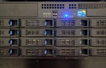

In diesem Kapitel werden Sie ...

- ... Speichertechnologien und -medien unterscheiden.
- ... Speichermaßeinheiten umrechnen.
- ... Größen von Bild- und Videodateien bestimmen.
- ... Übertragung von Daten berechnen.
- ... RAID-Level unterscheiden.
- ... die Energieeffizienz berechnen.
- ... einen Netzwerkspeicher auswählen.

## Handlungssituation

Das Unternehmen Yoel.de AG hat bei der Change IT GmbH einen Netzwerkspeicher angefragt. Der zuständige Außendienst hat nach dem Gespräch mit dem Kunden eine Gesprächsnotiz für die Vertriebsabteilung geschrieben, um alle Anforderungen zur Datensicherheit, den verwendeten Technologien, der Energieeffizienz und weiterer Bedingungen an das System zusammenzufassen. Sie sollen sich auf Basis einer Vorauswahl für ein passendes Gerät entscheiden.

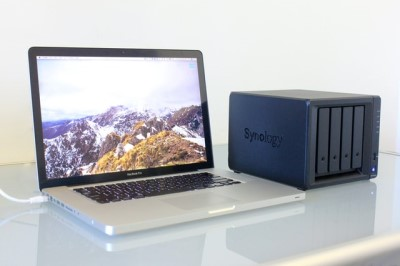

### Informationsmaterial M|3.0: Gesprächsnotiz zu Yoel.de AG

**Betrifft:** Videokonferenz vom 01.10.  
**Zu erledigen:** Auswahl für einen Netzwerkspeicher treffen

Hallo Zusammen,

ich habe mich in einer VK mit dem Kunden Yoel.de AG ausgetauscht. Aktuell gibt es dort ein Projekt zur Dokumentation der neuen Geschäftsprozesse und dem Anlegen von Leitfäden. Diese sollen im betriebsinternen Netzwerk bereitgestellt werden. Hierfür sollen wir einen Netzwerkspeicher anbieten.

- Anforderungen an die **Speichertechnologie**
    - Optimum von Kapazität und Preis
    - verlässlich und langlebig
    - Geschwindigkeit ist für den Anwendungsfall nicht ausschlaggebend
- Anforderungen an die **Speicherkapazität**
    - Video-Tutorials der Geschäftsprozesse liegen vor, die konkreten Datenmengen müssen noch bestimmt werden
    - erste Schätzung: 18 TB zu realisierende Nettospeicherkapazität
- Anforderungen an die **Übertragungsraten**
    - relativ große Videodateien, daher angemessen schnelle Bandbreite berücksichtigen
    - redundante Netzwerkschnittstelle wünschenswert
- Anforderungen an die **Datensicherheit**
    - Die Daten sollen gegen Festplatten-Ausfall eines Laufwerks gesichert werden
    - Datensicherheit darf sich nicht zu sehr negativ auf die Nettospeicherkapazität auswirken
- Weitere Anforderungen
    - Im Rahmen der Neuausrichtung hat sich Yoel.de AG selbst zu mehr Umweltbewusstsein verpflichtet. Es ist in System auszuwählen, welches in der Energieeffizienz diese Ausrichtung berücksichtigt.
    - Vor Ort sind alle 19"-Racks voll bestückt, ein separates Gerät soll ausgewählt werden.

Ich habe aus dem System die NAS-Datenübersicht als Vorauswahl beigefügt. Bitte senden Sie dem Kunden einen Produktvorschlag zu und setzen Sie mich mit in Kopie.

Danke und bis die Tage!

Z. Andersen

### Informationsmaterial M|3.1: Vorauswahl der Change IT-NAS-Systeme

Auszug aus dem Produktkatalog der Change IT:

| Merkmal | NAS Basis | NAS Advanced | NAS Expert | NAS Serv Plus |
| :--- | :---: | :---: | :---: | :---: |
| Betriebsmodi | JBOD, RAID 0, RAID 1 | JBOD, RAID 0, RAID 1, RAID 5 | JBOD, RAID 0, RAID 1, RAID 5, RAID 10 | JBOD, RAID 0, RAID 1, RAID 5, RAID 6, RAID 10 |
| Ethernet-Port | 1x 1 Gbit/s | 1x 2,5 Gbit/s | 2x 2,5 Gbit/s | 2x 5 Gbit/s |
| Gerätetyp | Standalone | Standalone | Standalone | 19"-Rackmount |
| Anzahl Laufwerke | 2 x 2,5" oder 3,5" SATA | 4 x 2,5" oder 3,5" SATA | 4 x 2,5" oder 3,5" SATA | 8 x 2,5" oder 3,5" SATA |
| Laufwerkstypen | HDD | SSD oder HDD | SSD oder HDD | SSD oder HDD | SSD oder HDD |
| Max. Laufwerksgröße | 5.587,94 GiB | 7,28 TiB | 16 TB | 16,37 TiB |
| Energieverbrauch in Voll-Betrieb | 12 W | 50 W | 60 W | 90 W |
| Energieverbrauch im Festplattenruhestand | 8 W | 8 W | 10 W | 10 W |
| Energieverbrauch im Standby | 1 W | 1000 mW | 2 W | 5 W |
| ... | ... | ... | ... | ... |

## Kompetenz 3.0: Speichertechnologien und -medien auswählen

Auf Basis der Gesprächsnotiz und der durch den Kollegen Herrn Andersen getroffenen Vorauswahl ist ein IT-System zu dimensionieren. Im ersten Schritt sollen unterschiedliche Speichertechnologien beleuchtet werden, um ein passendes Medium für die vorliegende Kundenanfrage von Yoel.de AG zu erhalten.

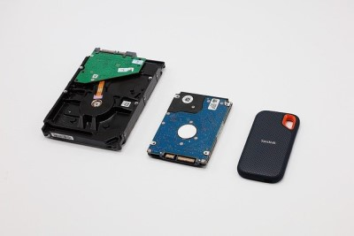

### Arbeitsauftrag A|3.0: Auswahl eines Speichermediums

Gehen Sie auf den Kundenauftrag ein:

#### Aufgabe 1

Was sind die Wünsche des Kunden Yoel.de AG bezüglich der Speichertechnologie?

#### Aufgabe 2

Erstellen Sie ein Schaubild zu den Eigenschaften und je zwei Vor- und Nachteilen der vier Arten der Speichertechnologien. Führen Sie außerdem beispielhaft den Technologien zuordenbare Speichermedien auf.

#### Aufgabe 3

Treffen Sie anhand Ihrer Zusammenstellung und auf Basis der NAS-Übersicht in der Vorauswahl eine sinnvolle und begründete Auswahl eines Speichermediums für die Kundenanfrage von Yoel.de AG.

### Informationsmaterial M|3.2: Speichertechnologien

TODO kürzen und SAS / SATA aufnehmen

#### Einleitung

Informationen und Daten sind flüchtiger Natur, wenn man sie nicht rechtzeitig speichert. Im stromabhängigen Zentralspeicher der Zentraleinheit können Informationsbestände und Programme nicht über längere Zeit aufbewahrt werden.

Es ist daher erforderlich, externe Speichergeräte bereitzuhalten, um Programme und Daten dauerhaft zu speichern. Überwiegend werden heute fünf verschiedene Gerätetypen verwendet: Magnetplattenspeicher, Magnetbandspeicher, Halbleiterlaufwerke, Flash-Speicher und optische Speicher.

Durch die Wahl des richtigen Speichergeräts wird die Leistungsfähigkeit des Computersystems ganz entscheidend mitbestimmt. Bei der Auswahl der Speichereinheit sollte daher nicht nur der Preis berücksichtigt werden, sondern auch die Speicherkapazität und ihre Ausbaufähigkeit, die Schnelligkeit des Datenzugriffs und der Datenübertragung, die Austauschbarkeit und der Energieverbrauch sollten bedacht werden.

#### Speichergeräte mit magnetischen Datenträgern

Der magnetische Datenspeicher besteht aus einem Datenträger, der aus einem magnetisierbaren Material besteht. Das kann auf Bänder, Karten, Papier oder Platten aufgebracht werden. Der Datenträger wird dann mittels einem Lese-Schreib-Kopf gelesen und beschrieben.

Typischerweise wird das Speichermedium im Datenträger gedreht oder rotiert, während der bewegliche oder unbewegliche Lese-Schreib-Kopf über das Speichermedium geführt wird. Die Daten können auf dem Speichermedium sowohl digital als auch analog gespeichert werden.

##### Festplattenlaufwerk

Ein externer Speicher mit sehr großer Speicherkapazität, ist die Festplatte, auf der das Betriebssystem, umfangreiche Anwendungsprogramme und Daten gespeichert werden. Die Festplatten bestehen aus einem starren unflexiblen Material (z.B. Aluminium), das mit einer magnetisierbaren Schicht überzogen ist. Sie heißen Festplatten, weil sie nicht ausgetauscht werden können, sondern fest im Laufwerk montiert sind. Sie lassen sich platzsparend und relativ einfach in den PC einbauen, natürlich auch nachträglich.

Bei einem Festplattenlaufwerk berühren die Schreib-/Leseköpfe nicht die Plattenoberfläche, sondern schweben auf einem Luftkissen, dass durch die hohe Umdrehungszahl (bis zu 10.000 U/Min.) entsteht. Die Schreib-/Leseköpfe bewegen sich dann in einem Abstand von wenigen tausendstel Millimetern mit einer hohen Geschwindigkeit über der Plattenoberfläche. Aus diesem Grund darf eine laufende Platte keinen harten Stößen ausgesetzt werden, um einen mechanischen Kontakt der Schreib-/Leseköpfe mit der Plattenoberfläche zu vermeiden. Solche Kollisionen, die man als Headcrash bezeichnet, beschädigen die Magnetschicht und führen zu Datenverlust.

Bevor Magnetfestplatten zur Speicherung von Software verwendet werden können, müssen sie formatiert werden. Über die Formatierung, die mithilfe eines speziellen Programms des Betriebssystems erfolgt, wird die Platte in Spuren und Sektoren unterteilt. Bei der Installation des Betriebssystems kann der Anwender die Platte in mehreren Partitionen (Bereiche) aufteilen, um auf diese Weise Systemsoftware und Anwendungssoftware mit den zugehörigen Daten voneinander getrennt auf der Platte abzulegen.

Magnetplatten bestehen aus runden Aluminiumscheiben, die beidseitig mit einem hochempfindlichen magnetisierbaren Material beschichtet sind, auf dem die Daten gespeichert werden. Mehrere Platten, die auf einer Spindel übereinander angeordnet sind, werden Plattenstapel genannt.

Jede dieser Platten ist in Spuren und Sektoren aufgeteilt, allerdings ist die schreibt Dichte erheblich höher als bei Disketten, sodass bei gleichem Durchmesser deutlich mehr Spuren und Sektoren aufgezeichnet werden können.

Für jede Magnetplattenseite ist ein separater Schreib-/Lesekopf vorgesehen. Alle Köpfe sind an einem horizontal beweglichen Arm befestigt. Durch konstante Bewegung der Magnetplatten um ihre Achse kann jeder Sektor einer Spur äußerst schnell im direkten Zugriff erreicht werden. Die Zugriffszeit auf die Daten liegt unter zehn Millisekunden. Beim Zugriff befinden sich immer alle Köpfe auf der gleichen Spur der untereinanderliegenden Platten, wobei sich immer nur ein Kopf in Aktion befindet. Die genau untereinanderliegenden Spuren eines Plattenstapels mit der jeweils gleichen Spurnummer, die sich mit einer Einstellung des Arms erreichen lassen, nennt man Zylinder.

Es gibt verschiedene Festplattentechnologien, am weitesten verbreitet sind SATA-Festplatten (auch Serial ATA oder SATA). Die Abkürzung SATA steht für Serial Advanced Technology Attachment. Diese Technologie wurde zunächst für den Datentransfer zwischen Prozessor und Festplatte entwickelt, kurze Zeit später auch für den Anschluss weiterer Geräte über die externe Schnittstelle eSATA (external SATA). Ältere Rechner arbeiten noch mit Enhanced-IDE-Platten. Die Abkürzung IDE steht für Integrated Disk Environment. Etwas teurer, dafür aber auch leistungsfähiger sind die SCSI-Festplatten (Abkürzung für Small Computer System Interface).

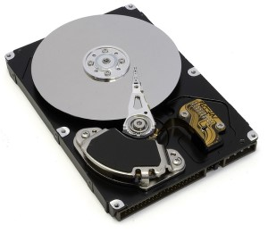

##### Mobile Festplatte

Aufgrund der flexiblen Einsatz- und Transportmöglichkeiten liegen mobile Festplatten zunehmend im Trend. Sie sind mit unterschiedlichen Zoll-Größen (bspw. 2,5‘‘ und 3,5‘‘) verfügbar und können sowohl in der Tasche als auch am Arbeitsplatz bequem und platzsparend aufbewahrt werden. Über die Schnittstellen USB (z.B. USB 3.0) oder FireWire wird die Verbindung mit dem PC oder Laptop hergestellt.

Mobile Platten stellen durch die sehr große Speicherkapazität von bis zu 8 Terrabyte und die hohen Datenübertragungsraten (USB 3.0 mit 640 Megabyte/s im Vergleich zu USB 2.0 mit 60 Megabyte/s und eSATA mit 375 Megabyte/s) ein ideales Backup-Medium zur Archivierung und Datensicherung dar.

##### Magnetbandspeicher, Magnetband

Zur Sicherung von umfangreichen Datenbeständen bietet sich als preiswerte Möglichkeit der Einsatz von Magnetbandspeichern (Streamer) an. Das sind Geräte, die mit sehr hoher Geschwindigkeit die Daten von der Festplatte auf eine spezielle Magnetband-Kassette schreiben. Das Band selbst ist 1/4 Zoll bereit und in neun Spuren eingeteilt, die parallel zur Laufrichtung angeordnet sind.

Den Streamer gibt es zum festen Einbau in dem PC oder als separates Laufwerk. Die Handhabung des genauso einfach wie bei einem Kassettenrekorder. Magnetbänder bestehen aus einer Kunststofffolie von unterschiedlicher Breite mit einseitig aufgetragener Magnetschicht, auf der die Daten gespeichert werden. Sie werden ausschließlich zur Archivierung, zur Datensicherung und zum Datenaustausch eingesetzt, weil sie keinen direkten Zugriff auf bestimmte Datensätze zulassen. Der Zugriff auf die Daten erfolgt bei einem Magnetband sequenziell, d.h., die Daten werden nacheinander in der Reihenfolge ihrer Aufzeichnung gelesen.

Nach der Art des Aufzeichnungsverfahrens unterscheidet man zwischen analogen und digitalen Magnetbändern. Bei der analogen Neunspuraufzeichnung werden acht Bit und ein Prüfbit gleichzeitig in einer Reihe quer zur Bahnrichtung aufgezeichnet. Je nach Bandlänge kann auf diesen Halbzollbändern eine Kapazität von mehreren Terabyte gespeichert werden.

Eine ganz andere Technik verwenden Streamer, die beispielsweise mit der DAT- oder DLT-Technologie arbeiten. Die Daten werden hier entweder schräg zur Bandachse oder blockweise über die Aufzeichnungsspuren versetzt in digitalisierter Form auf das Band geschrieben. Auf einer DLT-Kassette können bis zu 1.000 Gigabyte gespeichert werden. Magnetbänder verwendet man hauptsächlich dann, wenn sehr große Datenbestände langfristig archiviert oder komplette Festplatteninhalte gesichert werden sollen (Backup).

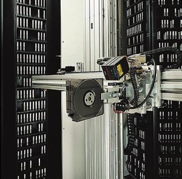

*Quelle: [http://2014.kes.info](http://2014.kes.info)*

#### Speichergeräte mit elektrischen Datenträgern

Halbleiterspeicher dient sowohl der zeitlich begrenzten als auch der unbegrenzten Aufbewahrung von Daten, Zuständen und Programmen in Form von digitalen Signalen.

Elektronische Datenspeicher fassen Halbleiterbauelemente, vorwiegend Transistoren, zu integrierten Schaltkreisen zusammen, um Daten und Informationen zu speichern. Dazu werden spezielle nicht-leitende Materialien, wie zum Beispiel Silizium, gezielt verunreinigt, um sie unter bestimmten Bedingungen in einen leitenden oder nicht-leitenden Zustand zu versetzen.

##### Flash-Speichermedien

Flash-Speicher (Blitz-Schreib-Lese-Speicher, elektrisch lösch- und beschreibbare Halbleiterspeicher) sind SSD-Speichermedien mit nichtflüchtigen, gepufferten Bausteinen, die aufgrund ihrer geringen Größe, der relativ großen Speicherkapazität und der vielseitigen Einsatzmöglichkeiten für einen breit gestreuten Anwenderkreis inzwischen unverzichtbar geworden sind. Die Produktpalette der Flash-Speicher reicht vom sogenannten Memorystick, auch unter den Bezeichnungen Flash Drive, Jump Drive, Mini Drive oder Speicherstick bekannt, bis hin zu diversen Flash-Speicherkarten (compact flash cards).

Der Memorystick ist praktisch Datenträger und mobiles Speicherlaufwerke zugleich, dass ohne Zusatzgerät mit der sonst üblichen Mechanik Daten über einen längeren Zeitraum speichern kann. Der Stick wird einfach an die USB-Schnittstelle des Rechners gesteckt, über die er die Stromversorgung erhält, und unmittelbar darauf vom Betriebssystem als externes Laufwerk erkannt (Plug and Play, also kein Treiber erforderlich).

Der USB-Stick eignet sich hervorragend für die mehr oder weniger spontane Speicherung von Daten jeder Art, für den Datenaustausch von Rechner zu Rechner oder für den Vor-Ort-Anwender-Service (z.B. Überspielen von Treibern, Dokumenten, etc.).

Speicherkarten werden überwiegend im Multimedia-Bereich eingesetzt, und zwar als Datenträger in mobilen Geräten wie digitale Kamera oder MP3 Player. Speicherkarten sind aber auch in Diktiergeräten oder dem Raspberry Pi anzutreffen. Die folgende Tabelle beschreibt einige gängigen Speicherkarten:

| Speicherkarte | Spezifikation |
| :--- | :--- |
| Compact Flash Card (CF) | wiederbeschreibbare Karte, Lesen mit 7 Mbit/s, Schreiben mit 2 Mbit/s |
| Multi Media Card (MMC) | Karte mit nicht-flüchtigen Halbleiter-Chips; über den integrierten Controller ist ein Passwort-Schutz möglich. |
| Secure Digital Card (SD) | Karte mit nicht-flüchtigen Halbleiter-Chips; Daten können verschlüsselt abgelegt oder auch in nicht geschützte Bereiche gespeichert werden; zusätzlicher mechanischer Schreibschutz, Lesen mit 18 Mbit/s, Schreiben mit 8 Mbit/s |
| Secure Digital Card High Capacity (SDHC) | Speicherkarte mit großer Kapazität (bis 512 GB), Lesen mit 24 Mbit/s, Schreiben mit 21 Mbit/s |
| microSDHC Card | Erweiterungskarte zur SD-Karte über SD-Adapter für Digitalkameras, Camcorder, eBook-Reader, Tablets und Smartphones |
| Smart Media Card (SM) | wiederbeschreibbare Karte auf Basis von Flash-Speicherbausteinen; sehr geringes Gewicht |

##### SSD-Speichermedien

Mit magnetisierbaren Oberflächen ausgestattete Festplatten bieten dem Anwender heute zwar sehr große Kapazitäten (z.B. 8 Terrabyte), sind jedoch aufgrund der mechanischen Arbeitsweise der Rotations- und Schreib-/Lese-Zugriffstechnik stoßempfindlich und unterliegen im jahrelangen Einsatz auch einem gewissen Verschleiß. Die Technologie der SSD (Solid State Drive) setzt im Vergleich zu den mechanischen Teilen der Magnetplattenlaufwerke auf den Einsatz von festen Halbleiterbausteinen. Da diese Speicher auf bewegliche Teile gänzlich verzichten, ist die Bezeichnung "Drive" für Laufwerk eigentlich eher irreführend. Diese besitzen gegenüber den Magnetplatten nicht nur den Vorteil, dass sie sehr robust und unempfindlich sind, sondern auch sehr kurze Zugriffszeiten erlauben und darüber hinaus völlig geräuschlos arbeiten.

Gegenwärtig sind SSD-Speicherlaufwerke deutlich teurer als herkömmliche Magnetplattenlaufwerke, auch die Kapazitäten der SSD-Speichermedien erreichen noch nicht die der gegenwärtig im Einsatz befindlichen magnetischen Festplatten. Es ist die Speicher sind aufgrund ihrer geringen Größe auch sehr gut geeignet für den mobilen Einsatz, beispielsweise in MP3-Playern oder als Flash-basierte SSD in USB-Sticks.

Keine Panik: Wenn Sie Ihre SSD "normal" verwenden, dürfte sie kaum an die Grenze der Belastbarkeit kommen. Dennoch: Je öfter Sie auf die Flash-Zellen einer Solid State Disk schreiben, desto schneller erreicht sie das Ende der Lebensdauer. Durch Schreibzyklen werden diese Zellen quasi abgenutzt. Je nach SSD-Modell und Speichertype hält jede einzelne Zelle zwischen 1.000 und mehreren zehntausend Schreibvorgänge aus, bevor sie an die Grenze der Belastbarkeit stößt. Dabei liegen TLC-Modelle bei rund 1.000, MLC-Speicher bei 3.000 und die selten genutzten SLC-Speicher bei bis zu 100.000 Vorgängen. Seit den ersten SSDs hat sich zudem technisch einiges getan. So sorgt beispielsweise "Wear Leveling", das viele moderne SSDs unterstützen, für eine gleichmäßige Beschreibung aller verfügbaren Flash-Zellen. Dadurch wird verhindert, dass einzelne Blöcke immer wieder beschrieben und andere wiederum gar nicht genutzt werden.

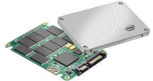

*Quelle: [http://praxistipps.s3.amazonaws.com](http://praxistipps.s3.amazonaws.com)*

#### Speichergeräte mit optischen Datenträgern

Sehr große Speicherkapazitäten bieten auch die optischen Speicher. Sie bestehen aus festen Kunststoffscheiben und einer speziellen Beschichtung, die auf optische Einwirkung reagiert. Fünf unterschiedliche Versionen sind derzeit auf dem Markt: die CD-Rom, die WORM, die MOD, die DVD und die Blu-Ray-Disc.

##### CD-Rom

Die CD-ROM ist ein Massenspeicher mit 650 bis 879 MByte Speicherkapazität. Als Vorlage diente die Compact-Disc (CD), die bereits Anfang der 80er Jahre als digitales Medium für Musik entwickelt wurde.

Im aufkommenden Multimedia-Zeitalter wurde es nötig die umfangreichen Computerdaten sinnvoll zu speichern. Dazu reichte die alte Diskette mit 1,4 MByte nicht mehr aus. Mit der Musik-CD war bereits ein zuverlässiger Datenträger für digitale Daten auf dem Markt. Somit war es naheliegend die Compact Disc als Speichermedium auch in der Computertechnik einzusetzen.

Der Durchmesser einer CD-ROM beträgt 12 cm. Die CD besteht aus Polycarbonat mit einer Dicke von 1,2 mm. Darin liegt eine reflektierende Aluminiumschicht. Sie ist einseitig mit Daten beschrieben und hat eine Speicherkapazität von 650 MByte bzw. 74 Minuten Abspielzeit.

Die Daten sind auf einer spiralförmigen, von innen nach außen, führenden Spur in Vertiefungen gespeichert. Diese Vertiefungen werden Pits (Täler) genannt. Sie sind 0,2 µm tief, 0,6 µm breit und maximal 0,9 µm lang. Der Abstand zwischen den Spuren beträgt 1,6 µm. Die Zwischenräume zwischen den Pits werden Lands genannt.

Die Laserdiode erzeugt einen Laserstrahl, der zusätzlich durch eine Linse gebündelten wird. Dieser Laserstrahl trifft auf die Unterseite der CD-ROM, durchdringt die Schutzschicht und trifft auf die Aluminium-Schicht. Dort wird er reflektiert. Das Prisma leitet den Laserstrahl zur Fotozelle weiter. Der Laserstrahl, der die Fotozelle trifft, erzeugt eine geringe elektrische Spannung. Trifft der Laserstrahl auf einen Übergang zwischen Pit und Land, dann wird der Laserstrahl abgelenkt, was eine andere elektrische Spannung in der Fotozelle verursacht. Auf diese Weise entsteht eine Reihe von Einsen und Nullen.

Eine Audio-CD wird mit einer konstanten Datenrate von 150 kByte/s ausgelesen. Dieser Datendurchsatz wird mit "1x" bezeichnet. Laufwerke, die einen 52-fachen Datendurchsatz haben, erreichen 7800 kByte/s. Diese Angabe bezieht sich auf den maximalen Datendurchsatz. Jede CD-ROM erhält im Laufe der Zeit und durch unsachgemäße Behandlung fehlerhafte Stellen (Kratzer, Risse). Diese Stellen bringen ein CD-ROM-Laufwerk zum häufigen Wiederholen des Lesevorgangs mit reduzierter Geschwindigkeit. Arbeitet die Fehlerkorrektur gut, sind diese Vorgänge seltener. Wobei sich das positiv auf die Lesegeschwindigkeit auswirkt.

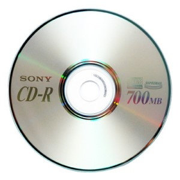

*Quelle: [http://1.bp.blogspot.com](http://1.bp.blogspot.com)*

##### DVD

Die DVD ist ein Massenspeicher, ähnlich wie die CD-ROM. Mit einer Speicherkapazität von 4,7 GByte (Single Layer) bzw. 8,5 GByte (Dual Layer) konnten viel mehr Daten gespeichert werden, als auf einer CD-ROM. Parallel dazu wurden beschreibbare und wiederbeschreibbare DVD-Varianten entwickelt. Ursprünglich stand DVD für Digital Video Disc. Ein Großteil der Anwendungen liegen jedoch im Computerbereich. Daher ist heute die korrekte Bezeichnung Digital Versatile Disc.

Die Daten auf einer DVD werden in Erhöhungen (Pits) und Vertiefungen (Lands) in der Reflektionsschicht gespeichert. Der Übergang von einem Pit zu einem Land bzw. umgekehrt wird als logische 1 gewertet. Findet kein Wechsel statt, wird das als logische 0 gewertet. Um mehr Daten auf ein gleich großes Medium wie die CD unterzubringen, werden die Pits und deren Abstand zueinander verkürzt und die Daten auf vier übereinanderliegende Schichten verteilt. Dadurch entsteht ein Speichermedium, das bis zu 17 GByte speichern kann.
Um die kleineren Pits lesen zu können, ist die Wellenlänge des roten Lasers auf 635 nm bzw. 650 nm verkürzt. Zum Vergleich: die CD-ROM wird mit einem infraroten Laser und einer Wellenlänge von 780 mm gelesen.

Der Durchmesser einer DVD beträgt 12 cm oder 120 mm. Die Scheibe ist 1,2 mm dick und wiegt zwischen 13 und 20 Gramm. Das Loch in der Mitte muss mindestens 15 mm groß sein. Es darf nicht enger, aber 0,15 mm weiter sein.

Die Speicherkapazitäten einer DVD sind eine Vorgabe der Filmindustrie. Diese geht von einer Standardlänge pro Film von 135 Minuten aus. Durch Addieren der Datenrate pro Sekunde kommt man mit Bild und Ton in mehreren Sprachen und Untertitel auf 4,69 MBit. In der Minute sind das 281,4 MBit. Bei 135 Minuten ergibt das eine Datenmenge von ca. 38 GBit, was umgerechnet etwa 4,7 GByte entspricht. Das ist die Speicherkapazität einer DVD-5 (Single Layer). Diese wird für Video-DVDs verwendet. Wenn die Speicherkapazität nicht ausreicht, dann greift man auf die doppellagige DVD-9 (Dual-Layer) zurück.

*Quelle: [https://upload.wikimedia.org/](https://upload.wikimedia.org/)*

##### Blu-ray Disc

Die Blu-ray Disc (BD) wurde für die Speicherung von hochauflösenden Videodaten (HDTV) entwickelt. Die Speicherung von mehr als zwei Stunden Audio- und Videodaten ist das maßgebliche Kriterium bei der Entwicklung gewesen. Die Speicherkapazität einer DVD reicht für diese Datenmenge nicht aus.

Die Bezeichnung Blu-ray Disc ist von der Farbe des Lasers abgeleitet. Weil sich eine Farbe nicht als Warenzeichen schützen lässt, hat man einfach das "e" aus dem Wort "Blue" weggelassen. Deshalb findet man ab und zu fälschlicherweise die Bezeichnung "Blue-ray Disc".

Mit Hilfe eines blauen Lasers mit einer Wellenlänge von 405 nm können 25 GByte auf einer einlagigen, einseitig beschreibbaren Blu-ray Disc gespeichert werden. Zweilagige Blu-ray Discs haben sogar die doppelte Kapazität (50 GByte). Denkbar wären Medien mit 8 Schichten, also 200 GByte. Allerdings wäre die Produktion dieser Medien sehr schwierig.

Um auf dem gleichen Medium, wie die CD bzw. DVD, eine höhere Speicherkapazität möglich zu machen, wurde die Struktur auf der Blu-ray Disc verkleinert. Dazu wird ein Laser im blauvioletten Bereich verwendet und die Wellenlänge auf 405 nm abgesenkt. Blaues Licht lässt sich feiner fokussieren und ermöglicht so eine höhere Datendichte auf der Scheibe. Dadurch muss aber auch der Abstand zwischen Scheibe und Schreib-/Leseoptik verringert werden. Nur lassen sich Schreib- und Lesefehler verringern.

Die Blu-ray Disc hat eine Schutzschicht von nur 0,1 mm. Aus diesem Grund war sie ursprünglich in einer Cartridge (Gehäuse) vorgesehen. Im Laufe der Weiterentwicklung gab es dann Materialien, die deutlich härter und als sehr dünne Schutzschicht geeignet waren. Deshalb wird die Blu-ray Disc ohne Gehäuse hergestellt. Der Formfaktor bleibt jedoch zur CD und DVD identisch. 12 cm Durchmesser und 1,2 mm Dicke. Damit ist die Kompatibilität zu Laufwerken gegeben, die neben der Blu-ray Disc auch CDs und DVDs lesen und schreiben können.

*Quelle: [http://zdnet3.cbsistatic.com](http://zdnet3.cbsistatic.com)*

#### Speichergeräte mit mechanischen Lesevorgängen

Man unterscheidet bei Speichergeräten mit mechanischen Lesevorgängen zwischen den analogen und digitalen Speichergeräten.

- Ein Beispiel für die analogen Medien ist die Schellackplatte / die Vinylschallplatte. Die eingepressten Vertiefungen in diesem Datenträger werden durch eine Spezialnadel abgetastet.
- Das Beispiel für digitale Medien dieser Kategorie ist die Lochkarte, welche zumeist aus hochwertigem Karton gefertigt ist. In der Datenverarbeitung wurde sie zur Datenerfassung und -Speicherung verwendet. In ihr wurden die Dateninhalte durch einen Lochcode abgebildet, dessen Verarbeitung mithilfe von elektro-mechanischen Geräten erfolgte.

## Kompetenz 3.1: Speichermaßeinheiten umrechnen

Bei der Auswahl eines geeigneten Speichermediums für einen Kunden fallen im Vergleich verschiedener Anbieter unterschiedliche Angaben zu den Größen auf. So werden einige Laufwerke mit der Einheit Gibibyte und andere mit der Einheit Gigabyte angeboten. Nach dem Einbau einer 1 TB Festplatte in einen Windows-PC für Testzwecke ist die Verwirrung groß: es werden nur 931 GB angezeigt. Wo ist der Rest? Etwas ähnliches ist Ihnen auch in der Vorauswahl unter der Angabe der maximalen Speichergröße je Laufwerk aufgefallen.

!!! attention "Taschenrechner"

    Nutzen Sie einen Taschenrechner, den Sie auch in der IHK-Prüfung verwenden wollen. Je mehr Übung Sie mit Ihrem Taschenrechner haben, desto einfacher werden Ihnen die Aufgabentypen in der Prüfung fallen. Ich empfehle Ihnen ein Modell, welches Zahlensysteme umrechnen kann (bspw. Casio FX991 DEX); damit ist bspw. auch das Berechnen von Break-even-Points und ähnliches möglich.

### Arbeitsauftrag A|3.1: Unterschied zwischen Gibibyte und Gigabyte

#### Aufgabe 1

Bei der Recherche zum Thema *Speichermaßeinheiten* sind Sie auf einen Artikel (M|3.3: Was unterscheidet Gigabyte und Gibibyte?) gestoßen, der das Problem in der Ausgangsbeschreibung beschreibt. Fassen Sie die Kernaussagen des Artikels im Informationsmaterial kurz und knapp zusammen.

#### Aufgabe 2

Nach dem Einbau einer 1 TB Festplatte in einem PC mit dem Betriebssystem *Microsoft Windows* wird eine Kapazität von 931 GB angezeigt. Informieren Sie sich mithilfe des Videos im Informationsmaterial (M|3.4: Umrechnungen von Speichermaßeinheiten), warum dies so ist und fassen Sie auch hier den Grund kurz und knapp zusammen.

#### Aufgabe 3

Rechnen Sie die Angaben in der Vorauswahl der NAS Systeme (M|3.1: Vorauswahl der Change IT-NAS-Systeme) oben im Kurs auf eine einheitliche Max. Laufwerksgröße in aufgerundeten ganzen TB um, damit ein Vergleich möglich ist.

### Informationsmaterial M|3.3: Was unterscheidet Gigabyte und Gibibyte?

**22.05.2014 um 18:00 Uhr von Henner Schröder u.a. - Kibibyte, Mebibyte, Gibibyte? In den Ohren der meisten Computernutzer klingt das fremd, obwohl wir alle täglich damit zu tun haben. Es handelt sich nämlich um die korrekten Bezeichnungen für Datenmengen in der Informationstechnik, die vom Internationalen Büro für Maß und Gewicht (BIPM) empfohlen werden.**

Grund für diese Norm: Die im täglichen Sprachgebrauch verwendeten Präfixe wie "kilo" oder "mega" für "Kilobyte" und "Megabyte" bezeichnen eigentlich Vielfache, die auf Zehnerpotenzen (10 hoch x) basieren. Ein Kilobyte ist demnach die Menge von genau 1.000 Byte - und nicht von 1.024, wie die meisten glauben. Das Wort "kilo" entstammt dem Griechischen und heißt "tausend"; in der Physik steht ein Kilogramm schließlich auch für 1.000 Gramm und ein Megahertz entspricht exakt einer Million Hertz.

In der Datenverarbeitung jedoch wird üblicherweise mit binären Größen gearbeitet, Angaben von Speichermengen basieren auf Zweierpotenzen (2 hoch x). Denn Grundlage der Datentechnik ist das Bit, eine binäre Einheit, die mit 0 und 1 nur zwei verschiedene Werte repräsentieren kann. Wenn Sie Ihrem PC ein Gigabyte Arbeitsspeicher gönnen, meinen Sie damit ergo nicht 1.000 (10 hoch 3), sondern 1.024 (2 hoch 10) Megabyte.

Geht es nach dem BIPM, sollten Sie diese Speichergröße jedoch nicht mehr als "Gigabyte" bezeichnen - sondern als "Gibibyte". Ein Gibibyte besteht aus 1.024 Mebibytes, die sich jeweils aus 1.024 Kibibytes zusammensetzen. Diese merkwürdig anmutenden Namen ergeben sich aus den Vorsilben der Präfixe giga, mega und kilo und der Silbe "bi", welche die "binäre" Bedeutung anzeigt. Abgekürzt sehen diese Angaben schon weniger gewöhnungsbedürftig aus, aus "Gibibyte" würde einfach "GiB" oder "GiByte".

Das ist ein durchaus logisches System, nur: Kaum jemand verwendet es. Die meisten kürzen das Giga-/Gibibyte zu "GByte" oder einfach "GB" ab - ohne genauer darauf einzugehen, wie viel Speicher nun tatsächlich gemeint ist. Und so wundert sich mancher Käufer einer "250 GB"-SSD darüber, dass Windows darauf partout nur "232 GB" erkennen will: Der Hersteller des Datenträgers rechnet in Milliarden Byte, also in tatsächlichen Gigabyte; Windows hingegen meint Gibibyte, ohne es explizit zu sagen.

Damit sind die Hersteller von Festplatten und SSDs im Recht, doch verwirrend ist die scheinbare Differenz in der Kapazität dennoch. Mit dieser Verwirrung wäre Schluss, wenn jeder die korrekten Begriffe verwenden würde. PC Games Hardware unterscheidet seit 2007 explizit zwischen Dezimal- und Primärprefixen, doch die alten, unpräzisen Bezeichnungen haben sich etabliert, viele Anwender sind daran gewöhnt.

Langfristig ist das aber keine gute Strategie: Mit stetig steigenden Datenmengen erhöht sich der Unterschied zwischen vermeintlich vorhandenem und tatsächlich vorhandenem Speicher. Während ein Kibibyte nur 2,4 % mehr Daten umfasst als ein Kilobyte, beinhaltet ein Tebibyte bereits 10 % mehr Informationen als ein Terabyte. Ein Zebibyte - in diesen Regionen liegt Schätzungen zufolge bereits das aktuelle jährliche anfallende Datenaufkommen über das Internet - entspricht bereits einer 18,1 % größeren Datenmenge als ein Zetabyte.

*Quelle: [https://www.pcgameshardware.de/Neue-Technologien-Thema-71240/Specials/PCGH-Basiswissen-im-Video-Was-unterscheidet-Gigabyte-und-Gibibyte-605340/](https://www.pcgameshardware.de/Neue-Technologien-Thema-71240/Specials/PCGH-Basiswissen-im-Video-Was-unterscheidet-Gigabyte-und-Gibibyte-605340/)*

### Arbeitsauftrag A|3.2: Umrechnungen zwischen SI- und IEC-Einheiten

Rechnen Sie für die folgenden Fälle die Maßeinheiten um:

#### Aufgabe 1

Sie kaufen sich eine Festplatte mit einer Speicherkapazität von 3000 GB. Wie groß ist die Speicherkapazität, die Ihnen Windows (in GiB) anzeigt? Geben Sie den Rechenweg an.

#### Aufgabe 2

Für eine Reservierung von Arbeitsspeicher für 8 GiB benötigt ein Programm diesen Wert in KiB. Rechnen Sie diesen unter Angabe des Rechenwegs um.

#### Aufgabe 3

Sie kaufen sich eine Festplatte mit einer Speicherkapazität von 128 GB. Wie groß ist die Speicherkapazität, die Ihnen Windows (in TiB) anzeigt? Geben Sie den Rechenweg an.

#### Aufgabe 4

Für Berechnungen zur Übertragung von Daten wird die Dateigröße von 536 GiB in MBit benötigt. Rechnen Sie diese unter Angabe des Rechenwegs um.

#### Aufgabe 5

Sie kaufen sich eine Festplatte mit einer Speicherkapazität von 240 GB. Wie groß ist die Speicherkapazität, die Ihnen Windows (in MiB) anzeigt? Geben Sie den Rechenweg an.

#### Aufgabe 6

Rechnen Sie den Wert von 375 MiB in den für ein Umrechnungsprogramm benötigten Wert als Angabe in KB um. Geben Sie Ihren Rechenweg an.

### Informationsmaterial M|3.4: Umrechnungen von Speichermaßeinheiten

#### Speichermaßeinheiten - Von SI- in IEC-Einheiten umrechnen

<iframe width="560" height="315" src="https://www.youtube-nocookie.com/embed/5bgE_CfPZR4" title="YouTube video player" frameborder="0" allow="accelerometer; autoplay; clipboard-write; encrypted-media; gyroscope; picture-in-picture" allowfullscreen></iframe>

#### Speichermaßeinheiten - Von IEC- zu SI-Einheiten umrechnen

<iframe width="560" height="315" src="https://www.youtube-nocookie.com/embed/0rfFf_FeZBQ" title="YouTube video player" frameborder="0" allow="accelerometer; autoplay; clipboard-write; encrypted-media; gyroscope; picture-in-picture" allowfullscreen></iframe>

---

## Kompetenz 3.2: Größen von Bild- und Videodateien bestimmen

Auf dem noch auszuwählenden Netzwerkspeicher für Yoel.de AG sollen Bilder und Videos für die Prozessdokumentation und als Tutorials gespeichert werden. Wenn von den 18 TB Nettokapazität des Netzwerkspeichers 2 TB für Videos und 1 TB für Bilder im Rahmen der ersten Tests mit einem Netzwerkspeicher bereitgestellt werden können, welche Menge an Videos und Bildern kann dann hierauf gespeichert werden?

---

### Arbeitsauftrag A|3.3: Dateigrößen berechnen

!!! attention "Taschenrechner"

    Nutzen Sie einen Taschenrechner, den Sie auch in der IHK-Prüfung verwenden wollen. Je mehr Übung Sie mit Ihrem Taschenrechner haben, desto einfacher werden Ihnen die Aufgabentypen in der Prüfung fallen.

#### Aufgabe 1

Der Speicherbedarf für 1200 Rastergrafikbilder soll berechnet werden. Nehmen Sie hierfür die folgenden Daten an:

| Aspekt | Wert |
| :--- | :--- |
| **Abmaße des Bildes:** | Höhe: 18 cm; Breite: 30 cm |
| **Hilfe zur Umrechnung:** | 1 Inch = 2,54 cm |
| **Auflösung:** | 400 ppi (Pixel per Inch) |
| **Farbmodell:** | RGB (drei Kanäle rot/grün/blau pro Pixel) |
| **Farbtiefe:** | Deep Color (12 Bit je Farbkanal) |

 

Berechnen Sie den Speicherbedarf in GiB.

#### Aufgabe 2

Berechnen Sie mithilfe Ihres Ergebnisses aus der vorherigen Aufgabe, wie viele Bilder auf 1 TB gespeichert werden können. Geben Sie den Rechenweg an.

#### Aufgabe 3

Es liegen bei Yoel.de AG bereits einige Videotutorials vor. Sie haben folgende Details für eines dieser Videos herausfinden können:

| Aspekt | Wert |
| :--- | :--- |
| **Auflösung in Pixel:** | 1072 x 768 |
| **Bilder je Sekunde:** | 30 |
| **Farbtiefe & Kanäle:** | 8 Bit je Farbe, RGB-Modus je Pixel |
| **Videodauer:** | 15 Min. |

 

Der Komprimierungsfaktor für ein Video beträgt 1:100. Die Dateigröße beträgt damit nach der Kompression einhundertstel der vorherigen Dateigröße. Die Tutorials sind reine Videobilder ohne Ton.

Wie groß ist die Videodatei in MiB?

#### Aufgabe 4

Für wie viele der Videos aus der vorherigen Aufgabe würden die reservierten 2 TB ausreichen?

---

### Informationsmaterial M|3.5: Dateigrößen von Bildern und Videos berechnen

#### Dateigrößen von Bildern berechnen

##### Infovideo

<iframe width="560" height="315" src="https://www.youtube-nocookie.com/embed/ygsrzNKgeSw" title="YouTube video player" frameborder="0" allow="accelerometer; autoplay; clipboard-write; encrypted-media; gyroscope; picture-in-picture" allowfullscreen></iframe>

##### Einflussfaktoren auf die Bildgröße

- **Auflösung:** Dies ist die Anzahl der Pixel pro Inch in einem Bild. Die Auflösung ist ein Raster, welches über ein Bild gelegt wird. Je mehr Bildpunkte vorhanden sind, desto größer ist die Auflösung und um so mehr Bildpunkte müssen gespeichert werden.
- **Farbtiefe:** Diese betrifft die Speichergröße, die benötigt wird, um die Farbinformationen eines Pixels abzuspeichern.
    - Das Minimum von 1 Bit (2 Farbwerte, da 2^1) entspricht lediglich der Unterscheidung eines Pixels in Weiß oder Schwarz.
    - Bei 8 Bit (256 Farbwerten, da 2^8) liegt ein Bild in Graustufen oder indizierten Farben vor.
    - Mit 16 Bit (65.536 mögliche Farbwerte, da 2^16) ist schon eine bessere Farbabstufung in Bildern vorhanden.
    - 24 Bit sind in einem Bild mit RGB-Modus (rot-grün-blau) vorhanden, sodass 16,7 Mio. mögliche Farbwerte zur Verfügung stehen (2^24).
- **Kompression:** In den Aufgaben gehen wir, wenn nicht anders beschrieben von unkomprimierten Bildern aus. Falls ein Faktor vorhanden ist, wird das Bild auf diesen Wert in seiner Dateigröße herunterkomprimiert. Dazu werden entweder weniger Pixel gespeichert (dies geht nur mit Qualitätsverlust) oder verlustfreie Verfahren angewandt. Die verlustfreien Verfahren legen bei Wiederholungen in den Bitfolgen in der Regel eine Art Wörterbuch an, um Redundanzen im Bild mittels kürzerer Bitfolgen beschreiben zu können.

##### Beispiel

Der Speicherbedarf für 500 Bilder soll in GiB berechnet werden.

###### Gegeben je Bild

- Höhe: 1.500 Pixel
- Breite: 2.000 Pixel
- Farbkanäle pro Pixel: 3 (RGB)
- Farbtiefe = 8 Bit pro Farbkanal = also je 1 Byte

###### Schritt 1 - Pixel-Anzahl pro Bild bestimmen

Pixelanzahl pro Bild = 1.500 * 2.000 Pixel = 3.000.000 Pixel/Bild

###### Schritt 2 - Byte pro Bild bestimmen

Byte pro Pixel = (Anzahl Farbkanäle * Bit pro Farbkanal) / 8 = (3 * 8 Bit/Pixel) / 8 = 3 Byte/Pixel

###### Schritt 3 - Speicherbedarf ausrechnen

Speicherbedarf pro Bild = 3.000.000 Pixel/Bild * 3 Byte/Pixel = 9.000.000 Byte/Bild
Speicherbedarf gesamt = 9.000.000 Byte/Bild * 500 Bilder = 4.500.000.000 Byte

###### Schritt 4 - Maßeinheit anpassen

Speicherbedarf gesamt = 4.500.000.000 Byte / 1024^3 = 4,19 GiB

#### Dateigrößen von Videos berechnen

<iframe width="560" height="315" src="https://www.youtube-nocookie.com/embed/gXxDKIrg-CA" title="YouTube video player" frameborder="0" allow="accelerometer; autoplay; clipboard-write; encrypted-media; gyroscope; picture-in-picture" allowfullscreen></iframe>

---

## Kompetenz 3.3: Übertragung von Daten berechnen

Die vorhandenen Videotutorials von Yoel.de AG sollen nach Einrichtung des Netzwerkspeichers auf diesen übertragen werden. Dazu ist für die Zeitplanung des Projektes die Dauer der Datentransfers zu planen.

---

### Arbeitsauftrag A|3.4: Werte zur Datenübertragung bestimmen

Berechnen Sie die folgenden Aufgaben zur Dateiübertragung:

#### Aufgabe 1

Ein Videotutorial mit einer Dateigröße von 650 MB soll über eine lokale Netzwerkverbindung auf den Netzwerkspeicher übertragen werden. Die theoretische Übertragungsgeschwindigkeit dieser Verbindung liegt bei 1 GBit pro Sekunde. Berechnen Sie die benötigte theoretische Übertragungszeit unter Angabe des Rechenwegs.

#### Aufgabe 2

Eine PDF-Anleitung mit einer Dateigröße von 2 MB wurde über eine drahtlose Netzwerkverbindung übertragen. Die Übertragungsdauer für diesen Vorgang betrug 0,45 Sekunden. Wie hoch war demnach die Übertragungsgeschwindigkeit (Einheit: MBit/s) des Netzwerks für diese Datei? Geben Sie den Rechenweg an.

#### Aufgabe 3

Mit einer Übertragungsgeschwindigkeit von 50 MBit/s können die restlichen Videotutorials vom Endgerät des Projektverantwortlichen auf den Netzwerkspeicher übertragen werden. Dieser hat für Videotutorials einer Abteilung des Unternehmens 30 Min. lang Daten übertragen. Wie groß war die gesamte Speichermenge (in GiB) der in dieser Zeit übertragenen Videos? Geben Sie den Rechenweg an.

---

### Informationsmaterial M|3.6: Berechnungen zu der Übertragung von Daten

#### Daten übertragen - Berechnung der Übertragungsdauer

<iframe width="560" height="315" src="https://www.youtube-nocookie.com/embed/rNLuo-fiYMM" title="YouTube video player" frameborder="0" allow="accelerometer; autoplay; clipboard-write; encrypted-media; gyroscope; picture-in-picture" allowfullscreen></iframe>

---

## Kompetenz 3.4: RAID-Level unterscheiden

Die Datensicherheit ist für Yoel.de AG ein wichtiger Aspekt in der Auswahl eines Netzwerkspeichers. Doch es gibt viele Unterschiedliche Möglichkeiten, die bei potenziellen Geräten verfügbar sind. JBOD, RAID 1, RAID 5 und viele mehr stehen zur Verfügung. Welches ist das passende Konzept für den Kundenauftrag?

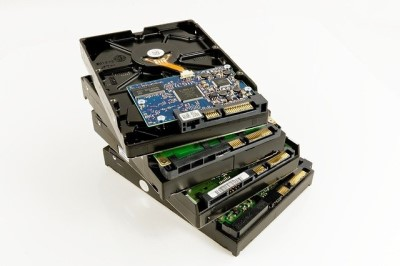

---

### Arbeitsauftrag A|3.5: Verfügbarkeit von Daten unterstützen

#### Aufgabe 1

Welche Anforderungen zur Datensicherheit hatte der Kunde dem Außendienst mitgeteilt (s. M|3.0: Gesprächsnotiz zu Yoel.de AG)? Fassen Sie diese in eigenen Worten zusammen.

#### Aufgabe 2

Es sind bei den Netzwerkspeichern verschiedene Möglichkeiten für den Betrieb mehrerer Festplatten angegeben. Wählen Sie für den Anwendungsfall zwischen JBOD, RAID 0, RAID 1, RAID 10 und RAID 5 begründet aus. Prüfen Sie dazu jeden Betriebsmodus und beschreiben Sie, warum Sie diesen für den Anwendungsfall von Yoel.de AG für angemessen oder eben nicht angemessen halten. Informationen zu den Betriebsmodi finden Sie im Kurs (s. M|3.7: Betriebsmodi für Festplatten im NAS).

#### Aufgabe 3

Nehmen Sie zu der folgenden Aussage begründet Stellung:

!!! quote "Herr Müller:"
    
    "Wenn ich ein zentrales NAS mit einem RAID 1 oder 5 betreibe, so bildet dies ein Backup meiner Daten ab. Ein weiteres Backup ist nicht notwendig."

#### Aufgabe 4

Das NAS-System *NAS Serv Plus* ist mit dem Modus des RAID 6 kompatibel. Informieren Sie sich im Informationsmaterial (s. M|3.7: Betriebsmodi für Festplatten im NAS), wie dieses funktioniert und prüfen Sie, ob dieses aufgrund der Kundenanforderungen eine Alternative darstellt.

---

### Informationsmaterial M|3.7: Betriebsmodi für Festplatten im NAS

#### JBOD

JBOD bedeutet *Just a Bunch of Disks*, also: Nur ein Haufen Festplatten. Bei JBOD fehlt die Redundanz, daher gehört es nicht zu den RAID-Systemen, es ist nur ein einfaches „Array of Independent Disks“. Der Begriff wird in der Praxis in Abgrenzung zu RAID-Systemen auf drei verschiedene Arten verwendet:

1. Konfiguration eines RAID-Controllers mit mehreren Festplatten, die keinen Verbund bilden. Viele Hardware-RAID-Controller sind in der Lage, die angeschlossenen Festplatten dem Betriebssystem einzeln zur Verfügung zu stellen; die RAID-Funktionen des Controllers werden dabei abgeschaltet und er arbeitet als einfacher Festplatten-Controller.
2. Ein JBOD kann auch, unabhängig vom Controller, eine auf beliebige Arten an den Computer angeschlossene Anzahl von Festplatten bezeichnen. Mithilfe einer Volume Management Software kann ein solches JBOD zu einem gemeinsamen logischen Volume zusammengeschaltet werden.
3. Konfiguration eines RAID-Controllers als Aneinanderreihung („concatenation“) einer oder mehrerer Festplatten, die so als ein einziges Laufwerk erscheinen. Es ist jedoch auch möglich, eine Festplatte in mehrere logische Datenträger aufzuteilen, um diese für das Betriebssystem als mehrere Festplatten erscheinen zu lassen, zum Beispiel um Kapazitätsgrenzen zu umgehen.

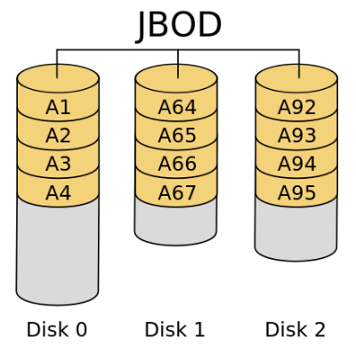

*Quelle: [https://de.wikipedia.org/wiki/RAID#Die_gebr%C3%A4uchlichen_RAID-Level_im_Einzelnen](https://de.wikipedia.org/wiki/RAID#Die_gebr%C3%A4uchlichen_RAID-Level_im_Einzelnen)*

#### RAID-Systeme

##### Übersicht zu den wichtigsten RAID-Systemen

<iframe width="560" height="315" src="https://www.youtube-nocookie.com/embed/1YoQ-T0wMfE" title="YouTube video player" frameborder="0" allow="accelerometer; autoplay; clipboard-write; encrypted-media; gyroscope; picture-in-picture" allowfullscreen></iframe>
 

##### RAID 0

| Eckdaten zu RAID 0 | |
| :--- | :--- |
| **Mindestanzahl an Festplatten:** | 2 |
| **Nettokapazität:** | = Speichermenge der Festplatten |
| **Nettokapazität Beispiel:** | Eingesetzt sind 2 Festplatten mit je 1 TB.   Nettokapazität = 2 * 1 TB = 2 TB |
| **Datenverlust:** | Es darf keine Festplatte ausfallen, ansonsten liegt Datenverlust vor. |

 
Bei RAID 0 fehlt die Redundanz, daher gehört es streng genommen nicht zu den RAID-Systemen, es ist nur ein schnelles „Array of Independent Disks“.

RAID 0 bietet gesteigerte Transferraten, indem die beteiligten Festplatten in zusammenhängende Blöcke gleicher Größe aufgeteilt werden, wobei diese Blöcke quasi im Reißverschlussverfahren zu einer großen Festplatte angeordnet werden. Somit können Zugriffe auf allen Platten parallel durchgeführt werden (engl. striping, was „in Streifen zerlegen“ bedeutet, abgeleitet von stripe, oder „Streifen“). Die Datendurchsatzsteigerung (bei sequentiellen Zugriffen, aber besonders auch bei hinreichend hoher Nebenläufigkeit) beruht darauf, dass die notwendigen Festplattenzugriffe in höherem Maße parallel abgewickelt werden können.

Fällt jedoch eine der Festplatten durch einen Defekt (vollständig) aus, kann der RAID-Controller ohne deren Teildaten die Nutzdaten nicht mehr vollständig rekonstruieren.

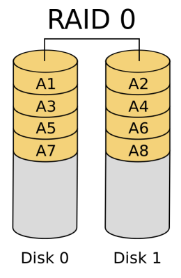

*Quelle: [https://de.wikipedia.org/wiki/RAID#Die_gebr%C3%A4uchlichen_RAID-Level_im_Einzelnen](https://de.wikipedia.org/wiki/RAID#Die_gebr%C3%A4uchlichen_RAID-Level_im_Einzelnen)*

##### RAID 1

| Eckdaten zu RAID 1 | |
| :--- | :--- |
| **Mindestanzahl an Festplatten:** | 2 |
| **Nettokapazität:** | = Speichermenge der Festplatten / 2 |
| **Nettokapazität Beispiel:** | Eingesetzt sind 2 Festplatten mit je 1 TB.   Nettokapazität = 2 * 1 TB / 2 = 1 TB |
| **Datenverlust:** | Es darf eine Festplatte ausfallen, ansonsten liegt Datenverlust vor. |

 
RAID 1 ist der Verbund von mindestens zwei Festplatten. Ein RAID 1 speichert auf allen Festplatten die gleichen Daten (Spiegelung) und bietet somit volle Redundanz. Die Kapazität des Arrays ist hierbei höchstens so groß wie die kleinste beteiligte Festplatte.

Ein enormer Vorteil von RAID 1 gegenüber allen anderen RAID-Verfahren liegt in seiner Einfachheit. Beide Platten sind identisch beschrieben und enthalten alle Daten eines Systems [...]. Im Störfall wie auch bei Migrationen beziehungsweise Upgrades bedeutet das einen enormen Vorteil.

Fällt eine der gespiegelten Platten aus, kann jede andere weiterhin alle Daten liefern. Besonders in sicherheitskritischen Echtzeitsystemen ist das unverzichtbar. RAID 1 bietet eine hohe Ausfallsicherheit, denn zum Totalverlust der Daten führt erst der Ausfall aller Platten.

Eine Spiegelplatte ist kein Ersatz für eine Datensicherung, da sich auch versehentliche oder fehlerhafte Schreiboperationen (Viren, Stromausfall, Benutzerfehler) augenblicklich auf die Spiegelplatte übertragen. Dies gilt insbesondere für unvollständig abgelaufene, schreibende Programme (etwa durch Stromausfall abgebrochene Update-Transaktionen auf Datenbanken ohne Logging-System), wobei es hier nicht nur zu der Beschädigung der Spiegelung, sondern auch zu einem inkonsistenten Datenzustand trotz intakter Spiegelung kommen kann.

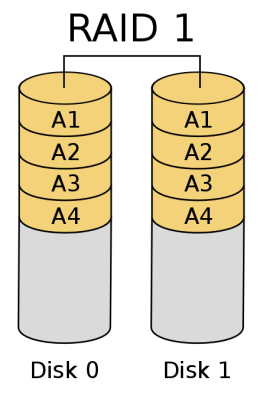

*Quelle: [https://de.wikipedia.org/wiki/RAID#Die_gebr%C3%A4uchlichen_RAID-Level_im_Einzelnen](https://de.wikipedia.org/wiki/RAID#Die_gebr%C3%A4uchlichen_RAID-Level_im_Einzelnen)*

##### RAID 10

| Eckdaten zu RAID 10 | |
| :--- | :--- |
| **Mindestanzahl an Festplatten:** | 4 |
| **Nettokapazität:** | = Speichermenge der Festplatten / 2 |
| **Nettokapazität Beispiel:** | Eingesetzt sind 4 Festplatten mit je 1 TB.   Nettokapazität = 4 * 1 TB / 2 = 2 TB |
| **Datenverlust:** | Es können bis zu zwei Festplatten ausfallen, wenn jeweils eine aus den Spiegelungen betroffen ist. Ansonsten liegt Datenverlust vor. |

 
Ein RAID-10-Verbund ist ein RAID 0 über mehrere RAID 1. Es werden dabei die Eigenschaften der beiden RAIDs kombiniert: Sicherheit und gesteigerte Schreib-/Lesegeschwindigkeit.

Ein RAID-10-Verbund benötigt mindestens vier Festplatten.

Während die RAID-1-Schicht einer RAID-0+1-Implementation nicht in der Lage ist, einen Schaden in einem untergeordneten RAID 0 differenziert den einzelnen Festplatten zuzuordnen, bietet RAID 10 gegenüber RAID 0+1 eine bessere Ausfallsicherheit und schnellere Rekonstruktion nach einem Plattenausfall, da nur ein Teil der Daten rekonstruiert werden muss. Auch hier hat man wie bei RAID 0+1 nur die Hälfte der gesamten Festplattenkapazität zur Verfügung.

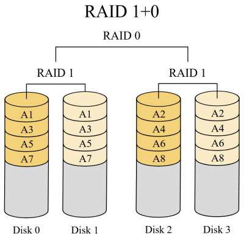

*Quelle: [https://de.wikipedia.org/wiki/RAID#Die_gebr%C3%A4uchlichen_RAID-Level_im_Einzelnen](https://de.wikipedia.org/wiki/RAID#Die_gebr%C3%A4uchlichen_RAID-Level_im_Einzelnen)*

##### RAID 5

| Eckdaten zu RAID 5 | |
| :--- | :--- |
| **Mindestanzahl an Festplatten:** | 3 |
| **Nettokapazität:** | = Speichermenge der Festplatten - Kapazität einer Festplatte |
| **Nettokapazität Beispiel:** | Eingesetzt sind 3 Festplatten mit je 1 TB.   Nettokapazität = 3 * 1 TB - 1 = 2 TB |
| **Datenverlust:** | Es darf eine Festplatte ausfallen, ansonsten liegt Datenverlust vor. |

 
RAID 5 implementiert Striping mit auf Block-Level-verteilten Paritätsinformationen. Zur Berechnung der Parität wird durch die jeweils an gleicher Adresse anliegenden Datenblöcke der am RAID-Verbund beteiligten Festplatten eine logische Gruppe gebildet. Von allen Datenblöcken einer Gruppe enthält ein Datenblock die Paritätsdaten, während die anderen Datenblöcke Nutzdaten enthalten. Die Nutzdaten von RAID-5-Gruppen werden wie bei RAID 0 auf alle Festplatten verteilt. Die Paritätsinformationen werden jedoch nicht wie bei RAID 4 auf einer Platte konzentriert, sondern ebenfalls verteilt.

RAID 5 bietet sowohl gesteigerten Datendurchsatz beim Lesen von Daten als auch Redundanz bei relativ geringen Kosten und ist dadurch eine sehr beliebte RAID-Variante. In schreibintensiven Umgebungen mit kleinen, nicht zusammenhängenden Änderungen ist RAID 5 nicht zu empfehlen, da bei zufälligen Schreibzugriffen der Durchsatz aufgrund des zweiphasigen Schreibverfahrens deutlich abnimmt. An dieser Stelle wäre eine RAID-01-Konfiguration vorzuziehen. RAID 5 ist eine der kostengünstigsten Möglichkeiten, Daten auf mehreren Festplatten redundant zu speichern und dabei das Speichervolumen effizient zu nutzen. Dieser Vorteil kann bei wenigen Platten allerdings durch hohe Controllerpreise vernichtet werden. Daher kann es in einigen Situationen dazu führen, dass ein RAID 10 kostengünstiger ist.

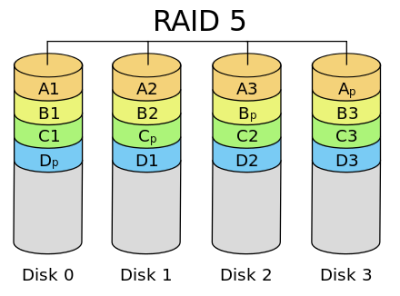

*Quelle: [https://de.wikipedia.org/wiki/RAID#Die_gebr%C3%A4uchlichen_RAID-Level_im_Einzelnen](https://de.wikipedia.org/wiki/RAID#Die_gebr%C3%A4uchlichen_RAID-Level_im_Einzelnen)*

##### RAID 6

| Eckdaten zu RAID 6 | |
| :--- | :--- |
| **Mindestanzahl an Festplatten:** | 4 |
| **Nettokapazität:** | = Speichermenge der Festplatten - Kapazität von zwei Festplatten |
| **Nettokapazität Beispiel:** | Eingesetzt sind 4 Festplatten mit je 1 TB.   Nettokapazität = 4 * 1 TB -2 = 2 TB |
| **Datenverlust:** | Es können bis zu zwei Festplatten ausfallen, ansonsten liegt Datenverlust vor. |

 
RAID 6 (unter diversen Handelsnamen angeboten, zum Beispiel Advanced Data Guarding) funktioniert ähnlich wie RAID 5, verkraftet aber den gleichzeitigen Ausfall von bis zu zwei Festplatten. Insbesondere beim intensiven Einsatz hochkapazitiver SATA-/IDE-Festplatten kann die Wiederherstellung der Redundanz nach dem Ausfall einer Platte viele Stunden bis hin zu Tagen dauern.

RAID 6 implementiert Striping mit doppelten, auf Block-Level verteilten Paritätsinformationen. Im Gegensatz zu RAID 5 gibt es bei RAID 6 mehrere mögliche Implementierungsformen, die sich insbesondere in der Schreibleistung und dem Rechenaufwand unterscheiden. Im Allgemeinen gilt: Bessere Schreibleistung wird durch erhöhten Rechenaufwand erkauft. Im einfachsten Fall wird eine zusätzliche XOR-Operation über eine orthogonale Datenzeile berechnet, siehe Grafik. Auch die zweite Parität wird rotierend auf alle Platten verteilt. Eine andere RAID-6-Implementierung rechnet mit nur einer Datenzeile, produziert allerdings keine Paritätsbits, sondern einen Zusatzcode, der 2 Einzelbit-Fehler beheben kann. Das Verfahren ist rechnerisch aufwändiger.

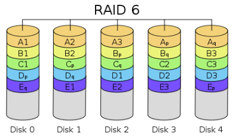

*Quelle: [https://de.wikipedia.org/wiki/RAID#Die_gebr%C3%A4uchlichen_RAID-Level_im_Einzelnen](https://de.wikipedia.org/wiki/RAID#Die_gebr%C3%A4uchlichen_RAID-Level_im_Einzelnen)*

---

### Informationsmaterial M|3.8: Überlegungen zur Ausstattung eines NAS

#### Festplatten mit 3,5 Zoll oder 2,5 Zoll?

In den meisten NAS-Systemen können sowohl Festplatten mit 3,5 Zoll Formfaktor als auch mit 2,5 Zoll Formfaktor verbaut werden. Für 2,5 Zoll Festplatten benötigt man aber häufig noch einen Adapter. Preislich sind diese teurer als 3,5 Zoll Festplatten und bieten weniger Kapazität. Ich würde an dieser Stelle deshalb zu 3,5 Zoll Festplatten raten.

#### Sind SSDs im NAS sinnvoll?

SSDs im NAS-System sind meiner Meinung nach nicht sinnvoll. Zum einen bekommt man bei klassischen Festplatten deutlich mehr Speicherplatz zum selben Preis, zum anderen habt ihr keinen Geschwindigkeitsvorteil, da die Netzwerkgeschwindigkeit nicht ausreichend ist. Lediglich bei großen NAS-Systemen mit 10 Gigabit Anbindung kann sich dies lohnen. Viele Hersteller bieten mittlerweile auch SSDs an, die geeignet sind für den Betrieb im NAS-System.

#### Für den Dauerbetrieb geeignet?

Einer der wohl wichtigsten Punkte bei der Auswahl von Festplatten ist ob diese für den Einsatz im NAS geeignet sind. Speziell geht es hier um den Dauerbetrieb. Normale Desktop-Festplatten sind normalerweise darauf ausgelegt 8 Stunden am Tag in Betrieb zu sein. In NAS-Systemen laufen die Festplatten aber in der Regel 24 Stunden am Tag. Einige Hersteller haben daher Modelle für diesen Anwendungsfall im Portfolio. Zusätzlich sind diese Festplatten für den Betrieb im RAID ausgelegt und verfügen über einen Fehlerreporting-Mechanismus.

#### Kompatibilität vorher prüfen

Habt ihr euch für eine bestimmte Festplatte entschieden, ist es ratsam zu prüfen ob diese auch kompatibel mit eurem NAS-System ist. Auf den Webseiten der Hersteller finden sich dazu Listen mit kompatiblen Festplatten.

#### Geschwindigkeiten bei NAS-Festplatten

Anders als im Desktop PC oder Notebook kommt es bei NAS-Festplatten weniger auf die Geschwindigkeit an. Der Flaschenhals ist hier in der Regel die Netzwerkgeschwindigkeit von 1GBit/s. Durch die Bündelung der Festplatten im RAID summieren sich die Geschwindigkeiten der Festplatten. Die speziellen NAS-Festplatten der Hersteller drehen mit 5400 Umdrehungen pro Minute anstatt 7200 U/min wie im Desktop. Das ist völlig ausreichend. Durch die langsamere Drehzahl sind diese Festplatten zusätzlich leiser und benötigen weniger Strom.

#### Maximale Größe beachten

Je nach NAS-System solltet ihr darauf achten die maximal unterstützte Größe pro Festplatte nicht zu überschreiten. Welche maximale Speichergröße euer NAS-System unterstützt findet ihr im Datenblatt des Geräts.

#### Festplatten aus unterschiedlichen Chargen

Häufig findet man im Internet oder beim Elektronikhändler sogenannte NAS Bundles. Hier bekommt man das NAS-System inklusive Festplatten (z.B. NAS mit 4x4TB). In diesen Bundles sind meistens Festplatten aus der gleichen Charge verbaut. Das kann unter Umständen zu Problemen führen. Wenn die Charge einen Fehler aufweist, ist es möglich das mehrere Festplatten gleichzeitig ausfallen. Die Sicherheit des RAID Systems ist dann nicht mehr gewährleistet. Außerdem dürfte die Lebenserwartung der Festplatten in etwa gleich sein. Besser ist es die Festplatten zu mischen. Hierbei wählt ihr zwar den gleichen Hersteller, achtet aber auf unterschiedliche Chargen. Das erreicht ihr, indem ihr bei verschiedenen Zulieferern oder zu unterschiedlichen Zeitpunkten bestellt. Festplatten unterschiedlicher Hersteller würde ich aufgrund von Kompatibilitätsproblemen nicht empfehlen.

*Quelle: [https://lost-in-it.de/welche-festplatten-eignen-sich-fuer-nas-systeme/](https://lost-in-it.de/welche-festplatten-eignen-sich-fuer-nas-systeme/)*

---

## Kompetenz 3.5: Energieeffizienz berechnen

Den Betriebsmodus für die Festplatten im Netzwerkspeicher haben Sie festgelegt. Im nächsten Schritt soll die Energieeffizienz der Alternativen aus der Vorauswahl bestimmt werden, um dem Kunden Yoel.de AG ein passendes Angebot zu unterbreiten.

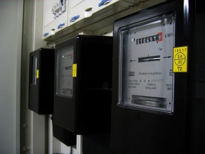

---

### Arbeitsauftrag A|3.6: Energieeffizienz eines Netzwerkspeichers berechnen

!!! attention "Taschenrechner"

    Nutzen Sie einen Taschenrechner, den Sie auch in der IHK-Prüfung verwenden wollen. Je mehr Übung Sie mit Ihrem Taschenrechner haben, desto einfacher werden Ihnen die Aufgabentypen in der Prüfung fallen.

#### Aufgabe 1

Berechnen Sie, was die Netzwerkspeicher jeweils an Stromkosten verursachen, wenn diese 24/7 für ein Jahr in Voll-Betrieb sind. Der Preis je kWh beträgt 30 Cent. Entnehmen Sie die notwendigen Informationen der Gegenüberstellung sowie dem Material im Kurs.

#### Aufgabe 2

Da die Kosten bei verschiedener Festplattenanzahl schlecht vergleichbar sind, nehmen Sie Ihre Ergebnisse aus *Aufgabe 1* und berechnen Sie die durchschnittlichen Kosten der Netzwerkspeicher je Festplatte.

#### Aufgabe 3

Berechnen Sie, welche Energiekosten die Systeme jeweils verursachen, wenn neben dem Voll-Betrieb ein Energiesparmodus (Festplattenruhezustand) sowie eine Abschaltung (Standby) genutzt werden. Die Netzwerkspeicher werden damit durchschnittlich 30% des Tages unter voller Auslastung stehen. 25% des Tages wird der Netzwerkspeicher im Energiesparmodus betrieben. Den Rest des Tages ist das Gerät im Standby.

#### Aufgabe 4

Wie viele des voll bestückten Netzwerkspeichers *NAS Company Plus* können über eine Steckdose, die mit 16 A abgesichert ist, maximal betrieben werden?

---

---

### Informationsmaterial M|3.9: Elektrische Größen und Formeln

| Größe | Formel(-zeichen) | Maßeinheit |
| :--- | :--- | :--- |
| Ohmsches Gesetz | R = U / I | Ω → Ohm |
| elektrische Spannung | U = R * I | V → Volt |
| elektrischer Strom | I = U / R | A → Ampere |
| elektrischer Widerstand | R | Ω → Ohm |
| elektrische Leistung | P = U * I | W → Watt |
| elektrische Energie | E = P * t | Wh → Wattstunden |
| Ladungsmenge (Akku-Kapazität) | Q = I * t | Ah → Amperestunden |
| Kosten der Elektrischen Energie | Preis | oftmals als Preis in €/kWh oder Cent/kWh angegeben |
| Zeit | t | je nach Anwendungsfall   s → Sekunden   h → Stunden   d → Tage |

---

## Handlungsergebnis

Ihnen liegen alle benötigten Informationen bezüglich der Kundenanforderungen, der technischen Details sowie möglicher Alternativen vor. Zwischenzeitlich wurden aus dem Produktkatalog der Change IT verschiedene Netzwerkspeicher als Vorauswahl zusammengestellt. Sie sollen jetzt eine Auswahlentscheidung für die Yoel.de AG treffen und das Ergebnis verbal begründet als E-Mail zusenden.

*Bildquelle: [https://xkcd.com/1445/](https://xkcd.com/1445/)*

!!! question "Nice to know: Effizienz vs. Effektivität"

    - Effektives Arbeiten ist zielführend: der Einsatz von Maßnahmen, die auf ein gesetztes Ziel hinarbeiten.
    - Effizientes Arbeiten ist ressourcenschonend: der Einsatz von Maßnahmen, die mit möglichst geringem Aufwand das gesetzte Ziel erreichen.

---

### Arbeitsauftrag A|3.7: Auswahlentscheidung für einen Netzwerkspeicher (10 % der lernprozessbegleitenden Bewertung)

#### Aufgabe 1

Verschaffen Sie sich einen Überblick über die Vorauswahl des Kollegen.

#### Aufgabe 2

Beginnen Sie mit der verbalen Begründung, indem Sie die Anforderungen an das auszuwählende System zusammengestellt werden.

#### Aufgabe 3

Führen Sie die Abwägung durch.

#### Aufgabe 4

Treffen und begründen Sie Ihre letztendliche Entscheidung.

!!! tip "Hinweise zu dieser Aufgabe"

    - Geben Sie die als E-Mail an den Kunden formulierte verbale Begründung zur Auswahl des Netzwerkspeichers als .PDF-Datei (max. 2 MB) in dieser Aufgabe ab.
    - Schreiben Sie max. eine DIN-A4-Seite.
    - Benennen Sie die Datei nach dem Schema "klasse_nachname.pdf".

---

## Weitere Übungen

!!! note "Hinweis zu den Übungen"

    Nachfolgend finden Sie Aufgaben zur Wiederholung der Inhalte dieses Kapitels. Es liegen hierzu jeweils Beispiellösungen zum Zweck der Selbstkontrolle vor.

### Übung UE|3.0: Speichermaßeinheiten umrechnen

<iframe src="https://moodle.mm-bbs.de/moodle/mod/hvp/embed.php?id=110707" width="733" height="325" frameborder="0" allowfullscreen="allowfullscreen"></iframe>

!!! info

    Sie müssen in einem anderen Tab im Browser unter moodle.mm-bbs.de angemeldet sein, um diese Ressource laden zu können.

---

### Übung UE|3.1: Datenspeicher einordnen

<iframe src="https://moodle.mm-bbs.de/moodle/mod/hvp/embed.php?id=199060" width="1091" height="459" frameborder="0" allowfullscreen="allowfullscreen" title="UE|3.1: Datenspeicher einordnen"></iframe>

!!! info

    Sie müssen in einem anderen Tab im Browser unter moodle.mm-bbs.de angemeldet sein, um diese Ressource laden zu können.

---

### Übung UE|3.2: Übertragung von Daten berechnen

#### Aufgabe 1

Die KUMOT GmbH plant für drei Kunden ein großes Update einer Kassen-Software. Dazu muss diese durch den IT-Dienst vor Ort heruntergeladen werden. Für die ersten beiden Kunden beträgt die Dateigröße 15 GB.

1. Der Kunde „Aal & Krabbe e.K.“ im Vareler Hafen hat eine Internetanbindung mit 4.000 kbit/s. Wie lange dauert der Download? Geben Sie das Ergebnis in Stunden und Minuten an.
2. Die Kundin Walburga Immervoll hat in ihrer Gaststätte 4 Stunden, 28 Minuten und 26 Sekunden gebraucht, um das Update herunterzuladen. Welche Downloadgeschwindigkeit in Mbit/s lag hier vor?
3. Die Rechtsanwälte Zorn & Zorn haben ein anderes Update erhalten. Der Download mit VDSL bei 50 Mbit/s dauerte 2 Stunden und 10 Minuten. Wie groß war das Update-Paket in MiB?

#### Aufgabe 2

Wie lange (in Minuten und Sekunden) dauert voraussichtlich der Upload von 16 Mebibyte Daten, wenn die nominelle Datenübertragungsrate 192 Kilobit pro Sekunde beträgt und die reale Übertragungsgeschwindigkeit auf 80 % dieses Werts geschätzt wird?

#### Aufgabe 3

Wie hoch (in Kilobit pro Sekunde) war die effektive Datenübertragungsrate, wenn der Download eines 240 MiB großen Software-Updates sieben Minuten dauerte?

#### Aufgabe 4

Wie lange (in Minuten und Sekunden) dauert der Download eines 240 MiB großen Software-Updates, wenn die effektive Übertragungsgeschwindigkeit um 25 % geringer ist als die nominelle Übertragungsrate von 6 Mbit/s.

#### Aufgabe 5

Das Hochladen von 50 Mebibyte dauerte 15 Minuten.

1. Welche durchschnittliche Übertragungsrate in Kilobit pro Sekunde wurde erreicht?
2. Um wie viel Prozent wurde die nominelle Übertragungsrate von 512 kbit/s unterschritten?
3. Wie hoch müsste die effektiv erreichte Übertragungsrate in kbit/s sein, wenn die Übertragung von 100 MiB nicht länger als 5 Minuten dauern soll?

---

### Übung UE|3.3: Berechnungen zu elektrotechnischen Fragestellungen

#### Aufgabe 1

Die Change IT interessiert sich nun für die laufenden Betriebskosten des Raspberry Pi mit angeschlossener LED und angeschlossenem Temperatursensor.

Das Netzteil zeigt eine Ausgangsspannung von U = 5V und einen maximalen Ausgangsstrom von I = 2,5A. Der Raspberry Pi läuft im 24/7-Betrieb. Der Preis für eine kWh ist vom Versorger mit 24 Cent/kWh angegeben.

Berechnen Sie die Betriebskosten pro Jahr.

#### Aufgabe 2

Der Betrieb von IT-Systemen verbraucht relativ viel Energie und ist somit an der Produktion von Treibhausgasen mit beteiligt. Ihr Betrieb etabliert daher eine "grüne Unternehmenskultur" deren Philosophie es ist, dass nicht genutzte Systeme (vor allem nach Feierabend) ausgeschaltet werden sollen. Außerdem wurde effizientere Geräte an den IT-Arbeitsplätzen angeschafft.

A: Energiebedarf vor Umsetzung der "grünen Unternehmenskultur":

- IT Arbeitsplätze: 8
- Betriebsdauer pro Arbeitstag: 11 h (durchschnittlich)
- Leistung pro IT-Arbeitsplatz: 150 W 

B: Energiebedarf nach Umsetzung der "grünen Unternehmenskultur":

- IT Arbeitsplätze: 8
- Betriebsdauer pro Arbeitstag: 8 h (durchschnitt)
- Leistung pro IT-Arbeitsplatz: 85 W

Berechnen Sie für beide Varianten den Energiebedarf und die Energiekosten pro Jahr sowie den Kostenvorteil in Prozent.

Gehen Sie von 225 Arbeitstagen im Jahr aus. Die Energiekosten belaufen sich auf 30 Cent pro kWh.

#### Aufgabe 3

An ein Tablet mit einer USB 3.0 Schnittstelle (U = 5 V, I max = 900 mA) sollen über einen passiven USB-Hub die folgenden Peripheriegeräte angeschlossen werden.

- USB Tastatur (0,5 W)
- USB Maus (0,7 W)
- USB Festplatte (2,6 W)

Berechnen Sie die Stromstärke in Ampere, die das Tablet an der USB Schnittstelle beim gleichzeitigem Betrieb der Peripheriegeräte bereitstellen muss und bewerten Sie, ob die vom USB Port zur Verfügung gestellte Stromstärke ausreicht.

---

### Lösung zu UE|3.3: Berechnungen zu elektrotechnischen Fragestellungen

#### Aufgabe 1

Die Change IT interessiert sich nun für die laufenden Betriebskosten des Raspberry Pi mit angeschlossener LED und angeschlossenem Temperatursensor.

Das Netzteil zeigt eine Ausgangsspannung von U = 5V und einen maximalen Ausgangsstrom von I = 2,5A. Der Raspberry Pi läuft im 24/7-Betrieb. Der Preis für eine kWh ist vom Versorger mit 24 Cent/kWh angegeben.

Berechnen Sie die Betriebskosten pro Jahr.

- *P = U * I = 5 V * 2,5 A = 12,5 W*
- *E = P * t = 12,5 W * 24 h * 365 d = 109500 Wh*
- *E = 109500 Wh / 1000 = 109,5 kWh*
- *Kosten = 109,5 kWh * 0,24 €/kWh = 26,28 €*

#### Aufgabe 2

Der Betrieb von IT-Systemen verbraucht relativ viel Energie und ist somit an der Produktion von Treibhausgasen mit beteiligt. Ihr Betrieb etabliert daher eine "grüne Unternehmenskultur" deren Philosophie es ist, dass nicht genutzte Systeme (vor allem nach Feierabend) ausgeschaltet werden sollen. Außerdem wurde effizientere Geräte an den IT-Arbeitsplätzen angeschafft.

A: Energiebedarf vor Umsetzung der "grünen Unternehmenskultur":

- IT Arbeitsplätze: 8
- Betriebsdauer pro Arbeitstag: 11 h (durchschnittlich)
- Leistung pro IT-Arbeitsplatz: 150 W 

B: Energiebedarf nach Umsetzung der "grünen Unternehmenskultur":

- IT Arbeitsplätze: 8
- Betriebsdauer pro Arbeitstag: 8 h (durchschnitt)
- Leistung pro IT-Arbeitsplatz: 85 W

Berechnen Sie für beide Varianten den Energiebedarf und die Energiekosten pro Jahr sowie den Kostenvorteil in Prozent.

Gehen Sie von 225 Arbeitstagen im Jahr aus. Die Energiekosten belaufen sich auf 30 Cent pro kWh.

- *Variante A* 
    - *P = 8 * 150 W = 1200 W*  
    - *E = 1200 W * 11 h * 225 d = 2970 kWh*  
    - *Kosten = 2970 kWh * 0,30 €/kWh = 891 €*
- *Variante B*
    - *P = 8 * 85 W = 680 W*
    - *E = 680 W * 8 h * 225 d = 1224 kWh*
    - *Kosten = 1224 kWh * 0,30 €/kWh = 367,20 €*
- *Kostenvorteil in %*  
    - Berechnung = 100 − (367,2 € ∗ 100 / 891 €) = 58,79 %

#### Aufgabe 3

An ein Tablet mit einer USB 3.0 Schnittstelle (U = 5 V, I max = 900 mA) sollen über einen passiven USB-Hub die folgenden Peripheriegeräte angeschlossen werden.

- USB Tastatur (0,5 W)
- USB Maus (0,7 W)
- USB Festplatte (2,6 W)

Berechnen Sie die Stromstärke in Ampere, die das Tablet an der USB Schnittstelle beim gleichzeitigem Betrieb der Peripheriegeräte bereitstellen muss und bewerten Sie, ob die vom USB Port zur Verfügung gestellte Stromstärke ausreicht.

- *Pges = 0,5 W + 0,7 W + 2,6 W = 3,8 W*
- *I = P / U*
- *I = 3,8 W / 5 V = 0,76 A*
- *Die vom USB Port bereitgestellte Stromstärke von 0,9 A reicht für die benötigten 0,76 A aus.*

---

### UE|3.4: Wiederholung der Themen aus diesem Kapitel

#### UE|3.4.0: Handlungssituation

Bearbeiten Sie die Aufgaben auf dem Lernpfad in der Abbildung in der angegebenen Reihenfolge. Notieren Sie sich für den Abgleich mit der Beispiellösung Ihre Rechenwege und Ergebnisse. Eine Beispiellösung für alle Aufgaben wird am Ende verfügbar gemacht. Dazu müssen Sie Ihre Teilschritte in den einzelnen Aufgaben hochgeladen haben.

Versuchen Sie alle Aufgaben in max. 30 Min. fertig zu bearbeiten.

#### UE|3.4.1: Speichertechnologien

Der Raspberry Pi soll für ein Projekt das Betriebssystem "DietPi" nutzen. Dieses wird auf die Micro-SD-Karte installiert. Welche Vor- und welche Nachteile hat dieses Speichermedium? Nennen Sie jeweils zwei.

Für die Speicherung größerer Datenmengen wird per USB eine HDD angeschlossen. Welche Vor- und welche Nachteile hat dieses Speichermedium? Nennen Sie jeweils zwei.

#### UE|3.4.2: Speichermaßeinheiten

Das Betriebssystem "DietPi" soll installiert werden. Die Dateigröße des gepackten Images beträgt 169.895 KB. Wie viel ist dies als Angabe in MiB?

#### UE|3.4.3: Übertragung von Daten

Für die Vorbereitung der Installation von Pi-Hole (einem Werbeblocker für das eigene Netzwerk) sollen Updates durchgeführt werden. Es sind 148 MiB mit einer Geschwindigkeit von 10,4 Mbit/s herunterzuladen. Wie lange dauert der Download (in Sekunden)?

#### UE|3.4.4: Bildgrößen berechnen

Ein an den Raspberry Pi angeschlossenes Kameramodul soll für eine Zeitrafferaufnahme jede volle Stunde ein Foto machen. Die Bildgröße entspricht späteren 20x30cm mit 300 ppi Auflösung bei 24-Bit RGB-Modus (je Kanal 8 Bit). Die Aufnahmen sollen für 30 Tage durchgeführt und gespeichert werden. Wie viel Platz muss auf dem Speichermedium reserviert werden? Geben Sie die Speichermenge in MiB an.

#### UE|3.4.5: RAID-Level unterscheiden

Die Fotos sollen auf einem NAS abgespeichert werden. Wählen Sie ein RAID-Level aus, welches bei drei Festplatten das höchste Maß an Sicherheit gegen den Ausfall von Festplatten bietet. Die Nettokapazität spielt gegenüber der Sicherheit in diesem Fall eine untergeordnete Rolle. Wählen Sie aus folgenden RAID-Leveln begründet aus:

- RAID 0
- RAID 1
- RAID 5
- RAID 10

#### UE|3.4.6: Energieeffizienz berechnen

Für den Einsatz als Werbeblocker mit Pi-Hole soll die geeignetste Hardware gefunden werden. Ein Aspekt dabei ist die Energieeffizienz.

Ein RPi Zero würde mit 5V Spannung versorgt werden und zieht 1A. Es müsste allerdings noch ein Shield für die RJ45-Netzwerkschnittstelle hinzugefügt werden. Dieses wird mit 3,3V Spannung versorgt und zieht nochmal zusätzlich 0,75A.

Ein RPi 3B+ würde ebenfalls mit 5V Spannung versorgt werden und dabei 1,75A ziehen.

Berechnen Sie die Kosten für beide Optionen für jeweils 365 Tage Dauerbetrieb, wenn der Preis für eine kWh bei 31,4ct liegt. Welches ist die günstigere Variante?

#### UE|3.4.7: Info pi-hole

Sie haben die Aufgaben geschafft! Wenn Sie das Projekt gerne selbst einmal ausprobieren wollen, finden Sie hier viele weitere Informationen: [https://pi-hole.net/](https://pi-hole.net/)

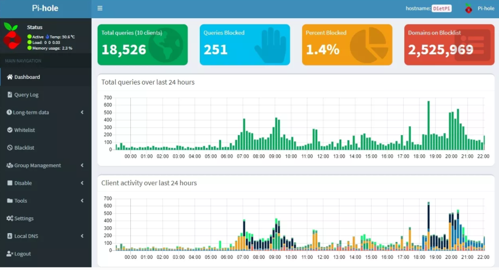

Die Lösungen zu den Aufgaben finden Sie im nächsten Abschnitt der Lernlandkarte.

#### UE|3.4.8: Beispiellösung zu den Aufgaben

##### Speichertechnologien

Der Raspberry Pi soll für ein Projekt das Betriebssystem "DietPi" nutzen. Dieses wird auf die Micro-SD-Karte installiert. Welche Vor- und welche Nachteile hat dieses Speichermedium? Nennen Sie jeweils zwei.

Für die Speicherung größerer Datenmengen wird per USB eine HDD angeschlossen. Welche Vor- und welche Nachteile hat dieses Speichermedium? Nennen Sie jeweils zwei.

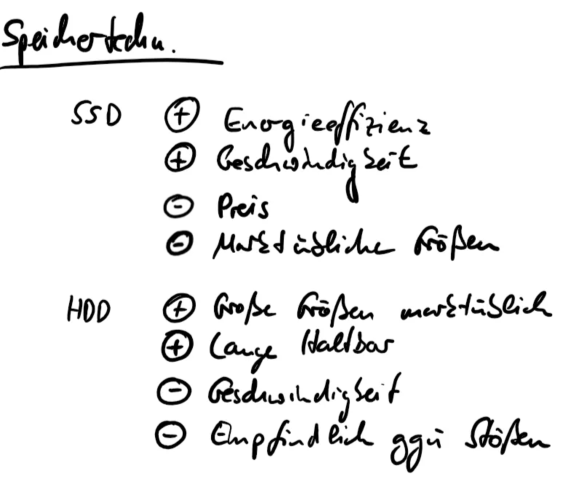

##### Speichermaßeinheiten

Das Betriebssystem "DietPi" soll installiert werden. Die Dateigröße des gepackten Images beträgt 169.895 KB. Wie viel ist dies als Angabe in MiB?

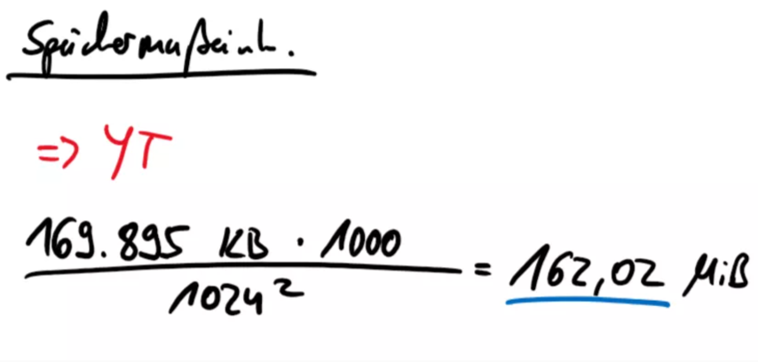

##### Übertragung von Daten
Für die Vorbereitung der Installation von Pi-Hole (einem Werbeblocker für das eigene Netzwerk) sollen Updates durchgeführt werden. Es sind 148 MiB mit einer Geschwindigkeit von 10,4 Mbit/s herunterzuladen. Wie lange dauert der Download (in Sekunden)?

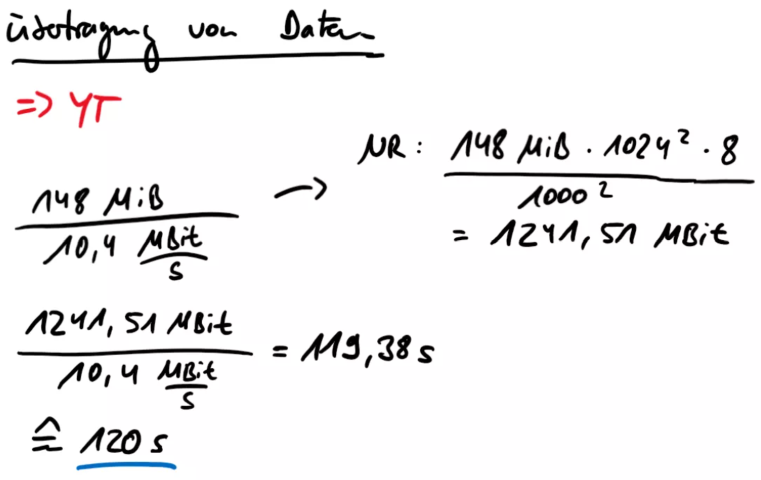

##### Bildgrößen berechnen
Ein an den Raspberry Pi angeschlossenes Kameramodul soll für eine Zeitrafferaufnahme jede volle Stunde ein Foto machen. Die Bildgröße entspricht späteren 20x30cm mit 300 ppi Auflösung bei 24-Bit RGB-Modus (je Kanal 8 Bit). Die Aufnahmen sollen für 30 Tage durchgeführt und gespeichert werden. Wie viel Platz muss auf dem Speichermedium reserviert werden? Geben Sie die Speichermenge in MiB an.

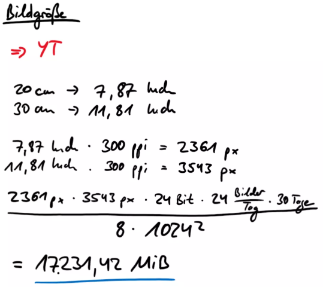

##### RAID
Die Fotos sollen auf einem NAS abgespeichert werden. Wählen Sie ein RAID-Level aus, welches bei drei Festplatten das höchste Maß an Sicherheit gegen den Ausfall von Festplatten bietet. Die Nettokapazität spielt gegenüber der Sicherheit in diesem Fall eine untergeordnete Rolle. Wählen Sie aus folgenden RAID-Leveln begründet aus:

- RAID 0
- RAID 1
- RAID 5
- RAID 10

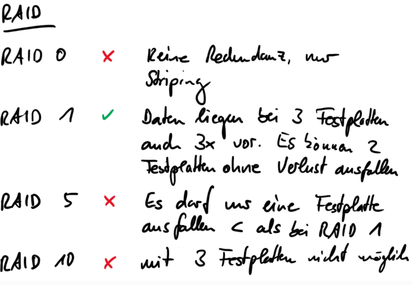

##### Energieeffizienz berechnen

Für den Einsatz als Werbeblocker mit Pi-Hole soll die geeignetste Hardware gefunden werden. Ein Aspekt dabei ist die Energieeffizienz.

Ein RPi Zero würde mit 5V Spannung versorgt werden und zieht 1A. Es müsste allerdings noch ein Shield für die RJ45-Netzwerkschnittstelle hinzugefügt werden. Dieses wird mit 3,3V Spannung versorgt und zieht nochmal zusätzlich 0,75A.

Ein RPi 3B+ würde ebenfalls mit 5V Spannung versorgt werden und dabei 1,75A ziehen.

Berechnen Sie die Kosten für beide Optionen für jeweils 365 Tage Dauerbetrieb, wenn der Preis für eine kWh bei 31,4ct liegt. Welches ist die günstigere Variante?

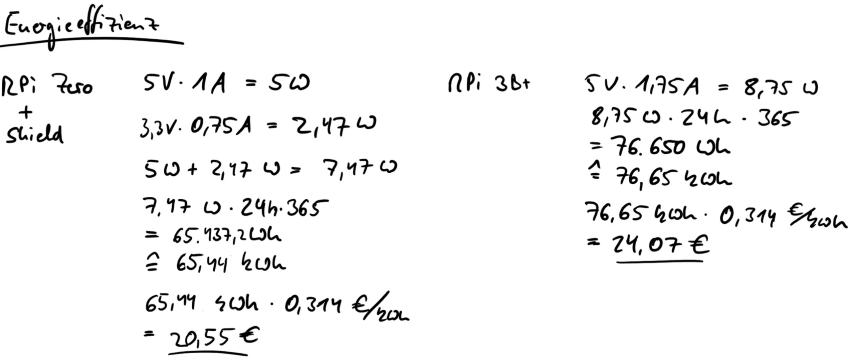

---

## Tipps & Tricks

---

!!! hint "ISA-Aufgaben"

    Aus diesem Kapitel sind für die ISA-Stunden Aufgaben enthalten.

### Videos zum Thema "Elektrotechnik"

#### Studyflix-Video: Ohmsches Gesetz

    

---

#### Studyflix-Video: Elektrische Stromstärke

    

---

#### Studyflix-Video: Elektrische Energie

    

---

#### Studyflix-Video: Elektrische Arbeit

    

---

#### Studyflix-Video: Reihen- und Parallelschaltung

    

---


