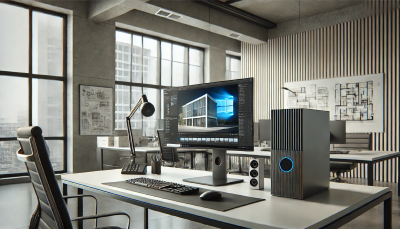
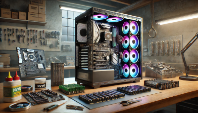

# Kapitel 4: IT-Systeme in Betrieb nehmen

In diesem Kapitel werden Sie ...

- ... kompatible Hardwarekomponenten auswählen.
- ... das Zusammenspiel zwischen Hardware und BIOS/UEFI aufzeigen.
- ... die Einbindung eines IT-Systems in eine Domäne beschreiben.
- ... die Anforderungen an ein Videokonferenzsystem darstellen.
- ... die Voraussetzungen zur Nutzung einer KI-Anwendung beschreiben.
- ... die Übergabe des Systems an den Kunden vorbereiten.

## Handlungssituation

Ein Architekturbüro plant, einen leistungsstarken Computer für CAD-Anwendungen, Videokonferenzen und KI-gestützte Berechnungen zu beschaffen. Die IT-Abteilung soll die optimale Hardware zusammenstellen und die Integration des Systems in die bestehende IT-Infrastruktur konzipieren.

Sie arbeiten im Vertrieb der ChangeIT GmbH und erstellen ein umfassendes Konzept zur Beschaffung, Einrichtung und Inbetriebnahme des Systems, einschließlich der theoretischen Konfiguration von Hardware, Domänenintegration und KI-Einsatz.

## Kompetenz 4.0: Hardwarekomponenten auswählen

Sie haben bereits eine kleine Vorauswahl von Komponenten für das Architekturbüro getroffen. Dabei bestehen jeweils zwei Alternativen, welche Sie noch bezüglich der Auswahl voneinander abgrenzen wollen. Lediglich die Auswahl einer zum System passenden CPU ist noch nicht erfolgt. Die Restarbeiten zur Zusammenstellung des IT-Systems sollen zeitnah erfolgen, um die Bestellung der Komponenten durchführen zu können.

### Arbeitsauftrag A|4.0: Vervollständigung der Auswahlmatrix für Computerkomponenten

#### Aufgabenstellung

Sie übernehmen die finale Auswahl der Hardwarekomponenten für das Architekturbüro. Ihre Aufgabe ist es, die Auswahlmatrix (M|4.0: Bisherige Zusammenstellung der Komponenten) zu vervollständigen und eine passende CPU auszuwählen. Ihre Entscheidung soll auf einer fundierten Analyse der technischen Spezifikationen und Anforderungen (M|4.1: Auszug aus dem Lastenheft) basieren.

#### Arbeitsschritte

**1. Vergleich der bestehenden Alternativen**

- Analysieren Sie die beiden Alternativen für Motherboard und Grafikkarte.
- Verschaffen Sie sich einen Überblick über beide Systeme mittels Vergleichswebseite (M|4.2: Vergleichswebseite zu den Motherboards & M|4.3: Vergleichswebseite zu den Grafikkarten)
- Füllen Sie die Spalte "Empfohlene Auswahl" in der Tabelle aus und begründen Sie Ihre Entscheidung.

**2. Auswahl der CPU:**

- Recherchieren Sie zwei geeignete CPUs (eine von AMD, eine von Intel), die die Anforderungen aus dem Lastenheft erfüllen.
- Ergänzen Sie diese in der Auswahlmatrix.
- Stellen Sie die beiden Kandidaten in einem Vergleich gegenüber. Sie können hierfür ebenbfalls die Webseite https://versus.com/de nutzen.
- Schreiben Sie zu jeder ausgewählten Komponente eine kurze Begründung, warum diese die beste Wahl ist.
- Gehen Sie dabei auf Kompatibilität, Leistungsanforderungen und Energieeffizienz ein.

**3. Zusammenfassung der Ergebnisse:**

- Speichern Sie die fertiggestellte Komponenten-Matrix für den späteren Zugriff ab.
- Lessons Learned: Sie haben in Ihrer Gruppe die Auswahl der vorbereiteten Komponenten sowie die Recherche zu zwei Optionen der CPU durchgeführt. Welche Erkenntnisse haben Sie hieraus gewonnen. Die folgenden Leitfragen können Ihnen bei der Rückschau auf den Prozess helfen:
  - Welche Kriterien waren für die Auswahl der Hardwarekomponenten am wichtigsten und warum?
  - Welche Herausforderungen sind bei der Bewertung der verschiedenen CPU-Optionen aufgetreten?
  - Wie haben Sie die Kompatibilität zwischen den einzelnen Komponenten sichergestellt?
   - Gab es in der Gruppe unterschiedliche Meinungen zur Auswahl der Komponenten? Falls ja, wie wurden diese gelöst?
  - Welche Quellen oder Tools waren besonders hilfreich bei der Recherche und warum?
  - Wie würden Sie den Auswahlprozess beim nächsten Mal optimieren oder effizienter gestalten?

### Informationsmaterial M|4.0: Bisherige Zusammenstellung der Komponenten

| Komponente | Alternative 1 | Alternative 2 | Bemerkung | Empfohlene Auswahl |
| :--- | :--- | :--- | :--- | :--- |
| Motherboard | ASUS TUF Gaming B550-Plus | MSI MAG B550 Tomahawk | Beide Boards unterstützen PCIe 4.0 | |
| CPU | | | |
| Grafikkarte | NVIDIA RTX 3060 Ti (8 GB GDDR6) | AMD Radeon RX 6750 XT (12 GB GDDR6) | Für CAD-Software wie AutoCAD empfohlen: NVIDIA RTX | |
| Arbeitsspeicher | 32 GB DDR4-3200 (2x16 GB) | 64 GB DDR4-3200 (2x32 GB) | Abhängig von der Komplexität der CAD-Projekte | Es werden umfangreiche Projekte erwartet, deshalb 64 GB RAM ausgewählt. |
| Netzteil | be quiet! Pure Power 11 FM 650W (80+ Gold) | Corsair RM750x 750W (80+ Gold) | Beide effizient, Corsair bietet mehr Leistung | Zur Sicherstellung der Erweiterbarkeit des Systems soll das Corsair-Netzteil mit entsprechend 100W mehr Leistung gewählt werden |
| Speicher | 1 TB NVMe SSD (Samsung 970 EVO Plus) | 2 TB NVMe SSD (WD Black SN850) | Kapazität abhängig von Projekterfordernissen | Rücksprache mit dem Kunden: Die aktuellen Projektdaten werden auf dem neuen System bearbeitet, nach Abschluss werden diese auf den Netzwerkspeicher übertragen. 1 TB reicht damit aus. |

### Informationsmaterial M|4.1: Auszug aus dem Lastenheft

#### Motherboard

**1. Kompatibilität und Leistungsanforderungen:**

- Prozessorsockel: Das Motherboard muss den gewählten CPU-Typ unterstützen:
   - AMD: Sockel AM4 oder AM5
   - Intel: Sockel LGA 1200 oder LGA 1700
- Chipsatz: Der Chipsatz soll eine optimale Balance zwischen Leistung und Stabilität bieten:
   - Für AMD: B550 oder besser (z. B. X570)
   - Für Intel: Z690 oder B660 (abhängig von der gewählten CPU)
- Arbeitsspeicher-Unterstützung:
   - Unterstützung für mindestens 64 GB DDR4/DDR5 RAM.
   - Dual-Channel-Betrieb für maximale Speicherbandbreite.

**2. Erweiterbarkeit und Konnektivität:**

- PCIe-Steckplätze:
   - Mindestens 1 PCIe 4.0 x16-Steckplatz für die Grafikkarte.
   - Zusätzliche PCIe x1-Steckplätze für Erweiterungskarten (z. B. Netzwerkkarten, zusätzliche Schnittstellen).
- M.2- und SATA-Schnittstellen:
   - Mindestens 2 M.2 NVMe-Steckplätze für schnellen SSD-Speicher.
   - Unterstützung von RAID-Konfigurationen für Datensicherheit und Performance.
- Netzwerk und Internet:
   - Integrierter Gigabit-Ethernet-Anschluss.
   - Optional: WLAN 6 (802.11ax) für kabellose Verbindungen.
- USB-Anschlüsse:
   - Mindestens 4 USB 3.2 Gen 2-Anschlüsse (Typ-A und Typ-C).
   - Unterstützung von USB-C mit Power Delivery für zukünftige Geräte.

**3. BIOS/UEFI und Systemstabilität:**

- UEFI/BIOS-Funktionen:
   - Einfache Benutzeroberfläche mit erweiterten Konfigurationsmöglichkeiten.
   - BIOS-Flashback-Funktion zur einfachen Aktualisierung der Firmware ohne installierte CPU.
   - Unterstützung für Secure Boot und TPM 2.0 (für Windows 11-Kompatibilität).
- Stromversorgung und Kühlung:
   - VRM-Kühlung (spannungsregulierende Module) für stabile Leistung unter Last.
   - Effizientes Power Management zur Optimierung des Energieverbrauchs.

**4. Besondere Anforderungen:**

- Zukunftssicherheit: Das Motherboard soll PCIe 4.0 (oder besser) unterstützen, um zukünftige Hardware-Upgrades zu ermöglichen.
- Formfaktor: Das Systemgehäuse des Architekturbüros erfordert den Formfaktor ATX.
- Langlebigkeit: Hochwertige Kondensatoren und 5-Jahres-Herstellergarantie werden bevorzugt.

#### Grafikkarte

**1. Leistungsanforderungen:**

- VRAM (Videospeicher):
  - Mindestens 8 GB GDDR6 für große CAD-Modelle und flüssige 3D-Darstellungen. 12 GB oder mehr sind wünschenswert für besonders komplexe Baupläne oder Renderings.
- GPU-Architektur:
  - Die Grafikkarte muss eine moderne Architektur besitzen (z. B. NVIDIA Ampere oder AMD RDNA 2), um optimale Performance für CAD und KI-gestützte Berechnungen zu gewährleisten.
- CUDA-/OpenCL-Unterstützung:
  - Für KI-Anwendungen wird CUDA-Unterstützung (nur bei NVIDIA-Karten) bevorzugt.
  - Alternativ muss die Karte OpenCL-kompatibel sein (unterstützt von AMD und NVIDIA).
- DirectX und OpenGL:
  - Unterstützung von DirectX 12 Ultimate für CAD-Visualisierungen und OpenGL 4.6 (oder höher) ist erforderlich.

**2. Kompatibilität und Anschlüsse:**

- Schnittstelle:
  - Die Grafikkarte muss PCIe 4.0 x16 unterstützen, um die volle Bandbreite moderner Motherboards zu nutzen.
- Bildschirmanschlüsse (mindestens):
  - 1x HDMI 2.1 (für hochauflösende Monitore oder Präsentationen)
  - 3x DisplayPort 1.4a (für Multi-Monitor-Setups)
  - Auflösung und Multi-Monitor-Unterstützung:
      - Unterstützung von 4K-Auflösung bei 60 Hz für Präsentationen.
      - Betrieb von bis zu 3 Monitoren gleichzeitig (für CAD, Videokonferenzen und KI-Arbeitsumgebungen parallel).

**3. Energieeffizienz und Kühlung:**

- Leistungsaufnahme (TDP):
  - Die Grafikkarte sollte eine maximale TDP von 250 Watt nicht überschreiten, um mit dem geplanten Netzteil kompatibel zu bleiben.
- Kühlsystem:
   - Effizientes und leises Kühlsystem mit mindestens zwei Lüftern. Semi-passive Kühlung ist wünschenswert, um Geräusche während ruhender Phasen zu minimieren.

**4. Besondere Anforderungen:**

- Zertifizierungen für CAD-Software:
  - Die Grafikkarte sollte idealerweise von den Herstellern der CAD-Software (z. B. Autodesk, Dassault Systèmes) zertifiziert sein, um maximale Stabilität und Performance sicherzustellen.
- KI-Unterstützung:
  - Für lokale KI-Anwendungen wird eine GPU mit Tensor-Kernen (bei NVIDIA) oder Ray Accelerators (bei AMD) bevorzugt.
  - Kompatibilität mit KI-Frameworks wie TensorFlow und PyTorch.
- Zukunftssicherheit:
  - Unterstützung zukünftiger Technologien wie Raytracing und DLSS (Deep Learning Super Sampling) ist wünschenswert, um den PC langfristig aktuell zu halten.

#### CPU

**1. Leistung und Effizienz**

- Mindestens 8 physische Kerne und 16 Threads für parallele Berechnungen.
- Taktfrequenz von mindestens 3,5 GHz (Boost bis zu 4,5 GHz wünschenswert).
- Unterstützung von SIMD-Erweiterungen (z. B. AVX2, AVX-512) für CAD- und KI-Berechnungen.

**2. Kompatibilität:**

- Kompatibel mit dem ausgewählten Motherboard (Sockel AM4 oder AM5 für AMD, LGA 1200 oder LGA 1700 für Intel).
- PCIe 4.0-Unterstützung für schnelle Kommunikation mit der GPU.

**3. Energieeffizienz und Kühlung:**

- Maximale Thermal Design Power (TDP) von 125 Watt.
- Unterstützung moderner Energiesparmodi (z.B. AMD Eco Mode oder Intel Speed Shift).

**4. Besondere Anforderungen:**

- Virtualisierungsunterstützung für zukünftige Tests von virtuellen Maschinen.
- Optimale Single-Core-Leistung für CAD-Programme, die nicht vollständig multithreaded arbeiten.

### Informationsmaterial M|4.2: Vergleichswebseite zu den Motherboards

https://versus.com/de/asus-tuf-gaming-b550-plus-vs-msi-mag-b550-tomahawk

### Informationsmaterial M|4.3: Vergleichswebseite zu den Grafikkarten

https://versus.com/de/amd-radeon-rx-6750-xt-vs-nvidia-geforce-rtx-3060-ti

## Kompetenz 4.1: BIOS/UEFI einstellen

Die ChangeIT GmbH hat im Wareneingang die Komponenten des neuen CAD-PC erhalten und geprüft. Bevor das Betriebssystem installiert wird, müssen im BIOS/UEFI wichtige Einstellungen vorgenommen werden, um das System optimal für den geplanten Einsatz zu konfigurieren.

Als IT-Spezialist der ChangeIT GmbH sind Sie dafür verantwortlich, das System für Virtualisierungsaufgaben, energieeffizienten Betrieb und höchste Sicherheit vorzubereiten. Der Kunde möchte später ggf. virtuelle Maschinen mit VirtualBox betreiben und wünscht sich außerdem, dass das System vor unbefugtem Zugriff geschützt ist.

Der Computer befindet sich noch in der Montage in der Werkstatt. Da Sie aktuell nicht direkt auf das BIOS zugreifen können, sollen Sie die nötigen Einstellungen theoretisch erarbeiten und in einem Konfigurationsleitfaden dokumentieren. Dieser Leitfaden wird dem Kunden bei der Übergabe des Systems übergeben.

### Arbeitsauftrag A|4.1: BIOS/UEFI-Einstellungen für Virtualisierung, Energieeffizienz und Sicherheit vornehmen

#### Aufgabenstellung

Sie erstellen Hinweise für den CAD-PC des Architekturbüros. Der Leitfaden soll bei der Einrichtung herangezogen werden, um das System optimal für Virtualisierung, Energieeffizienz und Sicherheit zu konfigurieren.

Da Sie aktuell keinen Zugriff auf die Kundenhardware haben, nutzen Sie Ihr dienstliches Lenovo Yoga All-in-One Gerät, um sich einen Überblick im UEFI zu verschaffen (M|4.4: UEFI-Simulator des Lenovo YOGA AIO 7). Ein BIOS steht Ihnen an einem Workstation-Laptop der Abteilung zur Einsicht zur Verfügung (M|4.5: BIOS-Simulator des Lenovo P14).

#### Arbeitsschritte

*Hinweise zur Bearbeitung der Arbeitsschritte:*

- *Fertigen Sie ggf. zum Verständnis notwendige Screenshots an.*
- *Stellen die die Handlungsempfehlungen möglichst übersichtlich zusammen.*

**1. Recherche zu BIOS/UEFI-Grundlagen:**

- Welche Unterschiede bestehen zwischen BIOS und UEFI?
- Welche grundlegenden Menüpunkte finden sich in einem typischen BIOS/UEFI?

**2. Einstellungen zur Virtualisierung:**

- Recherchieren Sie, wie die Virtualisierungstechnologie im BIOS/UEFI aktiviert wird.
- Erläutern Sie, warum diese Einstellung wichtig ist, um virtuelle Maschinen mit VirtualBox betreiben zu können.
- Erstellen Sie eine Schritt-für-Schritt-Anleitung mit Beispielscreenshots.

**3. Einstellungen zur Energieeffizienz:**

- Recherchieren Sie BIOS/UEFI-Optionen, die den Energieverbrauch optimieren:
  - Aktivierung von CPU Power Management-Funktionen
  - Anpassen von C-States (Energiesparmodi) und Sleep-States
  - ggf. Steuerung von Lüfterprofilen (z.B. Quiet Mode, Performance Mode).
- Beschreiben Sie, wie diese Einstellungen die Leistungsaufnahme und die Geräuschentwicklung des PCs beeinflussen.

**4. Einstellungen zur Sicherheit:**

- Recherchieren Sie Sicherheitsfunktionen im BIOS/UEFI:
  - Setzen eines Supervisor-Passworts (BIOS/UEFI-Passwort) zum Schutz der Systemeinstellungen.
  - Aktivierung von Secure Boot zur Verhinderung von Malware beim Systemstart.
  - Aktivierung von TPM 2.0 (Trusted Platform Module) für zusätzliche Sicherheit, z. B. für BitLocker-Verschlüsselung.

### Informationsmaterial M|4.4: UEFI-Simulator des Lenovo YOGA AIO 7

https://download.lenovo.com/bsco/index.html#/graphicalsimulator/Yoga%20AIO%207%2027ARH6%20(F0FN)

### Informationsmaterial M|4.5: BIOS-Simulator des Lenovo P14

https://download.lenovo.com/bsco/index.html#/textsimulator/ThinkPad%20P14s%20Gen%203%20AMD%20(21J5,21J6)

### Informationsmaterial M|4.6: BIOS und UEFI

#### **BIOS und UEFI – Die Steuerzentrale des Computers**

##### **1. Was ist das BIOS?**

Das **BIOS** (Basic Input/Output System) ist eine Firmware, die direkt auf dem **Motherboard** eines Computers gespeichert ist. Es stellt die grundlegenden Funktionen bereit, die notwendig sind, damit der Computer startet und das Betriebssystem geladen werden kann.

###### **Funktionen des BIOS:**

- **POST (Power-On Self Test):** Beim Einschalten des Computers führt das BIOS einen Selbsttest durch, um sicherzustellen, dass die Hardware (z. B. RAM, Grafikkarte, Festplatte) ordnungsgemäß funktioniert.
- **Hardware-Initialisierung:** Das BIOS erkennt und konfiguriert die angeschlossenen Hardwarekomponenten.
- **Bootloader:** Das BIOS sucht nach einem **Boot-Medium** (z. B. Festplatte, USB-Stick) und startet das Betriebssystem.
- **Einstellungen:** Über das BIOS können grundlegende Einstellungen wie die **Boot-Reihenfolge**, **Datum und Uhrzeit** sowie **Sicherheitsoptionen** (z. B. Passwortschutz) konfiguriert werden.

###### **Merkmale des klassischen BIOS:**

- **Textbasierte Benutzeroberfläche**: Navigation erfolgt über die Tastatur.
- Unterstützt **MBR (Master Boot Record)** als Partitionsschema, was die maximale Festplattengröße auf **2 TB** begrenzt.
- Beschränkter **Adressraum**: Kann nur **16-Bit-Prozessorbefehle** ausführen und maximal **1 MB Speicher** direkt ansprechen.

##### **2. Was ist UEFI?**

Das **UEFI** (Unified Extensible Firmware Interface) ist der **moderne Nachfolger des BIOS**. Es wurde entwickelt, um die Einschränkungen des klassischen BIOS zu überwinden und zusätzliche Funktionen bereitzustellen.

###### **Funktionen des UEFI:**

- **Erweiterter POST und Hardware-Initialisierung:** Schnellere Erkennung und Konfiguration von Hardware.
- **Grafische Benutzeroberfläche (GUI):** UEFI bietet oft eine **grafische Oberfläche** mit Mausunterstützung und erweiterten Konfigurationsmöglichkeiten.
- **Unterstützung für große Festplatten:** UEFI verwendet das **GPT (GUID Partition Table)**-Partitionsschema, das Festplatten **größer als 2 TB** unterstützt.
- **Sicherheitsfunktionen:** UEFI bietet Funktionen wie **Secure Boot**, das verhindert, dass unsichere Betriebssysteme oder Malware beim Start geladen werden.
- **Netzwerk-Boot:** UEFI ermöglicht den **Start über das Netzwerk** (z. B. für Remote-Installationen).

###### **Merkmale von UEFI:**
- **Schnelleres Booten:** Dank effizienterer Hardware-Initialisierung und Optimierungen.
- **Modular und erweiterbar:** UEFI kann mit **Plugins** und **Treibern** erweitert werden.
- **Kompatibilität:** Die meisten UEFI-Firmwares bieten einen **Legacy BIOS-Kompatibilitätsmodus (CSM)**, sodass ältere Betriebssysteme weiterhin unterstützt werden.

##### **3. Wichtige Unterschiede zwischen BIOS und UEFI:**

| **Eigenschaft**        | **BIOS**                                | **UEFI**                                 |
|------------------------|-----------------------------------------|------------------------------------------|
| **Startdatum**         | 1970er Jahre                            | Mitte 2000er Jahre                       |
| **Benutzeroberfläche** | Textbasiert, nur Tastatursteuerung      | Grafisch, Maus- und Tastatursteuerung    |
| **Partitionsschema**   | MBR (max. 2 TB Festplatten)             | GPT (Unterstützung für > 2 TB Festplatten)|
| **Sicherheitsfunktionen** | Keine speziellen Funktionen            | Secure Boot, TPM-Unterstützung           |
| **Bootgeschwindigkeit**| Langsamer                               | Schneller                                |
| **Erweiterbarkeit**    | Eingeschränkt                           | Modular, erweiterbar                     |
| **Kompatibilität**     | Ältere Systeme und Betriebssysteme      | Neuere Systeme, aber mit BIOS-Kompatibilität|

##### **4. Warum ist UEFI heute Standard?**

Moderne Computer verwenden fast ausschließlich **UEFI**, da es leistungsfähiger und flexibler ist als das klassische BIOS. Vor allem für Aufgaben wie **Virtualisierung**, **große Speicherlaufwerke**, **schnelle SSDs** und **moderne Sicherheitsanforderungen** (z. B. Secure Boot für Windows 11) ist UEFI notwendig.

Trotzdem bieten viele Systeme weiterhin die Möglichkeit, in den **Legacy BIOS-Modus** zu wechseln, um ältere Betriebssysteme zu unterstützen.

##### **5. Zugriff auf BIOS/UEFI:**

Um ins BIOS oder UEFI zu gelangen, muss beim **Start des Computers** eine bestimmte **Taste gedrückt** werden. Die gängigsten Tasten sind:
- **Entf** (Delete)
- **F2**
- **Esc**

Die genaue Taste wird beim Start kurz auf dem Bildschirm angezeigt oder kann im Handbuch des Motherboards nachgelesen werden.

##### **6. BIOS Flash – Firmware-Update für das Motherboard**

Ein **BIOS-Flash** bezeichnet das **Aktualisieren der BIOS- oder UEFI-Firmware** auf dem Motherboard. Dieses Update kann notwendig sein, um **Kompatibilitätsprobleme** mit neuer Hardware (z. B. neuen CPUs oder RAM) zu beheben, **Stabilitätsverbesserungen** durchzuführen oder **Sicherheitslücken** zu schließen. Moderne Motherboards mit UEFI bieten oft eine einfache Möglichkeit zum Flashen der Firmware direkt aus dem UEFI-Menü heraus, häufig als **"EZ Flash"** oder **"Q-Flash"** bezeichnet. Dabei wird die neue Firmware von einem **USB-Stick** geladen und installiert. Vor dem Flashen sollte immer überprüft werden, ob das Update wirklich notwendig ist, da ein **fehlerhaftes Update** das Motherboard unbrauchbar machen kann. Daher sollte der **Flash-Vorgang niemals unterbrochen** werden (z. B. durch Stromausfall). Manche Motherboards bieten eine **Dual-BIOS-Funktion**, die ein Backup der alten Firmware speichert und im Notfall wiederherstellen kann.

#### Quellen:
- https://learn.microsoft.com/de-de/windows-hardware/manufacture/desktop/boot-to-uefi-mode-or-legacy-bios-mode?view=windows-11
- https://comheld.de/bios-und-uefi-die-herzstuecke-ihres-computers-verstaendlich-erklaert/
- https://www.esm-computer.de/ratgeber-infos/lexikon/bios/
- https://wiki.inonet.com/uefi-vs-bios
- https://www.dell.com/support/contents/de-de/article/product-support/self-support-knowledgebase/fix-common-issues/bios-uefi

## Kompetenz 4.2: IT-Systeme in Domänen einbinden

Das neue IT-System soll in den Verzeichnisdienst bzw. die Domäne des Architekturbüros eingebettet werden. Es wird Microsoft Active Directory (AD) eingesetzt, um alle Mitarbeiterkonten, Computer und Ressourcen zentral zu verwalten.

### Arbeitsauftrag A|4.2: Verzeichnisdienste und Domänen beschreiben

#### Aufgabenstellung

Sie haben sich bisher nur wenig mit Verzeichnisdiensten und Domänen auseinandergesetzt. Für einen Überblick sollen Sie die folgenden Fragen in eigenen Worten beantworten und für den betriebsinternen Runden Tisch der Auszubildenden kurz präsentieren. Fertigen Sie daher ein ansprechendes Handout mit den wichtigsten Informationen an.

#### Arbeitsschritte

1. Erklären Sie den Unterschied zwischen einer Domäne und einer Arbeitsgruppe.
2. Was ist ein Verzeichnisdienst? Welche Aufgaben erfüllt er in einem Netzwerk?
3. Beschreibe die Struktur von Active Directory. Was sind Domänencontroller, Benutzerobjekte und Gruppenrichtlinien?
4. Warum ist der DNS-Server wichtig für die Domänenanmeldung?
5. Was versteht man unter Kerberos und wie funktioniert die Authentifizierung in einer Domäne?
6. Nennen Sie drei Sicherheitsmaßnahmen, die in einer Domänenumgebung angewendet werden sollten.
7. Was ist der Vorteil von Gruppenrichtlinien (GPOs) in Bezug auf die Sicherheit?

### Informationsmaterial M|4.7: Verzeichnisdienste und Domänen

**Definitionen und Konzepte**

- Unterschied zwischen einer Domäne und einer ArbeitsgruppeEine Domäne ist ein zentral verwaltetes Netzwerk, in dem Benutzerkonten, Computer und Ressourcen von einem Domänencontroller (DC) gesteuert werden. Der DC authentifiziert Benutzer und kontrolliert den Zugriff auf Netzwerkressourcen. Benutzer können sich an jedem Rechner der Domäne mit denselben Anmeldedaten anmelden, und die Zugriffsrechte werden zentral verwaltet.
- Eine Arbeitsgruppe hingegen ist eine lose verbundene Gruppe von Computern, bei der jeder Rechner seine eigenen Benutzerkonten verwaltet. Es gibt keine zentrale Steuerung, und Benutzer müssen sich für jeden Computer einzeln anmelden. Diese Struktur ist weniger komplex, aber auch weniger sicher und schwierig zu verwalten, wenn das Netzwerk größer wird.
- Was ist ein Verzeichnisdienst? Welche Aufgaben erfüllt er in einem Netzwerk? Ein Verzeichnisdienst ist eine spezialisierte Datenbank, die Informationen über Benutzer, Computer, Gruppen und andere Netzwerkressourcen speichert und organisiert. Der bekannteste Verzeichnisdienst ist Microsoft Active Directory (AD). Er ermöglicht die zentrale Verwaltung von:

  - Benutzerkonten und Authentifizierung: Wer darf sich anmelden?
  - Ressourcenzugriff: Welche Dateien, Ordner oder Drucker sind verfügbar?
  - Sicherheitsrichtlinien: Wie werden Passwörter und Rechte verwaltet?
- Andere Beispiele für Verzeichnisdienste sind LDAP (Lightweight Directory Access Protocol) und OpenLDAP.

**Struktur von Active Directory**

Active Directory ist hierarchisch aufgebaut und besteht aus verschiedenen Komponenten:
  - Domänencontroller (DC): Der Server, der Active Directory ausführt und Benutzer authentifiziert sowie Sicherheitsrichtlinien durchsetzt.
  - Benutzerobjekte: Jedes Benutzerkonto in der Domäne wird als Objekt gespeichert. Diese Objekte enthalten Informationen wie Benutzername, Passwort und Zugehörigkeit zu Gruppen.
  - Gruppenrichtlinien (GPOs): Mit GPOs können Administratoren Sicherheits- und Konfigurationseinstellungen zentral verwalten und automatisch auf Benutzer und Computer anwenden.

**DNS und Authentifizierung**

- Warum ist der DNS-Server wichtig für die Domänenanmeldung? Der DNS-Server (Domain Name System) ist entscheidend für die Domänenanmeldung, da er die Namen von Computern und Diensten in IP-Adressen übersetzt. Wenn ein Computer einer Domäne beitreten oder sich ein Benutzer anmelden möchte, muss der Computer den Domänencontroller finden. Dies geschieht über DNS. Ist der DNS-Server falsch konfiguriert, kann der Domänenbeitritt oder die Anmeldung fehlschlagen.
- Was versteht man unter Kerberos und wie funktioniert die Authentifizierung in einer Domäne? Kerberos ist ein Netzwerk-Authentifizierungsprotokoll, das in Windows-Domänen verwendet wird. Es basiert auf einem Ticket-System, das sichere und schnelle Anmeldungen ermöglicht. Der Ablauf:
   - Anfrage an den Key Distribution Center (KDC): Der Benutzer sendet eine Anfrage zur Authentifizierung.
   - Ticket Granting Ticket (TGT): Der KDC prüft die Anmeldedaten und stellt ein TGT aus.
   - Zugriff auf Ressourcen: Mit dem TGT fordert der Benutzer Zugang zu spezifischen Ressourcen an. Der KDC stellt ein Service-Ticket aus, das dem Benutzer Zugang gewährt.
- Vorteil von Kerberos: Die Anmeldedaten werden nicht wiederholt über das Netzwerk gesendet, was die Sicherheit erhöht.

**Sicherheitsaspekte**

- Drei Sicherheitsmaßnahmen in einer Domänenumgebung
  - Starke Passwort-Richtlinien: Erzwingen komplexe Passwörter und regelmäßige Änderungen.
  - Zwei-Faktor-Authentifizierung (2FA): Eine zusätzliche Sicherheitsebene neben dem Passwort.
  - Regelbasierte Zugriffssteuerung: Benutzer erhalten nur Zugriff auf die Ressourcen, die sie wirklich benötigen (Prinzip der minimalen Rechte).
- Vorteil von Gruppenrichtlinien (GPOs) in Bezug auf die Sicherheit
  - Gruppenrichtlinien (GPOs) ermöglichen die zentrale Verwaltung von Sicherheits- und Konfigurationseinstellungen.
  - Automatisierung von Sicherheitsrichtlinien: Einstellungen wie Passwortregeln, Firewall-Konfigurationen und Software-Updates werden automatisch angewendet.
  - Konsistenz: Alle Benutzer und Computer in der Domäne erhalten dieselben Sicherheitsrichtlinien, wodurch Fehler und Inkonsistenzen vermieden werden.
  - Schnelle Anpassung: Änderungen an Sicherheitsrichtlinien können zentral vorgenommen und sofort auf alle Geräte übertragen werden.

## Kompetenz 4.3: Videokonferenzssysteme unterscheiden

Das Architekturbüro expandiert und möchte seine Arbeitsprozesse durch den Einsatz moderner IT-Infrastruktur optimieren. Neben der Beschaffung des leistungsstarken Computers für CAD-Anwendungen und KI-gestützte Berechnungen soll auch ein effizientes Videokonferenzsystem integriert werden. Dieses System muss den Anforderungen an hochauflösende Bildübertragung, stabile Verbindungen sowie sichere Datenübertragung genügen, da regelmäßig virtuelle Meetings mit internationalen Geschäftspartnern und Bauherren stattfinden.

Sie arbeiten im Vertrieb der ChangeIT GmbH und wurden beauftragt, ein  Konzept zu erstellen. Ihr Fokus liegt dabei auf der Auswahl eines geeigneten Videokonferenzsystems, das nahtlos in die bestehende IT-Infrastruktur des Architekturbüros integriert werden kann. Dabei sollen drei verschiedene Systeme aus dem Produktprogramm verglichen und bewertet werden, um die beste Lösung zu finden.

### Arbeitsauftrag A|4.3: Auswahl eines Videokonferenzsystems

**1. Analyse der Anforderungen**

- Ermitteln Sie die spezifischen Anforderungen des Architekturbüros an ein Videokonferenzsystem. Berücksichtigen Sie dabei Aspekte wie Bild- und Tonqualität, Teilnehmerzahl, Sicherheitsanforderungen sowie Integration in bestehende Softwarelösungen (z. B. Office 365, CAD-Software).

**2. Produktkatalog berücksichtigen**

- Verschaffen Sie sich einen Überblick über die drei Konferzenzsysteme, die im Standard-Produktprogramm der ChangeIT GmbH angeboten werden.
- Wägen Sie ab, welche Vor- und Nachteile eine Einbinung des Videokonferenzsystems einerseits via USB (ohne Netzwerkanbinung) und andererseits via LAN/WLAN über das Netzwerk des Büros hat.

**3. Entscheidungsempfehlung:**

- Erarbeiten Sie basierend auf Ihrem Vergleich eine fundierte Empfehlung für ein Videokonferenzsystem. Begründen Sie Ihre Entscheidung mit den Anforderungen des Architekturbüros und den Ergebnissen Ihrer Analyse.

### Informationsmaterial M|4.8: Produktkatalog Videokonferenzsysteme

| **Kriterium**                  | **Logitech Rally Plus**                          | **Logitech Rally Bar Mini**                     | **Logitech Connect**                           |
|--------------------------------|-------------------------------------------------|------------------------------------------------|------------------------------------------------|
| **Einsatzbereich**             | Große Konferenzräume                           | Kleine bis mittelgroße Räume                   | Mobile Nutzung, kleine Besprechungsräume       |
| **Kameraauflösung**            | 4K Ultra-HD                                    | 4K Ultra-HD                                    | 1080p Full HD                                  |
| **Zoom**                       | 15-facher HD-Zoom                              | 4-facher Digitalzoom                           | 4-facher Digitalzoom                           |
| **Sichtfeld**                  | 90°                                            | 120°                                           | 90°                                            |
| **Audio**                      | Separate Lautsprecher + Mikrofone (erweiterbar) | Integrierte Lautsprecher + Beamforming-Mikrofone | 360° Mikrofonreichweite, integrierter Lautsprecher |
| **Mikrofonreichweite**         | Erweiterbar bis 7 m                            | Bis zu 4,5 m                                   | Bis zu 3,6 m                                   |
| **Anschlüsse**                 | USB, HDMI, Ethernet, Erweiterungsanschlüsse     | USB, HDMI, Ethernet                            | USB, Bluetooth                                  |
| **Kompatibilität**             | Plug-and-Play mit gängigen VC-Apps (Zoom, Teams, etc.) | Plug-and-Play mit gängigen VC-Apps (Zoom, Teams, etc.) | Plug-and-Play mit gängigen VC-Apps (Zoom, Teams, etc.) |
| **Steuerung**                  | Fernbedienung, App, Touch-Controller (optional) | Fernbedienung, App                             | Fernbedienung, mobile App                      |
| **Besondere Features**         | Automatischer Kameraschwenk, erweiterbare Mikrofone | KI-gestützte Bild- und Tonoptimierung         | Portables Design, Akku-Betrieb                 |
| **Montagemöglichkeiten**       | Wand-, Tisch- oder Stativmontage                | Wand-, Tisch- oder Bildschirmmontage           | Tragbar, für mobilen Einsatz                   |
| **Preis (ca.)**                | 3.000 - 4.000 €                                | 2.500 - 3.000 €                                | 400 - 500 €                                    |
| **Stromversorgung**            | Netzbetrieb                                    | Netzbetrieb                                    | Netz- und Akkubetrieb (bis zu 3 Stunden)       |
| **Einsatzszenario**            | Große Unternehmen, Konferenzräume               | Huddle Rooms, mittelgroße Meetingräume         | Mobile Teams, spontane Meetings                |
| **Sicherheitsfeatures**        | Verschlüsselung der Audio-/Videoübertragung     | Verschlüsselung der Audio-/Videoübertragung    | Verschlüsselung der Audio-/Videoübertragung    |

### Informationsmaterial M|4.9: Auszug aus dem Lastenheft Videokonferenzsysteme

Das System soll sowohl für regelmäßige Teammeetings als auch für Kundenpräsentationen und Bauabstimmungen mit internationalen Partnern genutzt werden. Ziel ist es, eine Lösung zu finden, die sich nahtlos in die bestehende IT-Infrastruktur einfügt, benutzerfreundlich ist und den hohen Anforderungen an Bild- und Tonqualität gerecht wird.

#### Anforderungen an das Videokonferenzsystem

##### Funktionale Anforderungen:

- Unterstützung für bis zu 15 Teilnehmer in einem Raum mit der Möglichkeit, externe Teilnehmer problemlos einzubinden.
- 4K-Kameraauflösung mit automatischer Anpassung des Bildausschnitts an die Anzahl der Teilnehmer.
- Integrierte Mikrofone mit Beamforming-Technologie, um klare Sprachaufnahmen aus verschiedenen Sitzpositionen im Raum zu gewährleisten.
- Integrierte Lautsprecher, die für einen mittelgroßen Konferenzraum (bis 5x7 m) ausreichend sind, ohne zusätzliche Hardware.
- Automatische Geräuschunterdrückung und Echounterdrückung für eine störungsfreie Kommunikation.
- ggf. KI-gestützte Bild- und Tonoptimierung, um die Qualität der Übertragung an unterschiedliche Licht- und Akustikverhältnisse anzupassen.
- Kompatibilität mit Mircosoft Teams & Cisco WebEx

##### Technische Anforderungen:

- Plug-and-Play-Kompatibilität mit gängigen Videokonferenzplattformen wie Microsoft Teams, Zoom, und Google Meet.
- Anschlussmöglichkeiten über USB, HDMI und Ethernet, um Flexibilität in der Integration zu gewährleisten.
- Netzwerkfähig, um die direkte Integration in die bestehende Unternehmens-Domäne zu ermöglichen.
- Einfache Fernsteuerung über Fernbedienung oder mobile App.
- Unterstützung für Firmware-Updates zur Sicherstellung der langfristigen Nutzbarkeit.

##### Sicherheitsanforderungen:

- Ende-zu-Ende-Verschlüsselung für Audio- und Videoübertragungen.
- Zugriffskontrolle für die Nutzung des Systems innerhalb des Firmennetzwerks.
- Automatische Abmeldung nach Inaktivität, um unbefugte Nutzung zu verhindern.

##### Benutzerfreundlichkeit:

- Einfache Bedienung ohne umfangreiche Schulung der Mitarbeiter.
- Automatische Erkennung und Anpassung an die Raumgröße und Teilnehmerzahl.
- Kompaktes Design, das sich harmonisch in die moderne Büroeinrichtung des Architekturbüros einfügt.

## Kompetenz 4.4: KI-Anwendungen betreiben

Das Architekturbüro möchte seine Arbeitsprozesse durch den gezielten Einsatz von KI-Anwendungen optimieren. Die IT-Abteilung wurde beauftragt, verschiedene KI-Lösungen zu evaluieren, die sowohl die interne Effizienz steigern als auch die Kommunikation mit Kunden verbessern sollen. Die Integration dieser KI-Anwendungen soll nahtlos in die bestehende IT-Infrastruktur erfolgen und dabei höchste Sicherheits- und Datenschutzanforderungen erfüllen.

### Arbeitsauftrag A|4.4: Einsatz von KI-Anwendungen planen

#### Aufgabenstellung

Die ChangeIT GmbH, bei der Sie im Vertrieb tätig sind, wurde beauftragt, ein umfassendes Konzept zur Einrichtung, Integration und Inbetriebnahme der KI-Lösungen zu entwickeln. Dabei sollen folgende Anwendungsbereiche unter Berücksichtigung von Datenschutz und dem Schutz von Firmengeheimnissen einerseits, aber auch andererseits der Wahrung des Urheberrechts anderer betrachtet werden:

#### Arbeitsschritte

1. Fassen Sie die Anforderungen (M|4.10: Anforderungen an die KI-Anwendungen) des Kunden stichpunktartig zusammen.
2. Informieren Sie sich darüber, wie eigene KI-Projekte entwickelt und umgesetzt werden können.
   - Sehen Sie sich den Kurs in LinkedIn Learning an (M|4.11: Linkedin Learning - KI-Projekte planen und starten)
   - Machen Sie sich parallel Notizen über die wichtigsten Aussagen des Kurses und absolvieren Sie die Kapiteltests
   - Geben Sie in dieser Aufgabe auch das PDF-Zertifikat des Kurses als Tätigkeitsnachweis ab

Für die folgenden Aufgaben können Sie eine Publikation des BSI als Handreichung nutzen (M|4.12: BSI - Generative KI-Modelle - Chancen und Risiken für Industrie und Behörden).

3. Unterscheiden Sie den Einsatz von KI-Modellen anhand des Merkmals der Installation (Online-Dienst / API vs. lokal installiertes Modell)
4. Welche Hardware- und Softwareanforderungen sind notwendig, um die KI-Anwendungen (lokale PDF-Analyse, Chatbot, CAD-Generierung) effizient in die bestehende IT-Infrastruktur des Architekturbüros zu integrieren?
5. Welche Maßnahmen müssen ergriffen werden, um den Datenschutz und die Datensicherheit beim Einsatz der KI-Anwendungen, insbesondere des webbasierten Chatbots, zu gewährleisten?
6. Welche Vorteile und möglichen Herausforderungen ergeben sich durch den Einsatz der KI-Assistenz zur automatisierten Generierung von CAD-Zeichnungen aus Skizzen?

### Informationsmaterial M|4.10: Anforderungen an die KI-Anwendungen

**1. Ziel: Abfrage technischer Spezifikationen**

Eine lokal installierte KI soll es den Mitarbeitern ermöglichen, technische Spezifikationen von Gebäuden schnell und effizient abzufragen. Die KI erhält vorab PDF-Dateien mit den relevanten Informationen, die sie für Suchanfragen analysiert und verarbeitet. Dies soll die Recherchezeit erheblich reduzieren und die Genauigkeit bei technischen Abfragen verbessern.

**2. Ziel: Chatbot für die Unternehmenswebseite**

Auf der Webseite des Architekturbüros soll ein KI-gestützter Chatbot integriert werden, der allgemeine Kundenanfragen sowie häufig gestellte Fragen (FAQ) automatisch beantwortet. Der Chatbot soll so konfiguriert sein, dass er tiefergehende oder komplexe Anfragen erkennt und diese an die zuständigen Mitarbeiter weiterleitet. Dadurch soll der Kundenservice effizienter gestaltet werden.

**3. Ziel: KI-Assistenz zur Generierung von CAD-Zeichnungen**

Für die Planungsphase soll eine KI-Assistenz mit einem vortrainierten Modell eingesetzt werden, das in der Lage ist, aus groben Skizzen der Architekten erste CAD-Entwürfe zu generieren. Diese Entwürfe dienen als Anschauungsmaterial für Kunden und sollen den kreativen Planungsprozess unterstützen, indem sie schnell visuelle Konzepte liefern.

### Informationsmaterial M|4.11: Linkedin Learning - KI-Projekte planen und starten

https://www.linkedin.com/learning-login/share?account=68522354&forceAccount=false&redirect=https%3A%2F%2Fwww.linkedin.com%2Flearning%2Fki-projekte-planen-und-starten%3Ftrk%3Dshare_ent_url%26shareId%3Dtswnj0qnQsmANa1hKQkBRA%253D%253D

### Informationsmaterial M|4.12: BSI - Generative KI-Modelle - Chancen und Risiken für Industrie und Behörden

[BSI - Generative KI-Modelle - Chancen und Risiken für Industrie und Behörden](material/05_Generative_KI-Modelle.pdf)

## Kompetenz 4.5: IT-Systeme an Kunden übergeben

Nach der erfolgreichen Beschaffung, Einrichtung und Integration in die IT-Infrastruktur des Architekturbüros steht nun die Übergabe des Computers zur CAD-Bearbeitung an den Kunden an. Sie sind als IT-Spezialist der ChangeIT GmbH verantwortlich für die Endabnahme des Systems.

Um sicherzustellen, dass der CAD-PC den Anforderungen des Kunden entspricht und ordnungsgemäß funktioniert, müssen Sie eine Checkliste erstellen, die als Abnahmeprotokoll dient. Dieses Protokoll dokumentiert alle wichtigen Punkte der Inbetriebnahme und stellt sicher, dass der Kunde den PC in einwandfreiem Zustand übernimmt.

### Arbeitsauftrag A|4.5: Erstellung eines Abnahmeprotokolls

1. Beschreiben Sie kurz, warum das Abnahmeprotokoll wichtig ist. Gehen Sie hierbei auf technische sowie kaufmännische/rechtliche Aspekte ein.
2. Erstellen Sie auf einer DIN A4-Seite eine Checkliste, die beim Kunden vor Ort zum Einsatz kommen kann und die korrekte Funktion des IT-Systems abprüft. Gehen Sie dazu auf Hard- und Software sowie die Netzwerkanbindung ein. Auch der Bereich Sicherheit sollte erfasst sein.
3. Was passiert, wenn im Rahmen der Abnahme Aspekte auffallen, die eine negative Abweichung zum Soll-Zustand haben?

### Informationsmaterial M|4.13: Abnahmeprotokolle erstellen

#### 1. Bedeutung des Abnahmeprotokolls

Ein Abnahmeprotokoll ist ein unverzichtbares Dokument bei der Übergabe von IT-Systemen an den Kunden. Es dient sowohl technischen als auch kaufmännischen und rechtlichen Zwecken:

**Technische Aspekte:**

- Qualitätssicherung: Die Abnahme dokumentiert, dass das System funktionsfähig ist und den vereinbarten Spezifikationen entspricht.
- Transparenz: Alle getesteten Komponenten werden festgehalten, um eine klare Nachvollziehbarkeit zu gewährleisten.

**Kaufmännische und rechtliche Aspekte:**

- Vertragserfüllung: Mit der Unterschrift des Kunden wird die Lieferung als vertragsgemäß erfüllt betrachtet.
- Rechtliche Absicherung: Das Protokoll dient als Beleg, dass das System übergeben wurde. Eventuelle Mängel oder offene Punkte werden festgehalten, um spätere Streitigkeiten zu vermeiden.
- Garantiestart: Die Abnahme kann als Startzeitpunkt für Garantie- oder Gewährleistungsfristen dienen.

#### 2. Vorgehen bei festgestellten Mängeln

Wenn während der Abnahme Abweichungen vom Soll-Zustand festgestellt werden, sind folgende Schritte notwendig:

1. **Dokumentation der Mängel:** Alle Probleme werden im Abnahmeprotokoll detailliert beschrieben. Dazu gehört, welche Komponente betroffen ist und wie der Fehler auftritt.
2. **Festlegung von Fristen zur Nachbesserung:** Ein Zeitplan für die Behebung der Mängel wird festgelegt. Dies kann Teil eines Teilabnahmeprotokolls sein, wenn der Rest des Systems funktionsfähig ist.
3. **Kommunikation mit dem Kunden:** Der Kunde wird über die weiteren Schritte informiert. Je nach Vertrag kann der Kunde eine Nachbesserung fordern oder in schwerwiegenden Fällen den Abnahmeprozess verweigern.
4. **Wiederholte Abnahme:** Nach der Behebung der Mängel erfolgt eine erneute Abnahme der betroffenen Punkte. Dies wird im Protokoll nachgetragen.

