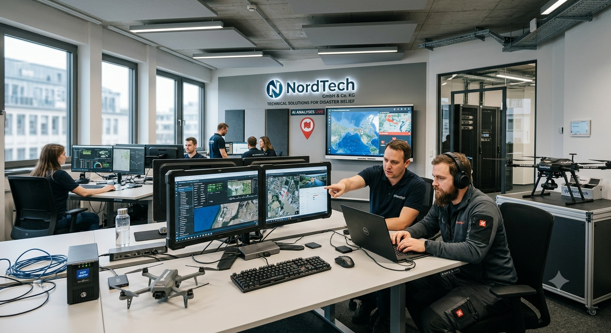
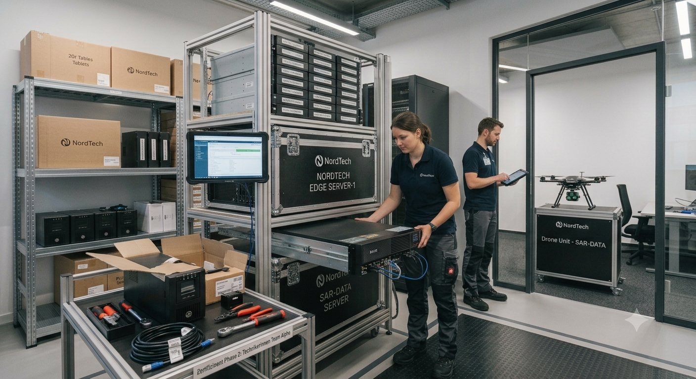
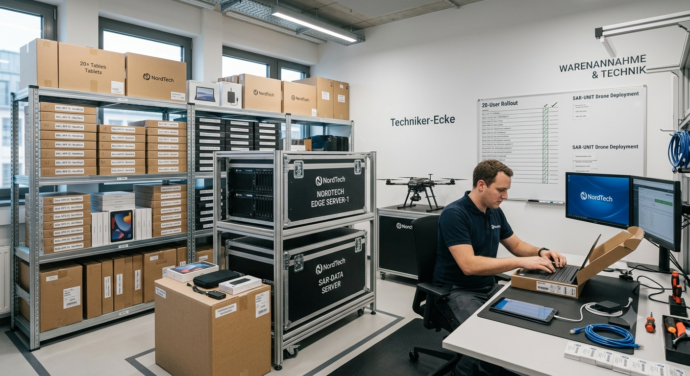
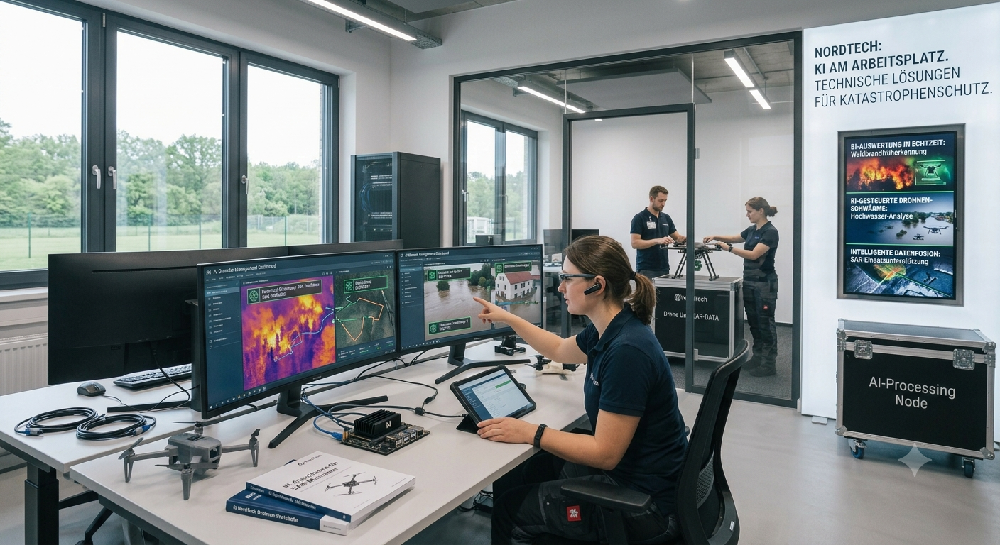

# Kapitel 4: IT-Systeme in Betrieb nehmen

In diesem Kapitel werden Sie ...

- ... Hardwarekomponenten auswählen.
- ... das BIOS und UEFI eines Neugerätes einstellen.
- ... die Integration im Verzeichnisdienst analysieren.
- ... das Geräte-Onboarding im Asset Management durchführen.
- ... Chancen und Risiken des KI-Einsatzes abschätzen.
- ... eine "User Policy" für den KI-Einsatz erstellen.
- ... Abnahmeprotokolle planen.

---

## Handlungssituation

Die NordTech GmbH & Co. KG expandiert und richtet eine neue, agile Zweigstelle für ein Team ein. NordTech ist ein Unternehmen, das sich im Katastropenschutz auf technische Lösungen spezialisiert hat. Kern des Produkt- und Dienstleistungsportfolios ist es, in unübersichtlichen Gebieten bspw. nach Hochwasser oder bei großflächigen Waldbränden eine Übersicht für die Rettungskräfte zu liefern. Hierzu werden Drohnen in der Luft und am Boden mit entsprechender Kameratechnik für Live-Feeds ausgestattet und via künstlicher Intelligenz ausgewertet.

Sie haben den Auftrag erhalten, die IT-Arbeitsplätze und die dazugehörige Raum-Infrastruktur der neuen Niederlassung zu planen, zu konfigurieren und zu inventarisieren. Da das Team der NordTech GmbH & Co. KG stark auf mobiles Arbeiten, Videokonferenzen und den Einsatz von künstlicher Intelligenz setzt, müssen spezielle Anforderungen erfüllt werden. Zudem soll die Niederlassung bei Stromausfällen abgesichert sein, um weiterhin handlungsfähig zu bleiben.

*KI-Bild mit Gemini generiert*

---

## Kompetenz 4.0: Hardwarekomponenten auswählen

Die Auswahl und Beschaffung der benötigten Server, Switches und NAS wurde von einer anderen Mitarbeiterin der ChangeIT durchgeführt. Die Warenannahme erfolgte ohne Mängel, sodass die Hard- und Software für die nächsten Schritte zur Verfügung steht.

*KI-Bild mit Gemini generiert*

---

### Arbeitsauftrag A|4.0: Dimensionierung und Absicherung der Notstromversorgung (USV)

Für die neue Zweigstelle der NordTech GmbH wurde das zentrale Netzwerk- und Serverrack im Serverraum bestückt. Um Datenverlusten und Netzwerkausfällen vorzubeugen, muss dieses Rack über eine unterbrechungsfreie Stromversorgung (USV) abgesichert werden. Die Geschäftsleitung fordert eine Überbrückungszeit von exakt 2 Stunden, um bei einem Stromausfall entweder den Betrieb aufrechtzuerhalten oder Systeme kontrolliert herunterzufahren.

Folgende Geräte und Leistungsdaten wurden für das Rack dokumentiert:

- 1x Core-Switch: 120 W
- 2x PoE-Switches für Access Points & VoIP: je 180 W
- 2x Virtualisierungsserver: je 350 W
- 1x NAS-Speichersystem (Storage): 110 W

##### Aufgabe 1

Ermitteln Sie die Mindestkapazität der Akkus in Amperestunden (Ah). Gehen Sie von einem Wirkungsgrad von 90% aus.

##### Aufgabe 2

Der Techniker hat sich für die Topologie de Line-Interactive USV entschieden. Recherchieren Sie zwei konkrete Produkte unterschiedlicher Hersteller, welche die Anforderungen erfüllen (ggf. inkl. Zusatzbatterie). Sichern Sie sich die technischen Datenblätter.

##### Aufgabe 3

Treffen Sie eine Auswahlentscheidung. Machen Sie diese nachvollziehbar und transparent für andere Stakeholder des Projektes.

##### Aufgabe 4

Szenario: Zwei Stunden Überbrückungszeit sind vorbei, der Stromausfall im Stadtgebiet dauert jedoch an. Die Akkus der USV neigen sich dem Ende zu.

##### Aufgabenteil 4a

Welche automatisierten Maßnahmen müssen auf den Servern greifen, bevor die USV komplett abschaltet? Nennen Sie das Fachwort für diesen Prozess und beschreiben Sie kurz den Ablauf.

##### Aufgabenteil 4b

Die Geschäftsleitung entscheidet, dass die Zweigstelle auch bei tagelangem Blackout dauerhaft arbeitsfähig bleiben muss. Wie muss die Infrastruktur erweitert werden?

---

### Informationsmaterial M|4.0.0: Arten von USV in a Nutshell

Eine unterbrechungsfreie Stromversorgung (USV) schützt empfindliche IT-Systeme vor Störungen im Stromnetz. Fällt der Netzstrom aus, übernehmen Akkumulatoren die Versorgung. Doch USV ist nicht gleich USV: Je nach Bauart bieten sie Schutz gegen unterschiedliche Störfaktoren wie Spannungsschwankungen, Frequenzfehler oder totalen Stromausfall.

Die internationale Norm **DIN EN 62040-3** teilt USV-Anlagen in drei standardisierte Klassen ein:

#### Offline-USV / Standby (Klasse 3: VFD)

* **Bedeutung:** *Voltage and Frequency Dependent* (Spannung und Frequenz abhängig vom Netz).
* **Funktionsweise:** Im Normalbetrieb leitet die USV den Netzstrom direkt an die Verbraucher weiter. Der Wechselrichter und der Akku „schlafen“ (Standby). Erst bei einem Stromausfall oder starker Unter-/Oberspannung schaltet ein mechanisches Relais auf Batteriebetrieb um.
* **Umschaltzeit:** ca. **4 bis 10 Millisekunden**. Für die meisten PC-Netzteile reicht das aus, hochempfindliche Geräte können in dieser Millisekunden-Lücke abstürzen.
* **In a Nutshell:** Günstig, hoher Wirkungsgrad, schützt *nur* vor totalem Stromausfall und groben Spannungsspitzen. Perfekt für einzelne Office-Arbeitsplätze.

#### Line-Interactive / Netzinteraktive USV (Klasse 2: VI)

* **Bedeutung:** *Voltage Independent* (Spannung unabhängig vom Netz).
* **Funktionsweise:** Ähnlich wie die Offline-USV, verfügt jedoch zusätzlich über einen eingebauten Regeltransformator (sog. *Spannungskonstanthalter* oder *AVR*). Schwankt die Netzspannung (z. B. durch Industrieanlagen in der Nachbarschaft), gleicht die USV dies aus, **ohne** den Akku zu belasten.
* **Umschaltzeit:** ca. **2 bis 4 Millisekunden**.
* **In a Nutshell:** Guter Kompromiss. Schützt vor Stromausfall und kleineren Spannungsschwankungen. Ideal für kleinere Abteilungs-Switches, NAS-Systeme und Server in KMUs.

#### Online-USV / Dauerwandler (Klasse 1: VFI)

* **Bedeutung:** *Voltage and Frequency Independent* (Spannung und Frequenz komplett unabhängig vom Netz).
* **Funktionsweise:** Hier gibt es keinen direkten Weg vom Stromnetz zum Gerät. Der eingehende Wechselstrom ($\text{AC}$) wird permanent in Gleichstrom ($\text{DC}$) umgewandelt, speist den Akku und wird dahinter sofort wieder in perfekten, sauberen Wechselstrom gewandelt (**Doppelwandler-Prinzip**).
* **Umschaltzeit:** **0 Millisekunden** (Unterbrechungsfrei). Da die Geräte ohnehin durchgehend aus dem Zwischenkreis versorgt werden, gibt es beim Netzausfall keine Umschaltzeit.
* **In a Nutshell:** Maximaler Schutz gegen alle 9 bekannten Stromnetz-Probleme (inkl. Frequenzänderungen und Oberschwingungen). Nachteil: Geringerer Wirkungsgrad (Wärmeentwicklung) und höherer Preis. Pflicht für Serverräume und Core-Infrastruktur.

#### Klassen-Vergleich auf einen Blick

| USV-Typ (Klasse) | Schutz vor... | Umschaltzeit | Typischer Einsatzbereich |
| --- | --- | --- | --- |
| **Offline / VFD** (Klasse 3) | Stromausfall, Kurzzeitige Spitzen | 4 – 10 ms | Standard-PC, Home-Office, Monitore |
| **Line-Interactive / VI** (Klasse 2) | + Unter- / Überspannung | 2 – 4 ms | NAS, kleine Server, Etagen-Switches |
| **Online / VFI** (Klasse 1) | + Frequenzfehlern, Rauschen, allen Störungen | 0 ms | Core-Infrastruktur, Rechenzentren, Medizintechnik |

---

### Informationsmaterial M|4.0.1: Elektrische Größen und Formeln

| Größe | Formel(-zeichen) | Maßeinheit |
| :--- | :--- | :--- |
| Ohmsches Gesetz | R = U / I | Ω → Ohm |
| elektrische Spannung | U = R * I | V → Volt |
| elektrischer Strom | I = U / R | A → Ampere |
| elektrischer Widerstand | R | Ω → Ohm |
| elektrische Leistung | P = U * I | W → Watt |
| elektrische Energie | E = P * t | Wh → Wattstunden |
| Ladungsmenge (Akku-Kapazität) | Q = I * t | Ah → Amperestunden |
| Kosten der Elektrischen Energie | Preis | oftmals als Preis in €/kWh oder Cent/kWh angegeben |
| Zeit | t | je nach Anwendungsfall   s → Sekunden   h → Stunden   d → Tage |

---

## Kompetenz 4.1: Geräte-Onboarding durchführen

Auch die neuen Client-Notebooks für die Zweigstelle sind eingetroffen. Bevor die Geräte an die Mitarbeiter übergeben und ins Firmennetzwerk eingebunden werden, müssen sie hardwareseitig abgesichert ("gehärtet") und für den Software-Einsatz vorbereitet werden.

Für das Entwickler-Team kommen ThinkPad P14s zum Einsatz, für die Arbeitsplätze in der Verwaltung die Yoga AIO 7 All-in-One-Systeme.

*KI-Bild mit Gemini generiert*

---

### Arbeitsauftrag A|4.1: BIOS/UEFI-Einstellungen vornehmen und Informationen erheben

#### Aufgabe 1

Nutzen Sie die bereitgestellten Lenovo-Simulatoren für das ThinkPad P14 (M|4.1.1: BIOS-Simulator des Lenovo P14) und das Yoga AIO 7 (Material M|4.1.0: UEFI-Simulator des Lenovo YOGA AIO 7), um die Sicherheits- und Systemkonfigurationen vorzunehmen. Dokumentieren Sie mit Screenshots Ihre Schritte/Fundorte der Einstellungen. Berücksichtigen Sie das Material M|4.1.2: BIOS und UEFI zu allgemeinen Hinweisen rund um das BIOS / UEFI.

##### Aufgabenteil 1a

Suchen Sie die Passwort-Einstellungen. Um unbefugte Änderungen an der Hardwarekonfiguration zu verhindern, muss ein Supervisor Password (beim Yoga: Administrator Password) gesetzt werden. Notieren Sie kurz den Unterschied zum klassischen Password zum Login in das Betriebssystem.

##### Aufgabenteil 1b

Aktivieren Sie Secure Boot. Erklären Sie in einem Satz, vor welcher Art von Schadsoftware (z.B. beim Systemstart) diese Funktion das Betriebssystem schützt.

##### Aufgabenteil 1c

Verhindern Sie, dass unbefugte Personen Schadsoftware oder fremde Betriebssysteme über USB-Sticks starten können. Passen Sie die Boot-Reihenfolge (Boot Priority Order) so an, dass die interne Festplatte/SSD an erster Stelle steht, und deaktivieren Sie den Boot von externen Medien (USB/CD), falls der Simulator dies zulässt.

Warum ist das Sperren des USB-Boots eine so kritische Maßnahme beim Onboarding von Firmen-Geräten? Welches Angriffs-Szenario wird damit verhindert?

##### Aufgabenteil 1d

Das Entwickler-Team benötigt später Docker-Container auf ihren Systemen. Aktivieren Sie die dafür notwendigen CPU-Features: Intel Virtualization Technology (VT-x) und Intel VT-d (bzw. die entsprechenden AMD-Pendanten SVM Mode).

#### Aufgabe 2

Bevor ein Gerät physisch im Lager verschwindet oder ausgegeben wird, müssen dessen eindeutige Hardware-Identifikationsmerkmale erfasst werden.

1. Was ist eine UUID?
2. Welche Werte werden Ihnen in den beiden Simulatoren für die System UUID sowie die System Serial Number angezeigt?
3. Welche MAC-Adressen sind hinterlegt?

---

### Material M|4.1.0: UEFI-Simulator des Lenovo YOGA AIO 7

https://download.lenovo.com/bsco/index.html#/graphicalsimulator/Yoga%20AIO%207%2027ARH6%20(F0FN)

---

### Material M|4.1.1: BIOS-Simulator des Lenovo P14

https://download.lenovo.com/bsco/index.html#/graphicalsimulator/Yoga%20AIO%207%2027ARH6%20(F0FN)

---

### Material M|4.1.2: BIOS und UEFI

# BIOS und UEFI – Die Steuerzentrale des Computers

## 1. Was ist das BIOS?
Das **BIOS** (Basic Input/Output System) ist eine Firmware, die direkt auf dem **Motherboard** eines Computers gespeichert ist. Es stellt die grundlegenden Funktionen bereit, die notwendig sind, damit der Computer startet und das Betriebssystem geladen werden kann.

### Funktionen des BIOS:
*   **POST (Power-On Self Test):** Beim Einschalten des Computers führt das BIOS einen Selbsttest durch, um sicherzustellen, dass die Hardware (z. B. RAM, Grafikkarte, Festplatte) ordnungsgemäß funktioniert.
*   **Hardware-Initialisierung:** Das BIOS erkennt und konfiguriert die angeschlossenen Hardwarekomponenten.
*   **Bootloader:** Das BIOS sucht nach einem **Boot-Medium** (z. B. Festplatte, USB-Stick) und startet das Betriebssystem.
*   **Einstellungen:** Über das BIOS können grundlegende Einstellungen wie die **Boot-Reihenfolge**, **Datum und Uhrzeit** sowie **Sicherheitsoptionen** (z. B. Passwortschutz) konfiguriert werden.

### Merkmale des klassischen BIOS:
*   **Textbasierte Benutzeroberfläche:** Navigation erfolgt über die Tastatur.
*   Unterstützt **MBR (Master Boot Record)** als Partitionsschema, was die maximale Festplattengröße auf **2 TB** begrenzt.
*   **Beschränkter Adressraum:** Kann nur **16-Bit-Prozessorbefehle** ausführen und maximal **1 MB Speicher** direkt ansprechen.

## 2. Was ist UEFI?
Das **UEFI** (Unified Extensible Firmware Interface) ist der **moderne Nachfolger des BIOS**. Es wurde entwickelt, um die Einschränkungen des klassischen BIOS zu überwinden und zusätzliche Funktionen bereitzustellen.

### Funktionen des UEFI:
*   **Erweiterter POST und Hardware-Initialisierung:** Schnellere Erkennung und Konfiguration von Hardware.
*   **Grafische Benutzeroberfläche (GUI):** UEFI bietet oft eine **grafische Oberfläche** mit Mausunterstützung und erweiterten Konfigurationsmöglichkeiten.
*   **Unterstützung für große Festplatten:** UEFI verwendet das **GPT (GUID Partition Table)**-Partitionsschema, das Festplatten **größer als 2 TB** unterstützt.
*   **Sicherheitsfunktionen:** UEFI bietet Funktionen wie **Secure Boot**, das verhindert, dass unsichere Betriebssysteme oder Malware beim Start geladen werden.
*   **Netzwerk-Boot:** UEFI ermöglicht den **Start über das Netzwerk** (z. B. für Remote-Installationen).

### Merkmale von UEFI:
*   **Schnelleres Booten:** Dank effizienterer Hardware-Initialisierung und Optimierungen.
*   **Modular und erweiterbar:** UEFI kann mit **Plugins** und **Treibern** erweitert werden.
*   **Kompatibilität:** Die meisten UEFI-Firmwares bieten einen **Legacy BIOS-Kompatibilitätsmodus (CSM)**, sodass ältere Betriebssysteme weiterhin unterstützt werden.

## 3. Wichtige Unterschiede zwischen BIOS und UEFI

| Eigenschaft | BIOS | UEFI |
| :--- | :--- | :--- |
| **Startdatum** | 1970er Jahre | Mitte 2000er Jahre |
| **Benutzeroberfläche** | Textbasiert, nur Tastatursteuerung | Grafisch, Maus- und Tastatursteuerung |
| **Partitionsschema** | MBR (max. 2 TB Festplatten) | GPT (Unterstützung für > 2 TB Festplatten) |
| **Sicherheitsfunktionen** | Keine speziellen Funktionen | Secure Boot, TPM-Unterstützung |
| **Bootgeschwindigkeit** | Langsamer | Schneller |
| **Erweiterbarkeit** | Eingeschränkt | Modular, erweiterbar |
| **Kompatibilität** | Ältere Systeme und Betriebssysteme | Neuere Systeme, aber mit BIOS-Kompatibilität |

## 4. Warum ist UEFI heute Standard?
Moderne Computer verwenden fast ausschließlich **UEFI**, da es leistungsfähiger und flexibler ist als das klassische BIOS. Vor allem für Aufgaben wie **Virtualisierung**, **große Speicherlaufwerke**, **schnelle SSDs** und **moderne Sicherheitsanforderungen** (z. B. Secure Boot für Windows 11) ist UEFI notwendig.

Trotzdem bieten viele Systeme weiterhin die Möglichkeit, in den **Legacy BIOS-Modus** zu wechseln, um ältere Betriebssysteme zu unterstützen.

## 5. Zugriff auf BIOS/UEFI
Um ins BIOS oder UEFI zu gelangen, muss beim **Start des Computers** eine bestimmte **Taste gedrückt** werden. Die gängigsten Tasten sind:

*   <kbd>Entf</kbd> (Delete)
*   <kbd>F2</kbd>
*   <kbd>Esc</kbd>

Die genaue Taste wird beim Start kurz auf dem Bildschirm angezeigt oder kann im Handbuch des Motherboards nachgelesen werden.

## 6. BIOS Flash – Firmware-Update für das Motherboard
Ein **BIOS-Flash** bezeichnet das **Aktualisieren der BIOS- oder UEFI-Firmware** auf dem Motherboard. Dieses Update kann notwendig sein, um **Kompatibilitätsprobleme** mit neuer Hardware (z. B. neuen CPUs oder RAM) zu beheben, **Stabilitätsverbesserungen** durchzuführen oder **Sicherheitslücken** zu schließen. 

Moderne Motherboards mit UEFI bieten oft eine einfache Möglichkeit zum Flashen der Firmware direkt aus dem UEFI-Menü heraus, häufig als **"EZ Flash"** oder **"Q-Flash"** bezeichnet. Dabei wird die neue Firmware von einem **USB-Stick** geladen und installiert. 

Vor dem Flashen sollte immer überprüft werden, ob das Update wirklich notwendig ist, da ein **fehlerhaftes Update** das Motherboard unbrauchbar machen kann. Daher sollte der **Flash-Vorgang niemals unterbrochen** werden (z. B. durch Stromausfall). Manche Motherboards bieten eine **Dual-BIOS-Funktion**, die ein Backup der alten Firmware speichert und im Notfall wiederherstellen kann.

---

## Weiterführende Quellen
*   [Microsoft Learn: Starten im UEFI-Modus oder im Legacy-BIOS-Modus](https://learn.microsoft.com/de-de/windows-hardware/manufacture/desktop/boot-to-uefi-mode-or-legacy-bios-mode?view=windows-11)
*   [Comheld: BIOS und UEFI verständlich erklärt](https://comheld.de/bios-und-uefi-die-herzstuecke-ihres-computers-verstaendlich-erklaert/)
*   [ESM-Computer Ratgeber: BIOS-Lexikon](https://www.esm-computer.de/ratgeber-infos/lexikon/bios/)
*   [Inonet Wiki: UEFI vs. BIOS](https://wiki.inonet.com/uefi-vs-bios)
*   [Dell Support: Beheben gängiger BIOS-/UEFI-Probleme](https://www.dell.com/support/contents/de-de/article/product-support/self-support-knowledgebase/fix-common-issues/bios-uefi)

---

### Arbeitsauftrag A|4.2: Integration in den Verzeichnisdienst

Die Hardware der neuen Notebooks (ThinkPads) und PCs (Yoga AIO) ist nun im BIOS abgesichert. Jetzt müssen die Geräte in die zentrale Infrastruktur der NordTech GmbH integriert werden. Damit sich die Mitarbeiter mit ihren personalisierten Konten anmelden können und zentrale Gruppenrichtlinien (GPOs) greifen, müssen die Clients technisch sicher in den Verzeichnisdienst (Domain Controller) aufgenommen werden.

#### Aufgabe 1

Der häufigste Grund, warum die Aufnahme eines PCs in eine Domäne fehlschlägt, ist eine fehlerhafte DNS-Konfiguration. Ein Client kann den Domain Controller (DC) nur finden, wenn er den korrekten DNS-Server abfragt.

Welcher DNS-Server muss zwingend in den Netzwerkeinstellungen des Clients eingetragen sein, damit der Domänenbeitritt funktioniert (der öffentliche DNS des Providers oder der interne DNS des Domain Controllers)? Begründen Sie kurz.

#### Aufgabe 2

Bevor Sie den Assistenten für den Domänenbeitritt starten, führen Sie an einem Windows-Client zwei Tests in der Eingabeaufforderung (cmd) durch. Notieren Sie die vollständigen Befehle für:

1. Das Prüfen der grundlegenden Ping-Erreichbarkeit der IP-Adresse des DCs (10.20.30.10).
2. Das gezielte Auflösen des vollqualifizierten Domatennamens (FQDN) intern.nordtech.de via DNS-Abfrage-Tool.

#### Aufgabe 3

Der eigentliche Beitritt verbindet das Betriebssystem des Clients mit dem Verzeichnisdienst. Diesen Prozess gilt es nun technisch sauber zu beschreiben.

Welche administrativen Voraussetzungen müssen erfüllt sein, um ein Gerät in die Domäne aufzunehmen? Wer darf diesen Schritt typischerweise durchführen?

#### Aufgabe 4

Erstellen Sie eine Kurzanleitung (als Bulletpoint-Liste) für den technischen Ablauf unter Windows 11. Gehen Sie dabei auf folgende Punkte ein:

1. Wo in den Systemeinstellungen wird der Domänenname (intern.nordtech.de) eingetragen?
2. Was passiert im Moment des Klicks auf "OK" im Hintergrund?
3. Welcher Schritt ist am Client zwingend erforderlich, damit der Beitritt final wirksam wird?

### Material M|4.2.0: Verzeichnisdienste und Domänenintegration

In modernen Unternehmensnetzwerken wird die Verwaltung von Benutzern, Computern und Rechten ab einer gewissen Größe unübersichtlich. Anstatt jeden PC einzeln zu konfigurieren, setzen Administratoren auf **Verzeichnisdienste** (engl. *Directory Services*), wie beispielsweise **Microsoft Active Directory (AD)** oder plattformunabhängige Samba-Lösungen.

#### Was ist ein Verzeichnisdienst?

Ein Verzeichnisdienst ist eine zentrale Datenbank im Netzwerk, die alle Ressourcen einer IT-Infrastruktur logisch abbildet und verwaltet. Zu diesen Ressourcen (sogenannten **Objekten**) gehören:

* **Benutzerkonten** (Logins, Passwörter, E-Mail-Adressen)
* **Computerobjekte** (Notebooks, Server, Arbeitsplatz-PCs)
* **Gruppen** (zur Steuerung von Zugriffsrechten auf Netzlaufwerke)

Der Server, auf dem dieser Dienst aktiv ist und der die Datenbank verwaltet, wird als **Domain Controller (DC)** bezeichnet. Das logisch abgegrenzte Netzwerk, das durch diesen DC verwaltet wird, nennt man **Domäne** (häufig erkennbar an Endungen wie `.local` oder `.internal`).

#### Das Fundament: Ohne DNS läuft nichts

Damit ein Client-PC überhaupt weiß, wohin er seine Daten schicken muss, wenn er mit der Domäne kommuniziert, benötigt er das **Domain Name System (DNS)**.

Der Domain Controller trägt sich bei seiner Einrichtung mit speziellen Dienst-Einträgen (sogenannten *SRV-Records*) im lokalen DNS-Server ein. Wenn ein Client der Domäne beitreten möchte, fragt er seinen konfigurierten DNS-Server: *„Wo finde ich den Domain Controller für das Netzwerk firmennetz.de?“*

**Wichtiger Administrations-Hinweis:** Zeigt der DNS-Eintrag eines Clients auf einen externen Server (z. B. den Router des Internetanbieters oder öffentliche Server wie `8.8.8.8`), kann die interne Domäne nicht aufgelöst werden. Der Domänenbeitritt schlägt mit einer Fehlermeldung fehl. Vor jedem Beitritt sollte die Namensauflösung daher mit Netzwerkkwerkzeugen wie `ping` oder `nslookup` geprüft werden.

#### Wie kommt der PC in die Domäne?

Befindet sich ein neuer PC frisch aus der Verpackung im Netzwerk, arbeitet er zunächst isoliert in einer sogenannten **Arbeitsgruppe** (Workgroup). In diesem Zustand kennt der PC nur seine eigenen, lokalen Benutzerkonten.

Der Übergang in die Domäne (der **Domänenbeitritt**) ist ein administrativer Akt:

1. **Authentifizierung:** Der IT-Administrator stößt den Beitritt in den Systemeinstellungen des Clients an. Da dieser Vorgang tief in die Sicherheitsstruktur des Netzwerks eingreift, verlangt das System zwingend die Eingabe von Zugangsdaten eines Kontos, welches das Recht besitzt, Computer zur Domäne hinzuzufügen.
2. **Objekt-Erstellung:** Bei einem erfolgreichen Beitritt wird in der zentralen Active Directory-Datenbank automatisch ein neues **Computerobjekt** angelegt. Ab diesem Moment vertrauen sich der Client-PC und der Domain Controller gegenseitig über ein verschlüsseltes Computerkonto-Passwort.
3. **Der finale Neustart:** Nach der Erfolgsmeldung muss das Client-Betriebssystem zwingend **neu gestartet** werden. Erst durch den Reboot werden die Sicherheits-Tokens (Kerberos-Tickets) initialisiert und der PC zieht sich beim Hochfahren die für ihn geltenden **Gruppenrichtlinien (GPOs)** vom Server. Nun können sich alle berechtigten Domänen-Benutzer an diesem PC anmelden.

---

### Arbeitsauftrag A|4.3: Asset Management

Alle Hardware-Komponenten für die neue Zweigstelle sind nun technisch konfiguriert, gehärtet und im Netzwerk integriert. Damit die IT-Abteilung der NordTech GmbH im Supportfall den Überblick behält und Lizenz- sowie Garantieansprüche nachverfolgen kann, müssen alle Systeme im zentralen Asset-Management-System Snipe-IT erfasst werden.

Ihr Ausbilder hat für Sie einen Docker-Server mit Snipe-IT aufgesetzt und Ihnen Ihre persönlichen Admin-Zugangsdaten bereitgestellt. Verschaffen Sie sich selbstständig einen Überblick über die Benutzeroberfläche von Snipe-IT und pflegen Sie die neue Infrastruktur sowie das Personal der Zweigstelle logisch in das System ein.

Gehen Sie dabei nach folgenden strategischen Meilensteinen vor:

#### Aufgabe 1

Bevor konkrete Hardware erfasst werden kann, müssen die strukturellen Rahmenbedingungen im System existieren. Legen Sie die neue Zweigstelle Nord als Standort an und richten Sie für das dortige Entwickler-Team ein Benutzerkonto für einen fiktiven Mitarbeiter ein.

- Die Zweigstelle benennen Sie mit Nord-[Klasse]-[erste drei Buchstaben Ihres Nachnamens].
- Der Mitarbeiter erhält einen beliebigen schultauglichen Vornamen und als Nachnamen eine Konbination aus [Klasse]-[erste drei Buchstaben Ihres Nachnamens].

#### Aufgabe 2

Inventarisieren Sie die Hardware aus den vorherigen Aufgaben. Wählen oder erstellen Sie dafür sinnvolle Gerätekategorien und -modelle. Erfassen Sie anschließend die folgenden zwei konkreten Gegenstände mit eindeutigen Firmen-Inventarnummern und den dazugehörigen Seriennummern:

- Die in Arbeitsauftrag A|4.0: Dimensionierung und Absicherung der Notstromversorgung (USV) berechnete Online-USV-Anlage (Nutzen Sie die genaue Modellbezeichnung Ihrer Marktrecherche).
- Das in Arbeitsauftrag A|4.1: BIOS/UEFI-Einstellungen vornehmen und Informationen erheben vorbereitete Entwickler-Notebook (Lenovo ThinkPad P14s).

#### Aufgabe 3

Schließen Sie das Onboarding ab, indem Sie die Assets in den Live-Betrieb übergeben (Check-Out).

Logik-Prüfung: Berücksichtigen Sie beim Verleih-Prozess den Unterschied zwischen persönlicher Arbeitsplatzausstattung und ortsgebundener Serverraum-Infrastruktur. Nicht jedes Asset gehört in die digitale Akte eines Mitarbeiters.

Dokumentieren Sie den Erfolg Ihrer Inventarisierung, indem Sie eine Übersicht aufrufen, die belegt, dass alle neu angelegten Assets dem richtigen Standort bzw. der richtigen Person zugewiesen sind.

---

## Kompetenz 4.2: KI am Arbeitsplatz einsetzen

Die Geschäftsleitung der NordTech GmbH möchte die Effizienz der neuen Zweigstelle steigern und plant, den Entwicklern und Verwaltungsmitarbeitern generative KI-Tools (wie z. B. ChatGPT, DeepL oder lokal gehostete Large Language Models) zur Verfügung zu stellen.

Bevor die Tools auf den frisch installierten und im Asset-Management erfassten Geräten freigegeben werden, fordert die Geschäftsführung eine fundierte Risikoanalyse sowie klare Spielregeln für die Belegschaft. Als IT-Spezialisten erhalten Sie den Auftrag, dieses Onboarding-Framework auf Basis der offiziellen Empfehlungen des Bundesamts für Sicherheit in der Informationstechnik (BSI) zu erarbeiten.

*KI-Bild mit Gemini generiert*

---

### Arbeitsauftrag A|4.4: Chancen und Risiken des KI-Einsatzes abschätzen

Analysieren Sie die Chancen und Risiken generativer KI-Systeme und erstellen Sie eine verbindliche Richtlinie für das Unternehmen. Nutzen Sie hierfür das bereitgestellte BSI-Dokument zu Generativen KI-Modellen (Chancen und Risiken) in M|4.4.0: BSI - Generative KI-Modelle - Chancen und Risiken für Industrie und Behörden

#### Aufgabe 1

Erstellen Sie eine strukturierte Matrix (Tabelle), in der Sie die Chancen des KI-Einsatzes den potenziellen Risiken für die NordTech GmbH gegenüberstellen.

#### Aufgabe 2

Die Geschäftsleitung schwankt zwischen der Nutzung von öffentlichen Cloud-Diensten (wie ChatGPT/Copilot im Standard-Abo) und dem Betrieb eines lokal gehosteten, Open-Source LLMs (z.B. via Docker auf einem eigenen Server in der Zweigstelle). Vergleichen Sie beide Ansätze kurz anhand von zwei entscheidenden Faktoren und geben Sie der Geschäftsführung eine begründete Empfehlung ab.

---

### Material M|4.4.0: BSI - Generative KI-Modelle - Chancen und Risiken für Industrie und Behörden

[BSI - Generative KI-Modelle - Chancen und Risiken für Industrie und Behörden](material/05_Generative_KI-Modelle.pdf)

---

### Arbeitsauftrag A|4.5: Entwurf einer "User Policy"

#### Aufgabe 1

Formulieren Sie eine kurze, prägnante und für alle Mitarbeiter verständliche Nutzungsrichtlinie (User Policy). Diese Richtlinie soll als "Do's and Don'ts"-Katalog aufgebaut sein.

- Erlaubt (Do's): Definieren Sie mindestens drei Szenarien, in denen die Nutzung von KI ausdrücklich erwünscht ist (z. B. Refactoring von nicht-sensiblem Programmcode).
- Verboten (Don'ts): Definieren Sie mindestens drei strikte Verbote (z. B. das Hochladen von personenbezogenen Kundendaten oder internem Quellcode in öffentliche, unverschlüsselte KI-Modelle).
- Qualitätskontrolle: Integrieren Sie eine goldene Regel zum Umgang mit den KI-Ergebnissen (Stichwort: Überprüfungspflicht/Vier-Augen-Prinzip).

#### Aufgabe 2

Bewerten Sie kritisch die Einführung einer solchen "User Policy" in einem Unternehmen. Was muss seitens der Geschäftsführung unternommen werden, damit diese Akzeptanz bei den Mitarbeitern findet und auch eingehalten wird. Welche Konsequenzen kann ein Unternehmen bei Verstößen gegen die "User Policy" ziehen?

---

## Kompetenz 4.3: IT-Systeme an Kunden übergeben

Nach der erfolgreichen Beschaffung, Einrichtung und Integration in die IT-Infrastruktur der Zweigstelle der NordTech GmbH steht nun die Übergabe eines Entwickler-Laptops an den Kunden an. Sie sind als IT-Spezialist der ChangeIT GmbH verantwortlich für die Endabnahme des Systems.

Um sicherzustellen, dass der Laptop den Anforderungen des Kunden entspricht und ordnungsgemäß funktioniert, müssen Sie eine Checkliste erstellen, die als Abnahmeprotokoll dient. Dieses Protokoll dokumentiert alle wichtigen Punkte der Inbetriebnahme und stellt sicher, dass der Kunde den PC in einwandfreiem Zustand übernimmt.

*KI-Bild mit Gemini generiert*

---

### Arbeitsauftrag A|4.6: Erstellung eines Abnahmeprotokolls

#### Aufgabe 1

Beschreiben Sie kurz, warum das Abnahmeprotokoll wichtig ist. Gehen Sie hierbei auf technische sowie kaufmännische/rechtliche Aspekte ein.

#### Aufgabe 2

Erstellen Sie auf einer DIN A4-Seite eine Checkliste, die beim Kunden vor Ort zum Einsatz kommen kann und die korrekte Funktion des IT-Systems abprüft. Gehen Sie dazu auf Hard- und Software sowie die Netzwerkanbindung ein. Auch der Bereich Sicherheit sollte erfasst sein.

#### Aufgabe 3

Was passiert, wenn im Rahmen der Abnahme Aspekte auffallen, die eine negative Abweichung zum Soll-Zustand haben?

---

### Material M|4.6.0: Abnahmeprotokolle erstellen

#### 1. Bedeutung des Abnahmeprotokolls

Ein Abnahmeprotokoll ist ein unverzichtbares Dokument bei der Übergabe von IT-Systemen an den Kunden. Es dient sowohl technischen als auch kaufmännischen und rechtlichen Zwecken:

**Technische Aspekte:**

- Qualitätssicherung: Die Abnahme dokumentiert, dass das System funktionsfähig ist und den vereinbarten Spezifikationen entspricht.
- Transparenz: Alle getesteten Komponenten werden festgehalten, um eine klare Nachvollziehbarkeit zu gewährleisten.

**Kaufmännische und rechtliche Aspekte:**

- Vertragserfüllung: Mit der Unterschrift des Kunden wird die Lieferung als vertragsgemäß erfüllt betrachtet.
- Rechtliche Absicherung: Das Protokoll dient als Beleg, dass das System übergeben wurde. Eventuelle Mängel oder offene Punkte werden festgehalten, um spätere Streitigkeiten zu vermeiden.
- Garantiestart: Die Abnahme kann als Startzeitpunkt für Garantie- oder Gewährleistungsfristen dienen.

#### 2. Vorgehen bei festgestellten Mängeln

Wenn während der Abnahme Abweichungen vom Soll-Zustand festgestellt werden, sind folgende Schritte notwendig:

1. **Dokumentation der Mängel:** Alle Probleme werden im Abnahmeprotokoll detailliert beschrieben. Dazu gehört, welche Komponente betroffen ist und wie der Fehler auftritt.
2. **Festlegung von Fristen zur Nachbesserung:** Ein Zeitplan für die Behebung der Mängel wird festgelegt. Dies kann Teil eines Teilabnahmeprotokolls sein, wenn der Rest des Systems funktionsfähig ist.
3. **Kommunikation mit dem Kunden:** Der Kunde wird über die weiteren Schritte informiert. Je nach Vertrag kann der Kunde eine Nachbesserung fordern oder in schwerwiegenden Fällen den Abnahmeprozess verweigern.
4. **Wiederholte Abnahme:** Nach der Behebung der Mängel erfolgt eine erneute Abnahme der betroffenen Punkte. Dies wird im Protokoll nachgetragen.

---

## Handlungsergebnis

In diesem Kapitel haben Sie die Tätigkeiten rund um die Einführung eines IT-Systems bei einem Kunden kennengelernt. Von der Auswahl über die Integration in ein Unternehmen bishin zur ggf. notwendigen "User Policy" sowie letztendlich dem Abnahmeprotokoll.

*KI-Bild mit Gemini generiert*

---

### Arbeitsauftrag A|4.7: Zusammenfassende Rückschau auf die Einführung eines IT-Systems

#### Aufgabe 1

Welcher Einzelschritt war Ihrer Meinung nach der risikoreichste für das Gelingen des Gesamtprojekts? Begründen Sie, warum genau an dieser Stelle eine Verzögerung oder ein Fehler die nachfolgenden Schritte blockiert hätte.

#### Aufgabe 2

Welches Tool (z.B. der BIOS-Simulator, Snipe-IT oder das Arbeiten mit dem BSI-Leitfaden) hat Ihnen den größten Aha-Effekt bezüglich des realen Berufsalltags geliefert? Begründen Sie.

---

