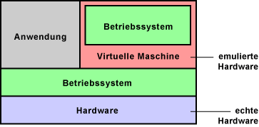
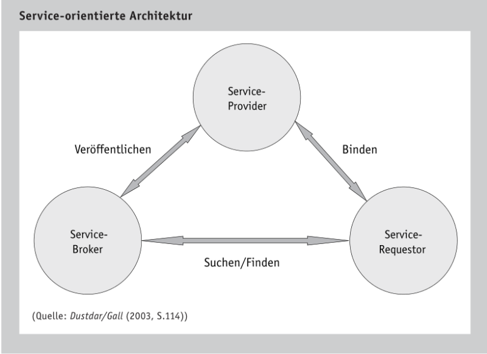

# Kapitel 5: Exkurs

In diesem Kapitel werden Sie ...

- ... 

---
### Informationsmaterial M|2.16: Weitere Informationen zu IT-Systemen

#### Virtualisierung an Einzeplatzsystemen

Der Begriff Virtualisierung ist mehrdeutig. In der Regel verwendet man den Begriff Virtualisierung in der Computertechnik. Typischerweise versteht man unter Virtualisierung die Prozessor-Virtualisierung. Neben der Prozessor-Virtualisierung gibt es auch noch andere Möglichkeiten. Dazu zählt zum Beispiel das Partitionieren von Festplatten oder die Netzwerk-Virtualisierung durch VLAN.

Virtualisierung ist eine Hardware-Unterstützung, die den Betrieb virtueller Computer auf einem echten Computer erleichtert oder beschleunigt. Mit der Virtualisierung kann man mehrere Software-Systeme auf einer Hardware laufen lassen. Das können zum Beispiel unterschiedliche Betriebssysteme sein. Virtualisierung macht dann Sinn, wenn ein Hardware-System nicht ausgelastet ist und die Ressourcen parallel für weitere Systeme genutzt werden sollen.

Da eine steigende Taktfrequenz bei Prozessoren so einfach nicht möglich ist, sind die Prozessorhersteller, insbesondere Intel und AMD, auf alternative leistungssteigernde Techniken für Prozessoren angewiesen. Neben Mehrkern-Prozessoren, Multimedia-Erweiterungen und 64-Bit gelten Virtualisierungs-Funktionen als die bahnbrechende Entwicklung.

##### Gründe für Virtualisierung

- Erhöhung der Ausfallsicherheit
- bessere Auslastung der IT-Systeme durch Konsolidierung der Hardware
- niedrigere IT-Kosten
- geringerer Stromverbrauch

Wichtigstes Merkmal der Virtualisierung ist die Ausfallsicherheit. Wenn eine Applikation sich selbst oder sogar das gesamte Betriebssystem zum Absturz bringt, laufen die anderen virtuellen Maschinen weiter.

Der Betrieb unterschiedlicher Applikationen in mehreren Umgebungen ist die häufigste Anwendung. Zum Beispiel um Applikationen aus Sicherheitsgründen und wegen des Datenschutzes getrennt zu halten. Um aber nicht für jede Applikation eine eigene Hardware bereitstellen zu müssen, werden virtuelle Maschinen geschaffen, auf denen dann die Applikationen getrennt voneinander arbeiten können.

Auf den ersten Blick scheint Virtualisierung nur etwas für Server zu sein. Doch auch normale Anwender können davon profitieren. Zum Beispiel zwei Umgebungen für das Arbeiten mit dem Computer. Die eine ganz normal und die andere bei Verbindung mit dem Internet. Hat sich das Internet-System Würmer oder Viren eingefangen, wird sie gelöscht und neu aufgesetzt. So etwas lässt sich zum Beispiel bei jedem Systemstart automatisieren. So hat man immer ein sauberes System. Das könnte auch soweit gehen, dass unsichere Programme in einer eigenen Umgebung laufen, damit das Betriebssystem von außen nicht angreifbar ist.

##### Virtuelle Maschine

Eine virtuelle Maschine ist ein Software-Container, der einem darin installierten Betriebssystem eine Scheinwelt vorgaukelt, in dem gängige Hardware-Komponenten emuliert werden. Üblicherweise verfügen Betriebssystem über Standard-Treiber mit denen sie die emulierte Hardware ansprechen können.

Virtuelle Maschinen verfügen nur über eine eingeschränkte Grafikleistung. 3D-Software und die Wiedergabe und Bearbeitung von Videos ist in einer virtuellen Maschine nicht ausreichend schnell machbar.

Mit virtuell ist die Hardware gemeint, die dem Betriebssystem in der virtuellen Maschine zur Verfügung steht. Denn CPU, Arbeitsspeicher, Grafikkarte, Laufwerke und Schnittstellen stehen den parallel arbeitenden Betriebssystemen nicht direkt zur Verfügung. Eine im Hintergrund laufende Virtualisierungssoftware überwacht die Zugriffe auf die Hardware. Sie organisiert und verwaltet die virtuellen Maschinen (VM).

Diese Aufgabe kann zum Beispiel ein Hypervisor übernehmen. Er benötigt einen kleinen Teil der Hardware-Leistung, insbesondere von Prozessor und Arbeitsspeicher, um seine Arbeit erledigen zu können.

##### Anwendungen

Virtuelle Computer sind eher selten im Einsatz. Es werden aber schon konkrete Anwendungen diskutiert. Einiges davon ist jetzt schon möglich. Mit einem neuen Software-Zweig ist zu rechnen.

- Software-Entwickler nutzen virtuelle Computer, um ihre Produkte unter verschiedenen Betriebssystemen zu testen.
- Auf Arbeitsplatz-Rechnern könnte man verschiedene Arbeitsumgebungen schaffen. Eine normale Arbeitsoberfläche, eine Oberfläche für den Internet-Zugang und eine für spezielle Hardware-Ressourcen. So lassen sich die verschiedenen Oberflächen gegen Hardware- und Software-Fehler, Viren und Würmern schützen.
- Bestimmte Anwendungen für ältere Betriebssysteme können in einem virtuellen Computer ausgeführt werden. Parallel dazu kann ein aktuelles Betriebssystem mit vollem Leistungsumfang arbeiten.
- Wenn zwei Applikationen sich nicht vertragen, kann man sie unter eigenen virtuellen Umgebungen installieren und ausführen.

##### Virtualisierung in der Server-Umgebung

- bessere Systemauslastung erreichbar
- leichter managebar
- Energiekosten senken -> Umweltrichtlinien einhalten
- höhere Sicherheit und Stabilität
- schneller Anforderungen umsetzen

*Quelle: [https://www.elektronik-kompendium.de/sites/com/1101011.htm](https://www.elektronik-kompendium.de/sites/com/1101011.htm)*

#### Everything as a Service

##### Service-orientierte Architektur

Die Service-orientierte Architektur (SOA) ist ein Architekturkonzept mit dem diverse Internetdienste, durch sogenannte Web Services, angeboten werden können. Web Services sind Softwareanwendungen zur Unterstützung maschinenübergreifender Interaktion. So lautet die Definition der zuständigen Working Group des World Wide Web Consortium. Damit stellen Web Services die Technologie zum Aufbau von verteilten, lose gekoppelten und Service-orientierten Anwendungen dar, die miteinander über ein Netzwerk kommunizieren und zum Anbieten von Diensten verwendet werden.

SOA ist wie ein Dreieck aufgebaut und unterscheidet die Rollen Service-Provider, Service-Requestor und Service-Broker. Durch den Service-Provider wird ein Dienst zur Verwendung bereitgestellt. Dieser Dienst wird wiederum bei dem Service-Broker gelistet. Über den Service-Broker kann der Service-Requestor einen bestimmten Dienst finden und einbinden. Ausgeführt wird der Dienst durch den Service-Provider. Somit fällt dem Service-Broker die Rolle des Vermittlers zwischen Service-Requestor und Service-Provider zu.

Die Umsetzung der Funktionsweise einer Service-orientierte Architektur findet sich in Web Services wieder. Dabei kommen unterschiedliche Techniken zum Datenaustausch und der Kommunikation zum Einsatz. Bekannte Protokolle wie das Transportprotokoll HTTP, das File Transfer Protocol (FTP) oder das Simple Mail Transfer Protocol (SMTP) können zur Verwendung von Web Services eingesetzt werden. Zur Speicherung der Dienstbeschreibung setzten Web Services auf XML-Dokumente. Die eingesetzte Beschreibungssprache ist die Web Service Description Language (WSDL), die dem entfernten Client die Nutzungsdetails für den angeforderten Web Service bereitstellt. Somit kann der Service-Provider seine Dienste veröffentlichen. Um einen bestimmten Web Service im Internet ausfindig zu machen, kann die durchsuchbare Datenbank Universal Description, Discovery and Integration (UDDI) verwendet werden.

*Quelle: Schwarzer & Krcmar (2014). Wirtschaftsinformatik. Grundlagen betrieblicher Informationssysteme. Stuttgart: Schäffer-Poeschel.*

### Informationsmaterial M|2.12: Kundenanfrage - Terminus Automobile GmbH

1. Lesen Sie sich aufmerksam die E-Mail des Kunden/Interessenten (s.u.) durch.
2. Führen Sie das Schema der verbalen Begründung durch und empfehlen Sie dem Kunden/Interessenten somit eine Art IT-System für seine Anforderungen. Es muss kein konkretes Produkt recherchiert und genannt werden. Bauen Sie die verbale Begründung auf, als wäre es eine E-Mail an den Kunden.
3. Suchen Sie im Internet nach einem Beispielprodukt für Ihre Entscheidung heraus und ergänzen Sie einen Screenshot/einen PDF-Ausdruck der Shopseite hinter Ihrer verbalen Begründung.

*Sehr geehrte Damen und Herren,*

*wir sind im Internet auf Ihre Webseite gestoßen und haben von ihrem breiten Service-Angebot gelesen. Die Terminus Automobile GmbH arbeitet aktuell mit klassischen Anwendungen auf Fatclients. Durch den Homeoffice-Druck wollen wir unserer Mitarbeiter zukünftig gerne mit Notebooks ausstatten. Die Hardwareauswahl ist unsererseits eigentlich schon getroffen, allderdings würden wir uns mit Ihnen gerne über die Software austauschen. Wir haben in einer Rubrik Ihrer Webseite vom Everything as a Service gelesen. Würden Sie uns einmal kurz zusammenfassen, was dies bei Ihnen konkret beinhaltet und inwiefern wir dieses Potenzial für uns nutzen können?*

*Freundliche Grüße*

Thomas Hannes
Terminus Automobile GmbH

##### Everything as a Service-Konzepte

Everything as a Service (XaaS) ist ein Oberbegriff für die Betrachtung sämtlicher Leistungen des Informationsmanagements aus einer dienstleistungsorientierten Perspektive. Die einzelnen Basisfunktionalitäten, Basistechniken und Technikbündel werden als grundlegende Dienstleistung eines Service-Ecosystems aufgefasst. So erlaubt das XaaS-Konzept ein feingranulares Outsourcing in diesen Bereichen. Ein Unternehmen kann z. B. die Bereitstellung der IT-Infrastruktur oder die Datenspeicherung von einem externen Dienstleister übernehmen lassen. Der Service-Anbieter kann, durch die Spezialisierung auf eine Aufgabe, Economies-of-Scale realisieren und somit diese Aufgabe kosteneffizienter ausführen. Einige ausgewählte Konzepte des XaaS werden im Folgenden vorgestellt.

Infrastructure as a Service (IaaS) bezeichnet die Anwendung des XaaS-Konzepts auf die IT-Infrastruktur. So wird die Bereitstellung der Infrastruktur als Dienstleistung angeboten (Hosting). Neben der Auslagerung der operativen Tätigkeit besteht die Möglichkeit, die benötigte Leistung, durch die Nutzung zusätzlicher Ressourcen kurzfristig anzupassen. Prominente Beispiele sind z.B. Amazon Webservices ([http://aws.amazon.com](http://aws.amazon.com)) oder Rackspace Hosting ([http://www.rackspace-hosting.de](http://www.rackspace-hosting.de)).

Das Konzept des Storage as a Service (StaaS) wendet das Konzept der Dienstleistungsorientierung auf die Datenspeicherung an. Durch eine Übernahme der Datenspeicherung durch einen Service-Anbieter können einerseits erneut Flexibilisierungspotenziale ausgeschöpft werden, andererseits kann die Aufgabe der Konzeption und Umsetzung notwendiger Speicherressourcen ausgelagert werden.

Durch das Software as a Service (SaaS)-Konzept wird eine bestimmte Applikation für eine Vielzahl von Servicekonsumenten zur Verfügung gestellt. Der Kunde kann die Software nach Vertragsabschluss einfach nutzen ohne diese selbst installieren oder warten zu müssen. Diese Aufgaben werden von dem Service-Anbieter übernommen. Für SaaS gibt es viele verschiedene Anbieter, wie z. B. Google, die mit der Software Google Docs einen SaaS anbieten, mit dem Tabellen und Textdokumente bearbeitet und verwaltet werden können ([http://docs.google.com](http://docs.google.com)).

Platform as a Service (PaaS) stellt eine Erweiterung des SaaS-Konzepts dar. Statt fertigen Anwendungen werden integrierte Entwicklungs- und Betriebsumgebungen für Software im Internet bereitgestellt. Microsoft stellt etwa mit der Plattform Azure einen solchen Service bereit ([http://www.microsoft.com/windowsazure](http://www.microsoft.com/windowsazure)).

*Quelle: Schwarzer & Krcmar (2014). Wirtschaftsinformatik. Grundlagen betrieblicher Informationssysteme. Stuttgart: Schäffer-Poeschel.*

##### Cloud Computing

Unter Cloud Computing wird ein IT-basiertes Bereitstellungsmodell verstanden, bei dem Ressourcen sowohl in Form von Infrastruktur als auch Anwendungen und Daten, als verteilter Dienst über das Internet, durch einen oder mehrere Leistungserbringer bereitgestellt wird. So wird das Prinzip von Web Services, mit denen komplette Anwendungen aus gekapselten Funktionen über das Internet ausgeführt werden können, erweitert. Diese „Clouds“ sind nach Bedarf flexibel skalierbar und können verbrauchsabhängig abgerechnet werden, d.h. es wird immer die aktuell benötigte Menge an Ressourcen zur Verfügung gestellt.

Aus Sicht des Nutzers werden die Ressourcen zentral in der „Cloud“ bereitgestellt. Im Hintergrund können diese aber auch über diverse Cloud-Dienste verstreut sein. Für die Realisation von Cloud Computing kann auf verschiedene XaaS-Verfahren zurückgegriffen werden. Durch XaaS und Cloud Computing lassen sich Vorteile durch eine feingranulare Gestaltung der Auslagerung realisieren. Auf der anderen Seite kann die hohe Beziehungskomplexität mit den verschiedenen Service-Anbietern und die Abhängigkeit zu selbigen ein Unternehmen vor weitere Herausforderungen stellen.

*Quelle: Schwarzer & Krcmar (2014). Wirtschaftsinformatik. Grundlagen betrieblicher Informationssysteme. Stuttgart: Schäffer-Poeschel.*

---

### Informationsmaterial M|2.14: Kundenanfrage - ProgIT GmbH

Sehr geehrte Damen und Herren der ChangeIT,

wir, die ProgIT sind seit etwa zwei Jahren Kunde bei Ihnen. Da wir in diesem Jahr zum ersten Mal Fachinformatiker Anwendungsentwicklung ausbilden, benötigen wir Ihre Unterstützung. Wir haben zwar noch eine ausreichende Anzahl an Notebooks für die neuen Azubis, diese müssten aber softwareseitig eingerichtet werden. Da wir aktuell noch unterbesetzt sind und die Auftragslage boomt, würden wir diese Tätigkeit gerne bei Ihnen in Auftrag geben. Welche Option sehen Sie, um die Notebooks für folgende Anwendungszwecke vorzubereiten?

- Einfacher Wechsel zwischen Windows-System und Linux-System
- Übergreifende Entwicklungsumgebung für beide Betriebssysteme
- Möglichkeit, eine Sandbox für das Testen von Software einzurichten

Bitte melden Sie sich bei uns, damit wir uns Abstimmen und wir die Notebooks zu Ihnen bringen können.

Mit freundlichen Grüßen

Saher Mekac
ProgIT GmbH

## Handlungssituation

Sie sind neu in der operativen IT-Abteilung der ChangeIT. In diesem Bereich werden die unternehmenseigenen Endgeräte eingerichtet, gewartet und außer Betrieb genommen. 

---

